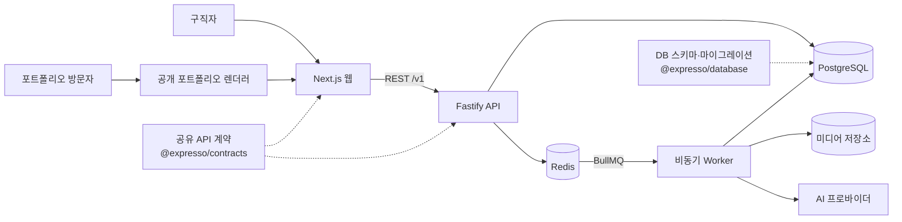

<p align="center">
  <picture>
    <source media="(prefers-color-scheme: dark)" srcset="assets/brand/expresso-mark-dark-256.png">
    
  </picture>
</p>

<h1 align="center">Expresso</h1>

<p align="center">
  커리어 기록을 채용 공고에 맞는 웹 포트폴리오로 만들고,<br>
  배포 이후의 방문 데이터까지 다음 행동으로 연결하는 커리어 플랫폼
</p>

<p align="center">
  <a href="https://expresso.ai.kr">제품</a>
  ·
  <a href="https://dev.expresso.ai.kr">개발 포털</a>
  ·
  <a href="docs/expresso-소개.html">소개 발표</a>
  ·
  <a href="docs/졸업작품-설계서.html">설계서</a>
</p>

<p align="center">
  <a href="https://github.com/Expresso-Organization/expresso/actions/workflows/backend-ci.yml"></a>
  <a href="https://github.com/Expresso-Organization/expresso/actions/workflows/web-ci.yml"></a>
  
  
  
</p>

---

Expresso는 구직자가 흩어진 경력·프로젝트·학력·활동을 꾸준히 기록하고, 지원할
채용 공고의 요구사항에 맞춰 실제 근거가 있는 포트폴리오를 만들도록 돕습니다.

> **핵심 원칙:** 원천 자료를 곧바로 생성 모델에 넣지 않습니다. 공고 요구사항과 사용자 기록을
> 먼저 근거 중심의 설계안으로 연결한 뒤, 그 근거 안에서만 문장과 지면을 만듭니다.

## 목차

- [제품이 해결하는 문제](#제품이-해결하는-문제)
- [사용자 흐름](#사용자-흐름)
- [핵심 기능](#핵심-기능)
- [시스템 구조](#시스템-구조)
- [빠른 시작](#빠른-시작)
- [개발 환경 설정](#개발-환경-설정)
- [AI 실행 모드](#ai-실행-모드)
- [검증과 테스트](#검증과-테스트)
- [저장소 구조](#저장소-구조)
- [배포](#배포)
- [문서 안내](#문서-안내)
- [협업 규칙](#협업-규칙)
- [현재 범위와 남은 작업](#현재-범위와-남은-작업)

## 제품이 해결하는 문제

채용 공고마다 포트폴리오를 다시 만드는 일은 단순한 복사·붙여넣기가 아닙니다.
같은 경험도 공고가 요구하는 기술, 역할, 영향력에 따라 무엇을 앞세울지가 달라집니다.

기존 방식은 대체로 두 극단에 있습니다.

| 방식 | 장점 | 한계 |
| --- | --- | --- |
| 템플릿 기반 빌더 | 빠르게 형태를 만들 수 있음 | 어떤 기록을 선택할지는 사용자가 직접 판단 |
| 생성형 AI 단독 사용 | 문장과 초안을 빠르게 생성 | 실제로 하지 않은 성과나 수치를 만들 위험 |
| **Expresso** | 공고와 기록을 먼저 연결한 뒤 생성 | 근거가 없는 정보는 생성 단계에서 차단 |

Expresso는 **기록 → 공고 분석 → 근거 선택 → 생성 → 배포 → 분석**을 하나의 흐름으로
묶습니다. 포트폴리오를 한 번 만들고 끝내는 도구가 아니라, 지원과 결과가 다시 다음
기록과 선택을 개선하는 작업 공간을 지향합니다.

## 사용자 흐름

| 단계 | 사용자가 하는 일 | Expresso가 하는 일 |
| ---: | --- | --- |
| 1. 기록 | 경력, 프로젝트, 학력, 자격, 활동을 축적 | 구조화된 커리어 기록과 증거를 한곳에 보관 |
| 2. 공고 선택 | 관심 공고를 찾거나 직접 가져오기 | 공고 본문을 정규화하고 요구사항과 조건을 추출 |
| 3. 재료 선정 | 포트폴리오에 넣을 경험을 검토 | 공고에 맞는 사용자 기록을 순위화하고 근거를 연결 |
| 4. 제작 | 구성과 스타일을 고르고 결과를 편집 | 설계안, 문장, 지면을 생성하고 근거 없는 수치를 검증 |
| 5. 배포·분석 | 공개 주소를 공유하고 반응을 확인 | 버전이 있는 공개 사이트를 배포하고 방문 지표를 집계 |

## 핵심 기능

### 커리어 기록

- 경력·프로젝트·학력 등 카테고리별 기록 관리
- 목록·표·보드·갤러리 형태의 탐색과 필터링
- 기록 속성, 본문, 기술, 증거 자료의 구조화
- AI 인터뷰와 정리 흐름을 통한 기록 보완

### 채용 공고

- 공고 수집 소스와 정기 수집 작업 관리
- 공고 검색, 조건 필터, 관심 공고 저장
- 공고 본문에서 필수·우대 조건과 인용 근거 추출
- 공고와 프로필 사이의 적합도 및 축별 분석

### 포트폴리오 제작

- 공고에 맞는 커리어 기록 추천과 재료 선택
- 근거를 먼저 묶는 `PortfolioPlan` 기반 생성
- 생성 과정의 실시간 지면 미리보기
- 블록 편집, 문장 수정, 스타일 재구성, 버전 관리
- 생성 결과의 미근거 수치·허용되지 않은 구조 검증

### 배포와 분석

- 공개 포트폴리오 주소와 배포 버전 관리
- 이미지·미디어 변형 및 공개 렌더링
- 방문 이벤트 수집과 지표 집계
- 배포 스냅샷, 롤백, 백업·복구 절차

## 시스템 구조

Expresso는 하나의 pnpm 모노레포 안에서 웹, API, Worker, 계약, 데이터베이스를
관리합니다. API와 Worker는 같은 도메인 코드를 사용하지만 서로 다른 프로세스로
실행됩니다.



### 기술 스택

| 영역 | 기술 | 역할 |
| --- | --- | --- |
| 웹 | Next.js 16, React 19, App Router | 앱 화면, 인증, 에디터, 공개 포트폴리오 |
| API | Fastify 5, TypeScript | REST API, 인증·권한, 도메인 규칙 |
| Worker | BullMQ 6, Redis 8 | 공고 분석, 생성, 집계 등 장시간 작업 |
| 데이터 | PostgreSQL 18, SQL 마이그레이션 | 사용자·공고·포트폴리오·분석 데이터 |
| 계약 | Zod 4 | 요청·응답 검증과 공유 타입의 단일 출처 |
| 테스트 | Vitest 4, PGlite, 실제 PostgreSQL·Redis | 단위·계약·통합 테스트 |
| 운영 | Docker Compose, nginx, systemd, GitHub Actions | 로컬 인프라와 단일 서버 배포 |

### 지키는 경계

- **계약이 유일한 출처입니다.** 요청·응답 타입은 `packages/contracts`의 Zod
  스키마에서 파생합니다.
- **스키마는 데이터베이스 패키지가 소유합니다.** 런타임에서 테이블을 만들지 않고
  `pnpm db:migrate`로 명시적으로 반영합니다.
- **도메인 모듈은 다른 모듈의 내부를 직접 열지 않습니다.** 공개 진입점과 계약만
  사용합니다.
- **API와 Worker의 역할을 분리합니다.** 오래 걸리는 작업은 큐에 넣고 상태를
  데이터베이스에 남깁니다.
- **세션 토큰은 `httpOnly` 쿠키 하나에만 둡니다.** 클라이언트 JavaScript에서
  토큰을 읽지 않습니다.
- **디자인 토큰은 한곳에서 관리합니다.** 웹의 색과 크기는
  `services/web/src/styles/tokens.css`가 기준입니다.

더 자세한 설명은 [백엔드 아키텍처](docs/architecture/backend.md)와
[프론트엔드 아키텍처](docs/architecture/frontend.md)에서 확인할 수 있습니다.

## 빠른 시작

### 준비물

| 도구 | 요구 버전 | 용도 |
| --- | --- | --- |
| Node.js | 24 이상 | 웹·API·Worker 실행 |
| pnpm | 11.16.0 | 워크스페이스 패키지 관리 |
| Docker | Compose 지원 버전 | PostgreSQL·Redis 실행 |
| Git | 최신 안정 버전 | 저장소와 변경 이력 관리 |

### 1. 의존성 설치

```bash
corepack enable
corepack prepare pnpm@11.16.0 --activate
pnpm install
```

### 2. 로컬 인프라와 환경 파일 준비

```bash
pnpm infra:up

cp services/backend/.env.example services/backend/.env
cp services/web/.env.example services/web/.env.local

pnpm db:migrate
```

로컬 인프라는 기존 서비스와 충돌하지 않도록 PostgreSQL `55432`, Redis `56379`를
사용합니다. `pnpm infra:down`은 컨테이너만 내리고 데이터 볼륨은 보존합니다.

### 3. 개발 서버 실행

각 명령은 별도 터미널에서 실행합니다.

```bash
# Terminal 1 — Fastify API
pnpm dev:backend

# Terminal 2 — BullMQ Worker
pnpm dev:worker

# Terminal 3 — Next.js 웹
pnpm dev:web
```

### 4. 실행 상태 확인

| 대상 | 주소 | 정상 상태 |
| --- | --- | --- |
| 웹 | <http://localhost:3000> | 로그인 또는 앱 화면 표시 |
| API | <http://127.0.0.1:4000> | Fastify 응답 |
| Liveness | <http://127.0.0.1:4000/health/live> | 프로세스가 살아 있으면 `200` |
| Readiness | <http://127.0.0.1:4000/health/ready> | PostgreSQL·Redis까지 준비되면 `200` |
| PostgreSQL | `127.0.0.1:55432` | Docker healthcheck 통과 |
| Redis | `127.0.0.1:56379` | Docker healthcheck 통과 |

```bash
curl http://127.0.0.1:4000/health/live
curl http://127.0.0.1:4000/health/ready
pnpm infra:ready
```

API 프로세스는 인프라가 없어도 시작할 수 있지만, 준비 상태 검사는 의도적으로
`503`을 반환합니다. 사용자 요청을 받기 전에 의존성이 실제로 준비되었는지 구분하기
위한 동작입니다.

## 개발 환경 설정

### 백엔드

`services/backend/.env`는 API와 Worker가 함께 읽습니다. 기본 예제에는 로컬
PostgreSQL·Redis 주소와 키 없이 동작하는 AI 설정이 들어 있습니다.

| 변수 | 기본값 | 설명 |
| --- | --- | --- |
| `DATABASE_URL` | `postgres://...@127.0.0.1:55432/expresso` | PostgreSQL 연결 주소 |
| `REDIS_URL` | `redis://127.0.0.1:56379` | 큐와 캐시 연결 주소 |
| `AI_PROVIDER` | `off` | AI 실행 모드 |
| `MEDIA_PROVIDER` | `local` | 미디어 저장 방식 |
| `MEDIA_DIR` | `var/media` | 로컬 미디어 저장 경로 |
| `GOOGLE_CLIENT_ID` | 비어 있음 | Google ID 토큰의 대상 검증 값 |

개발용 기본 비밀값은 운영에서 사용하면 안 됩니다. 운영 환경의
`ASSET_SIGNING_SECRET`과 `ANALYTICS_VISITOR_SALT`는 서로 다른 안전한 값으로
반드시 교체합니다.

### 웹

`services/web/.env.local`은 Next.js가 읽습니다.

| 변수 | 기본값 | 설명 |
| --- | --- | --- |
| `NEXT_PUBLIC_API_BASE_URL` | `http://127.0.0.1:4000` | 웹이 호출할 API 기준 주소 |
| `APP_BASE_URL` | `http://localhost:3000` | OAuth 리디렉션 주소 기준 |
| `GOOGLE_CLIENT_ID` | 비어 있음 | Google OAuth 클라이언트 ID |
| `GOOGLE_CLIENT_SECRET` | 비어 있음 | Google OAuth 클라이언트 비밀 |

Google 로그인을 사용할 때는 같은 클라이언트 ID를 웹과 백엔드에 넣고, Google Cloud
Console의 승인된 리디렉션 URI에 아래 주소를 정확히 등록합니다.

```text
http://localhost:3000/api/auth/google/callback
```

Google 설정이 비어 있으면 이메일 로그인은 그대로 사용할 수 있고, Google 버튼만
열리지 않습니다.

## AI 실행 모드

AI는 기본적으로 `off`입니다. API 키나 로컬 CLI 로그인이 없어도 웹·API·Worker와
결정적 규칙으로 처리하는 기능을 실행할 수 있습니다. 다만 AI가 반드시 필요한 공고
요구사항 추출과 지면 문장 생성은 가짜 결과로 대신하지 않고 명시적인 오류로 멈춥니다.

| `AI_PROVIDER` | 용도 | 인증 | 상태 |
| --- | --- | --- | --- |
| `off` | UI·API 개발, AI가 필요 없는 테스트 | 없음 | 기본값 |
| `fixture` | 녹화된 응답을 이용한 CI·회귀 테스트 | 없음 | 사용 가능 |
| `claude-code` | 로그인된 Claude Code CLI를 이용한 개발 | 로컬 CLI 로그인 | 개발 전용 |
| `codex` | 로그인된 Codex CLI를 이용한 개발 | 로컬 CLI 로그인 | 개발 전용 |
| `anthropic` | API 키를 이용한 운영 호출 | API 키 | 아직 미구현 |

```dotenv
# services/backend/.env
AI_PROVIDER=codex
CODEX_CLI_PATH=codex
AI_TIMEOUT_MS=180000
```

지면 생성만 별도 프로바이더로 실행하려면 `AI_PROVIDER_PAGE_GENERATION`을 사용합니다.
개발 중 성공한 호출을 픽스처로 남겨 회귀 테스트에 쓰려면 `AI_RECORD=true`를
설정합니다. 계약별 모델은 `AI_MODEL_JOB_ANALYSIS`, `AI_MODEL_GENERATION`처럼
개별적으로 덮어쓸 수 있습니다.

전체 선택지와 주의사항은
[`services/backend/.env.example`](services/backend/.env.example)에 있습니다.

## 검증과 테스트

변경을 마치기 전 기본 검증은 다음과 같습니다.

```bash
pnpm typecheck
pnpm test
pnpm build
```

백엔드 또는 데이터베이스를 변경했다면 실제 PostgreSQL과 Redis를 사용하는 통합
테스트까지 실행합니다.

```bash
pnpm infra:up
pnpm test:infra
```

| 명령 | 검증 범위 |
| --- | --- |
| `pnpm typecheck` | 모든 워크스페이스의 TypeScript 타입 검사 |
| `pnpm test` | 계약·데이터베이스·백엔드·웹 테스트 |
| `pnpm test:infra` | 실제 PostgreSQL·Redis 기반 백엔드 통합 테스트 |
| `pnpm build` | 배포 가능한 전체 워크스페이스 빌드 |
| `pnpm check:portfolio-css` | 생성 포트폴리오 CSS 산출물 동기화 검사 |

백엔드 테스트는 `@expresso/contracts`와 `@expresso/database`의 `dist`를 읽습니다.
각 테스트 스크립트와 CI가 두 패키지를 먼저 빌드하도록 구성되어 있으므로 이 순서를
따로 바꾸지 않습니다.

## 저장소 구조

```text
Expresso/
├── services/
│   ├── backend/       Fastify API와 BullMQ Worker
│   ├── web/           Next.js 앱·랜딩·공개 포트폴리오
│   ├── dev-portal/    포털 제작 당시의 스크랩과 원본 자료
│   ├── mobile/        향후 모바일 클라이언트 경계
│   └── desktop/       향후 데스크톱 클라이언트 경계
├── packages/
│   ├── contracts/     Zod 요청·응답 계약과 공유 타입
│   └── database/      SQL 스키마, 마이그레이션, 실행기
├── docs/              개발 포털의 단일 원본과 설계·운영 문서
├── infra/             Docker, nginx, systemd, 서버 배포 구성
├── scripts/           빌드·문서·데이터·운영 자동화
└── .github/workflows/ CI와 배포 워크플로
```

독립적으로 실행하거나 배포하는 단위만 `services`에 둡니다. 둘 이상의 서비스가
함께 사용하는 코드만 `packages`로 올립니다. 현재 개발 포털의 배포 원본은
`services/dev-portal`이 아니라 **`docs/` 한 벌**입니다.

### 자주 사용하는 명령

| 명령 | 설명 |
| --- | --- |
| `pnpm dev:web` | 웹 개발 서버를 `3000`번에서 실행 |
| `pnpm dev:backend` | API 개발 서버를 `4000`번에서 실행 |
| `pnpm dev:worker` | 큐 소비 Worker 실행 |
| `pnpm infra:up` | 로컬 PostgreSQL·Redis 시작 및 준비 대기 |
| `pnpm infra:ready` | 로컬 인프라 상태 확인 |
| `pnpm infra:down` | 컨테이너 종료, 데이터 볼륨 보존 |
| `pnpm db:migrate` | 미적용 데이터베이스 마이그레이션 실행 |
| `python3 scripts/serve-docs.py` | 개발 포털을 `8901`번에서 실행 |

## 배포

운영 환경은 Oracle Cloud 인스턴스 한 대에서 nginx가 웹·API를 묶고, API·Worker·웹은
각각 systemd 서비스로 실행됩니다. PostgreSQL과 Redis는 서버 전용 Docker Compose
구성을 사용합니다.

```text
Internet → nginx :443
               ├── /v1/* → Fastify API :4500
               └── /*     → Next.js Web :3500

Redis queue → Worker
API / Worker → PostgreSQL · local media
```

- 제품 코드가 `main`에 반영되면 `.github/workflows/web-deploy.yml`이
  `scripts/operations/deploy.sh`를 SSH로 실행합니다.
- `docs/`가 바뀌면 `.github/workflows/dev-portal-oracle.yml`이
  <https://dev.expresso.ai.kr>의 문서를 갱신합니다.
- 마이그레이션은 서비스 시작과 분리하고, 배포 스크립트가 명시적으로 실행합니다.
- 운영 비밀값, 포트 공개 범위, 롤백 절차는 README에 복제하지 않고 Runbook을
  단일 기준으로 사용합니다.

운영 작업 전에는 반드시 [배포 Runbook](docs/operations/DEPLOYMENT.md)을 읽습니다.
단계 배포가 필요한 스키마 변경은
[단계적 롤아웃](docs/operations/STAGED_ROLLOUT.md)을 따릅니다.

## 문서 안내

### 제품과 화면

| 문서 | 내용 |
| --- | --- |
| [개발 포털](docs/index.html) | 명세와 자료를 찾는 진입점 |
| [화면 정의서](<docs/Expresso Screens.dc.html>) | 앱 화면, 상태, 상호작용 기준 |
| [기능 명세서](<docs/Expresso 기능 명세서.dc.html>) | 도메인·기능·태스크 정의 |
| [구현 명세서](<docs/Expresso 구현 명세서.dc.html>) | 컴포넌트와 구현 규칙 |
| [디자인 시스템](<docs/Expresso Design System.dc.html>) | 색, 크기, 타이포그래피, 토큰 |
| [ERD](<docs/Expresso ERD.dc.html>) | 데이터 모델과 관계 |

### 아키텍처와 운영

| 문서 | 내용 |
| --- | --- |
| [백엔드 아키텍처](docs/architecture/backend.md) | 모듈러 모놀리스와 API·Worker 경계 |
| [프론트엔드 아키텍처](docs/architecture/frontend.md) | App Router, 셸, 계약, 세션, 스타일 |
| [포트폴리오 생성 방법론](docs/architecture/portfolio-generation-methodology-v1.md) | 근거 중심 설계와 생성 단계 |
| [데이터 모델 결정](docs/architecture/data-model-decisions.md) | 스키마 해석과 설계 결정 |
| [배포 Runbook](docs/operations/DEPLOYMENT.md) | 운영 서버 구성, 배포, 롤백 |
| [백업과 복구](docs/operations/BACKUP_AND_RESTORE.md) | PostgreSQL과 미디어 백업 |
| [보안 감사](docs/operations/SECURITY_AUDIT.md) | 보안 점검과 남은 위험 |
| [성능 예산](docs/operations/PERFORMANCE_BUDGET.md) | 성능 목표와 검증 기준 |

## 협업 규칙

### 변경 원칙

1. 실제 사용자에게 보여 줄 완성 제품을 기준으로 판단합니다.
2. 가짜 데이터나 동작하지 않는 UI를 완성된 기능처럼 두지 않습니다.
3. 계약, 스키마, 디자인 토큰처럼 이미 정한 단일 기준을 재사용합니다.
4. 관련 없는 워킹트리 변경을 함께 수정하거나 커밋하지 않습니다.
5. 요청한 화면과 실행 경로에서 기능을 검증합니다.

### 커밋 메시지

커밋 제목은 **`{tag}: {간결한 명사형 설명}`** 형식으로 작성합니다.

```text
feat: Google 로그인 웹 OAuth 왕복 추가
fix: 회사 필터 공고 목록 500 오류 수정
docs: 프로젝트 README 전면 개편
ci: 백엔드 CI 계약 빌드 선행 설정
chore: Node 버전 관리 강화
```

`~한다`, `~고친다`, `~넣는다`처럼 작업 일지를 서술하는 문장 대신, 완료한 변경을
한눈에 알 수 있는 명사형 제목을 사용합니다.

## 현재 범위와 남은 작업

저장소에는 웹 제품과 API·Worker의 주요 경로가 구현되어 있습니다. 다음 항목은
경계나 계약만 준비되어 있거나 후속 구현이 필요합니다.

- AI 학습서버와 자체 랭커 학습·검증·배포 파이프라인
- `anthropic` AI 프로바이더의 운영용 API 연동
- 다중 서버 운영을 위한 S3 미디어 저장 어댑터
- 네이티브 모바일·데스크톱 클라이언트

설계 상태와 구현 상태는 같지 않을 수 있습니다. 새 작업을 시작할 때는 README만으로
추정하지 말고, 현재 코드·테스트와 개발 포털의 명세를 함께 확인합니다.
