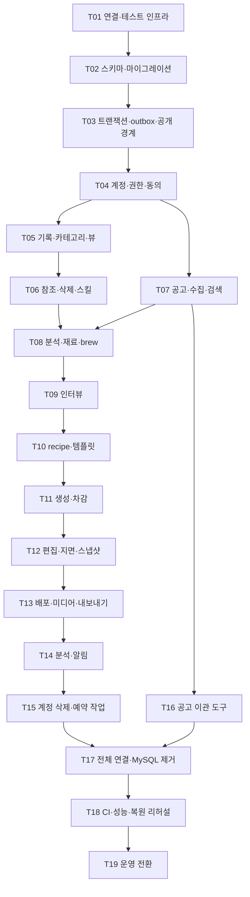
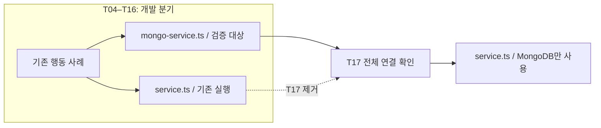

# T18 · CI·성능·백업·복원 리허설

원문: `docs/architecture/mongodb-migration-plan.md`

## 전체 제약과 공개 인터페이스

# MongoDB 백엔드 마이그레이션 구현 계획

> **For agentic workers:** REQUIRED SUB-SKILL: Use superpowers:subagent-driven-development (recommended) or superpowers:executing-plans to implement this plan task-by-task. Steps use checkbox (`- [ ]`) syntax for tracking.

**Goal:** 기존 API를 유지하면서 모든 백엔드 저장 경로를 MongoDB로 전환하고, 공고 자산의 이관과 복원을 검증합니다.

**Architecture:** 공식 MongoDB 드라이버를 사용합니다. 컬렉션과 마이그레이션은 `packages/database`가 소유하고, 도메인 모듈은 기존 공개 메서드를 유지합니다. API·Worker는 모든 도메인 전환을 확인한 뒤 한 번에 새 저장소로 연결합니다.

**Tech Stack:** Node.js 24 이상, pnpm 11, TypeScript, Zod, Fastify, MongoDB 8.0 계열 replica set, MongoDB Node.js 드라이버 7.5.0, Redis/BullMQ, Vitest입니다.

**Spec:** [승인된 설계](mongodb-migration-design.md), [74개 테이블의 컬렉션 대응표](mongodb-collection-map.md)를 함께 읽습니다.

작성일: 2026-08-28. 조사 기준은 `main`의 `c3db7e5`입니다. 이 문서는 구현 계획이며 작업 체크박스는 아직 완료하지 않았습니다.

## 공통 제약

- 이전 범위는 백엔드 전체입니다. 커리어 블록 편집기, 관계형 프로퍼티·수식·롤업의 새 기능, Yjs와 외부 MCP/API는 포함하지 않습니다.
- 공식 MongoDB Node.js 드라이버를 사용합니다. Mongoose와 SQL 호환 계층은 도입하지 않습니다.
- `packages/contracts`의 Zod 계약, UUID, 응답 형식을 유지합니다. 첫 번째 작업에서는 현재 `bodyMd` 계약을 유지합니다.
- 컬렉션·인덱스·검증 규칙·마이그레이션은 `packages/database`가 소유합니다. 서비스 시작 시 스키마를 변경하지 않습니다.
- 기존 Oracle Cloud 서버의 인증된 단일 노드 replica set으로 시작합니다. 자동 장애 전환은 제공하지 않습니다.
- Redis/BullMQ와 파일·객체 저장소를 유지합니다. 세션 토큰은 `httpOnly` 쿠키 `ex_session`에만 둡니다.
- 보존 대상은 `job_source`, `company`, `job_posting`, `job_posting_requirement`와 공고의 공통 분석 필드입니다. 사용자 데이터와 생성 결과는 초기화합니다.
- 전환 중단 시간에는 제한을 두지 않습니다. 이전 MySQL·파일·큐를 검증 전에 지우지 않습니다. Redis 전체 삭제와 운영 데이터에 대한 테스트 실행을 금지합니다.
- AI 호출은 기본 `off`를 유지합니다. 현재 모듈별 중단·폴백 동작을 변경하지 않습니다. 검증은 기존 stub을 사용하며 유료 AI를 자동 호출하지 않습니다.
- 주석은 한국어입니다. 커밋 제목은 `{tag}: {간결한 명사형 설명}`입니다. 문서는 `docs/architecture/`와 `docs/operations/`에 둡니다.
- 각 작업은 기존 테스트의 행동 검증을 보존합니다. 스키마 설정을 그대로 반복하는 테스트나 전환 후 중복되는 테스트는 남기지 않습니다.

## 실행 방식과 확인 지점

이번 전면 이전은 하나의 기능 작업입니다. 도메인별 커밋은 가능하지만 부분적으로 전환한 API를 운영에 배포하지 않습니다. 무중단 이중 쓰기, 변경 데이터 캡처, RDB로의 자동 역이관은 만들지 않습니다.



선은 선행 결과에 대한 의존입니다. 병렬 에이전트 실행을 자동으로 승인하는 그림은 아닙니다. 실제 작업 방식은 실행 전에 선택합니다.

| 확인 지점 | 필요한 증거 | 금지 사항 |
| --- | --- | --- |
| 기반: T01–T03 | replica set 트랜잭션, 마이그레이션 재실행, outbox 실패 복구 테스트 | 단위 mock 통과만으로 도메인 이전을 시작하지 않습니다. |
| 도메인: T04–T15 | 각 모듈의 기존 행동 검증과 새 동시성 검증 | 계약 변경으로 테스트를 맞추지 않습니다. |
| 통합: T16–T18 | 전체 타입 검사·테스트·부하·이관·복원 보고서 | 미완성 분기를 `main`에 합치지 않습니다. |
| 운영: T19 | 대상 서버·백업·중단 범위를 확인한 실제 전환 기록 | 계획 작성 요청을 운영 데이터 변경 승인으로 해석하지 않습니다. |

### 개발 중 두 구현의 경계

도메인을 옮기는 동안 기존 `service.ts`는 비교 기준으로 유지합니다. 새 구현은 같은 디렉터리의 `mongo-service.ts`에 작성합니다. 이는 개발 중 검증을 위한 배치이며 런타임의 이중 쓰기나 실패 시 MySQL 폴백이 아닙니다.

기존 통합 테스트 파일에 MongoDB fixture 구간을 추가합니다. 공통 검증 본문을 재사용하고, 준비·정리·직접 DB 검사만 저장소에 맞게 바꿉니다. 기존 사례를 빠짐없이 MongoDB로 옮긴 뒤 MySQL 구간을 제거합니다. T17에서 새 구현을 정식 `service.ts`로 바꾸고 이전 구현을 제거합니다. 중간 작업도 기존 실행 경로의 타입 검사와 테스트를 깨뜨리지 않아야 합니다.



## 파일과 인터페이스

경로는 저장소 루트 기준입니다. `신규`는 아직 없는 파일을 뜻합니다. 도메인 작업의 파일은 아래 작업별 목록에서 확정합니다.

| 위치 | 책임 |
| --- | --- |
| 신규 `packages/database/src/documents/*.ts` | 대응표의 영역별 저장 문서 타입입니다. 도메인별 파일명은 아래 T02에 정합니다. |
| 신규 `packages/database/src/collections.ts`, `collection-specs.ts` | 타입이 있는 컬렉션 접근과 검증 규칙·인덱스 명세입니다. |
| 신규 `packages/database/src/mongo-migrate.ts`, `mongo-migrations.ts` | 실행 이력·점유와 순서가 고정된 마이그레이션을 담당합니다. |
| 신규 `services/backend/src/platform/mongodb.ts`, `mongo-transaction.ts`, `mongo-outbox.ts` | 연결과 공통 저장 동작을 제공합니다. |
| 신규 `services/backend/test/support/mongodb.ts` | 테스트마다 격리 DB를 만들고 자신이 만든 DB만 정리합니다. |
| 신규 `infra/compose.mongodb.yaml`, `infra/mongodb/init-replica-set.js` | 개발·CI에서 검증할 MongoDB와 초기화 절차입니다. |
| 신규 `scripts/operations/migrate-mysql-to-mongodb.mjs` | 보존 데이터만 읽어 이관하는 명령입니다. |
| 신규 `scripts/operations/mongodb-import/*.mjs` | 원본 읽기, 변환, 검증, 체크포인트를 분리합니다. |

공통 타입은 T01과 T03에서 아래 이름으로 만듭니다. 이후 작업은 이름을 새로 만들지 않습니다.

```ts
// services/backend/src/platform/mongodb.ts
import type { Db, MongoClient } from "mongodb";
import type { ReadinessCheck } from "../modules/system/readiness.js";
export interface MongoContext { client: MongoClient; db: Db }
export interface MongoResource extends MongoContext {
  readinessCheck: ReadinessCheck;
  close(): Promise<void>;
}
export interface MongoResourceOptions { databaseName?: string }
// 구현 함수의 공개 서명입니다.
export declare function createMongoResource(
  uri: string, options?: MongoResourceOptions,
): MongoResource;
```

```ts
// services/backend/src/platform/mongo-transaction.ts
import type { ClientSession } from "mongodb";
import type { MongoContext } from "./mongodb.js";
export interface MongoTransaction extends MongoContext { session: ClientSession }
export declare function inTransaction<T>(
  context: MongoContext,
  action: (tx: MongoTransaction) => Promise<T>,
): Promise<T>;
```

도메인별 새 클래스의 첫 인자는 `MongoContext`입니다. 다른 생성자 인자와 공개 메서드의 인자·반환 타입은 기존 클래스를 유지합니다. 새 클래스 이름은 기존 이름 앞에 `Mongo`를 붙입니다. `JobBoardService`의 새 파일은 `jobs/mongo-board-service.ts`, 수집 서비스는 `jobs/ingest/mongo-service.ts`입니다. 나머지는 모듈 안의 `mongo-service.ts`입니다.

## 이 작업의 승인된 요구사항

## T18 · CI·성능·백업·복원 리허설

**파일:** 수정 `.github/workflows/{backend-ci,web-ci,web-deploy}.yml`, `infra/{compose,compose.server}.yaml`, `infra/README.md`, `scripts/operations/deploy.sh`, `scripts/operations/rehearse-staged-rollout.sh`, `README.md`, `AGENTS.md`, `packages/database/README.md`, `services/backend/test/{load,e2e,resilience,security}/`의 기존 테스트. 신규 `scripts/operations/backup-mongodb.sh`, `rehearse-mongodb-restore.sh`. 수정 `docs/operations/{DEPLOYMENT,BACKUP_AND_RESTORE,RECOVERY_REHEARSAL,PERFORMANCE_BUDGET,STAGED_ROLLOUT}.md`.

**입출력:** CI의 결과, 같은 데이터 규모의 성능 보고서, MongoDB·파일·큐의 복원 보고서를 생성합니다. 백업 아카이브는 서버와 분리된 승인된 저장 위치에 보관합니다.

- [ ] CI는 운영과 같은 digest·인증·replica set 초기화 절차를 사용합니다. 기존 단순 MySQL service 선언을 MongoDB 준비 명령으로 바꿉니다. 계약·database 빌드 → migrate → 타입 검사 → 테스트 → 통합 → 부하 → 빌드 순서를 유지합니다.
- [ ] Compose에서 DB는 loopback에만 노출합니다. runtime 계정은 DDL 권한이 없어야 합니다. 기존 MySQL 볼륨의 이름을 재사용하거나 `down -v`로 지우지 않습니다. MongoDB 준비와 schema migration은 API 기동 전에 수행합니다.
- [ ] 성능 테스트는 단독으로 실행합니다. 기존 read/write p95 300ms, 이벤트 150ms, 큐 등록 200ms 예산을 유지합니다. 추가로 이관 공고 전체의 필터·목록, 기록 1,000건, 큰 snapshot과 생성 완료의 실행 시간·query plan을 기록합니다. 작은 fixture 결과를 운영 규모의 보장으로 해석하지 않습니다.
- [ ] 공고 검색은 MySQL과 같은 입력 fixture·정렬·null 조건으로 응답을 비교합니다. keyset/cursor 경계에서 중복·누락을 확인합니다. 풀스캔이 남으면 대상 건수·실행 시간·이유를 보고하고 예산을 넘으면 인덱스나 집계를 수정합니다.
- [ ] DB 백업은 쓰기를 중단한 일관된 시점에 실행합니다. 파일과 Redis 상태, 배포 커밋·prefix·설정 버전을 함께 기록합니다. 비밀번호는 파일 또는 환경으로 전달하고 명령 로그·아카이브 이름에 넣지 않습니다. 스키마·인덱스와 snapshot chunks도 포함합니다.
- [ ] 별도 restore 인스턴스와 별도 prefix에 복원합니다. 원래 운영 DB·볼륨에 덮어쓰지 않습니다. 테스트 대상의 hostname·포트·DB명·볼륨 경계를 확인한 뒤 복원 스크립트를 진행합니다.
- [ ] 아래 확인 순서를 실행합니다. 생략하거나 skip된 suite는 결과와 이유를 따로 기록합니다. 기존 Windows Codex CLI 실행 실패는 별도 수정 또는 Linux 검증 결과로 해소하기 전까지 전체 테스트 통과라고 보고하지 않습니다.

```bash
pnpm --filter @expresso/contracts build
pnpm --filter @expresso/database build
pnpm db:migrate
pnpm typecheck
pnpm test
pnpm test:infra
pnpm --filter @expresso/backend test:load
pnpm build
```

- [ ] 복원 후 공고 건수·필드 해시, 신규 가입·기록·생성·배포, 재전달 작업의 중복 효과, 파일 링크와 접근 제어를 점검합니다. 원본 snapshot 삭제·부분 chunk 손상·DB 중단·재시작·queue publish 실패를 포함합니다.
- [ ] 문서의 현재 아키텍처를 이 시점에 MongoDB로 갱신합니다. 운영 전환 전에는 배포 완료라고 표시하지 않습니다. 커밋은 `ci: MongoDB 통합 검증과 복원 절차 전환`입니다.
