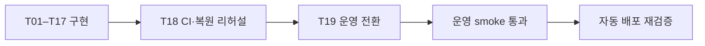
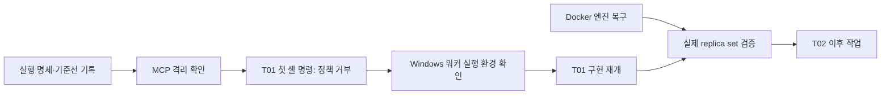

# MongoDB 구현 진행 보고서

상태: MongoDB 백엔드 이전과 T19 운영 전환을 완료했습니다. 최종 운영 결과와 복구
경계는 [운영 전환 기록](../../../docs/operations/MONGODB_CUTOVER.md)에서 확인합니다.

## 기준선

`../evidence/BASELINE.md`와 승인된 `docs/architecture/mongodb-migration-plan.md`를 기준으로 진행합니다. 기존 coordination의 제품 구현 기록은 변경하지 않습니다.

## 검증과 제한

실행 명세와 DAG 구조 검증을 통과했습니다. T01–T18의 구현·통합·복원 리허설 뒤
사용자 승인을 받아 T19를 실행했습니다. 공고 4개 영역의 원본·목적지 수가 일치했고,
운영 가입부터 공개 배포까지의 시나리오와 자동 배포 재실행이 통과했습니다.

## 2026-08-29 최초 중단 지점 (이력)

격리 워크트리와 MCP 없는 런타임을 준비했으나, 실제 작업 워커의 첫 PowerShell 프로세스 생성이 `blocked by policy`로 거부됐습니다. 앞선 두 probe는 도구 목록만 확인했으므로 셸 실행 가능 여부까지 검증한 것이 아닙니다. 권한을 넓히거나 다른 실행 경로로 우회하지 않았습니다.

Docker Desktop도 `sailor-ingest.sock` 접근 오류로 시작하지 못했습니다. 마지막 확인에서 Linux 엔진 파이프가 없었고 Docker 프로세스도 확인되지 않았습니다. 데이터 초기화는 하지 않았습니다.

증거: [실행 중단 기록](../evidence/T01-RUNTIME-BLOCKER.md). T01 체크리스트는 미완료이며 이후 작업은 배정하지 않았습니다. 운영 전환이나 제품 배포도 수행하지 않았습니다.
