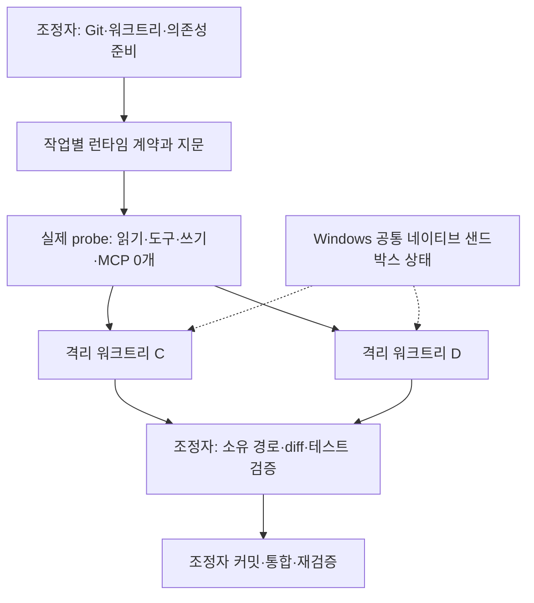

# Windows 파이프라인 실행 구조 개선

확인일: 2026-08-29 (Asia/Seoul).

**설치된 스킬의 공통 실행기를 수정했습니다.** 새 워크트리 두 개에서 실제 워커를 동시에 실행해 파일 수정·테스트·조정자 커밋·통합 후 재검증을 통과했습니다. Git 신뢰 예외나 추가 권한 변경은 하지 않았습니다. MongoDB 제품 구현과 운영 변경은 아직 수행하지 않았습니다.

## 원인과 구조 변경

| 문제 | 변경 |
| --- | --- |
| 사용자 설정 제외 시 Windows sandbox 설정도 빠져 workspace-write가 read-only로 해석됨 | 실행기가 `windows.sandbox="elevated"`를 명시하고 실제 CLI 설정 해석을 회귀 검사 |
| 일반 사용자 Python과 설치된 스킬을 제한된 OS 사용자가 읽거나 실행하지 못함 | 이미 접근 가능한 번들 런타임을 선언하고, 스킬 설치 점검과 작업별 실제 읽기·실행 검사를 분리 |
| 워커가 호스트 소유 저장소에 Git 명령을 실행해 dubious ownership 발생 | Git 검증·커밋·통합은 조정자 전담. 워커는 주어진 cwd와 `.git` 포인터 지문을 확인하고 소유 파일만 수정 |
| 워커별 CODEX_HOME을 초기화한 뒤 다른 워커에서 `CreateProcessWithLogonW: 1326` 발생 | Windows는 기존 인증 홈의 네이티브 샌드박스 상태를 공유. 설정은 `--ignore-user-config`와 명시적 기능 비활성화로 격리 |
| 모델이 PowerShell 실행 파일 경로를 인용만 하고 호출 연산자를 누락 | 실행기가 OS별 정확한 셸 표현식을 생성. 공백·따옴표·한글·셸 특수문자 회귀 검사 |
| MCP 목록 확인만으로 실행 가능하다고 판단 | v3 작업별 증명: 실제 명령 완료 이벤트, 파일 읽기, 도구 버전, 쓰기 결과까지 확인 |

Windows의 제한 계정 구조는 [공식 문서](https://learn.chatgpt.com/docs/windows/windows-sandbox)를 확인했습니다. **홈별 샌드박스 상태와 시스템 공통 계정의 충돌은 실패 순서와 비교 실행 결과에 근거한 진단**이며, Windows 계정 암호 내부를 조사하거나 변경하지 않았습니다. 별도 홈에서 A/B/R probe가 통과한 뒤 B 작업 실행이 1326으로 실패했고, 기존 홈을 공유한 C/D 동시 실행과 R 읽기 전용 실행은 통과했습니다.

## 다음 사용에도 적용되는 실행 계약

- Windows: `--runtime-home`은 `--auth-file`의 기존 정규 홈과 같아야 합니다. 작업별 홈 생성은 실행기가 거부합니다. POSIX에서는 별도 홈의 인증 참조 방식을 유지합니다.
- 설정 검사: `mcp list`에는 `--ignore-user-config`가 없어 인증이 없는 임시 설정 홈에서 목록만 조회합니다. 동일 cwd와 기능 정책을 사용하며 샌드박스 초기화는 하지 않습니다. 활성·잘못된 MCP 항목은 실행을 차단합니다.
- 실제 실행: 사용자 설정을 읽지 않고, MCP를 제공하는 기능을 끈 상태에서 네이티브 sandbox를 유지합니다. 제한 없는 워커로 전환하지 않습니다.
- 각 작업의 manifest·워크트리·HEAD·모델·sandbox·런타임·실행기 지문을 증명에 묶습니다. v1/v2 증명, 다른 작업의 증명, 변경된 실행기 증명은 재사용할 수 없습니다.
- 워커 시작에도 같은 검사기를 다시 실행합니다. 사전 검사보다 먼저 실행한 명령·파일 변경, 중복 검사, 다른 Python argv는 거부합니다. 셸 실행 결과가 없거나 검사가 실패하면 결과를 통합하지 않습니다.
- 실행 파일의 SHA-256 내용 지문과 저장된 MCP 0개 결과를 재확인합니다. 크기·수정 시각만 유지한 실행 파일 교체도 증명을 무효화합니다.
- 재시도 역시 `zero_mcp_exec.py run`으로 검증합니다. 현재 런처는 검증을 포함한 resume을 지원하지 않으므로 직접 `codex exec resume`을 호출하지 않습니다.
- 의존성 설치·인프라 준비·Git 작업은 조정자가 수행합니다. 워커는 커밋하지 않은 소유 파일 변경과 테스트 결과를 반환합니다.
- `setup_windows_runtime.ps1`은 기본적으로 점검만 합니다. 필요한 경우에만 사용자 승인 후 `-Apply`로 이 스킬 폴더의 읽기·실행 DACL을 추가합니다. 소유자·감사·상위 폴더·인증 파일은 바꾸지 않습니다.

설치 위치: `C:/Users/parkm/.codex/skills/parallel-implementation-pipeline`.

수정 파일은 `SKILL.md`, `references/worker-runtime.md`, `references/artifact-contracts.md`, `scripts/zero_mcp_exec.py`, `scripts/worker_runtime.py`, `scripts/setup_windows_runtime.ps1`, `scripts/validate_pipeline.py`, `references/review-correction.md` 및 관련 회귀 테스트입니다. 저장소 밖의 로컬 스킬 수정이며, 원본 Mac 스킬에 반영했다는 의미는 아닙니다.

## 검증 결과

| 검증 | 결과 |
| --- | --- |
| unittest discovery | 55개 통과 |
| 별도 worktree guard / MCP profile 회귀 검사 | 모두 통과 |
| Skill quick validation | 통과 |
| 설치 점검 재실행 | 누락된 RX 없음, `changed: false` |
| 새 C/D 워크트리의 workspace-write probe | 각각 MCP 0개, 실제 읽기·Python/Node/pnpm 실행·쓰기 통과 |
| C/D 동시 워커 | 각자 missing-file 실패 확인 → 소유 파일 생성 → 같은 테스트 성공 |
| 조정자 회수 | 소유 파일 하나씩만 변경, worker HEAD 유지 확인, 조정자가 커밋·cherry-pick |
| 통합 후 재검증 | `FIXTURE_PASS:C`, `FIXTURE_PASS:D`; fixture 저장소 clean |
| 별도 R 읽기 전용 probe | MCP 0개, 실제 셸·읽기·도구 검사 통과 |
| 검토 후 최종 버전 probe / 반복 실행 | C 쓰기·R 읽기 probe 통과, C 반복 실행 `FIXTURE_PASS:C` |

검증 환경: Codex `0.150.0-alpha.8`, `gpt-5.6-luna` / `xhigh`, 번들 Python `3.12.13`, Node `24.19.0`, pnpm `11.19.0`. 이번 수정의 macOS/Linux 실제 실행은 검증하지 않았습니다. 다른 CLI 버전이나 설치 환경은 동일한 사전 검증을 다시 통과해야 합니다.

Fixture 커밋 C: `c180e3a8cce036f6ea654d598ef2d155027479b8`, D: `ed7a6541c12f930d465c1035893c2c27389774ef`. 통합 HEAD: `c780a49b5b871ae321ef9ce82c5357d194a7f7ea`. 이 커밋들은 원격이 없는 임시 검증 저장소에만 있습니다.

원본 로컬 증거: `C:/code/expresso-mongodb/var/mongodb-run/runtime-shared-{C,D,R}-*.jsonl`, `runtime-shared-{C,D,R}-proof.json`, `runtime-shared-integration.json`. C/D 증명은 회수 커밋 후 HEAD가 바뀌었으므로 다음 실행에 재사용할 수 없습니다.

## 이전 복구와 승인 범위

Docker는 초기 `sailor-ingest.sock` 오류 뒤 소켓 바인딩에 성공했으나 종료됐고, 마지막 차단 상태는 엔진 미실행이었습니다. Docker Desktop 재실행 후 엔진 `29.7.2`, 기존 MySQL·Redis healthy를 확인했습니다. 볼륨·설정·데이터 초기화는 하지 않았습니다. 이 기록은 MongoDB 통합 검증을 대신하지 않습니다.

사용자가 앞서 승인한 ACL 변경은 이 스킬 폴더의 `CodexSandboxUsers` 읽기·실행 권한뿐입니다. 하위 69개 항목에서 확인했고 쓰기·삭제·권한 변경 권한은 추가하지 않았습니다. 상위 `.codex`, `skills`, `auth.json`의 보안 설명자가 유지되는 것도 확인했습니다. 이번 구조 개선에서는 추가 ACL 변경이 없었습니다.

백업: `C:/Users/parkm/.codex/skill-backups/parallel-implementation-pipeline/20260829-acl-read-execute/acl-before.json`, `20260829-runtime-contract/`.

## 구현 재개 조건

앞서 요청했던 **저장소별 Git 신뢰 예외 승인은 더 이상 필요하지 않습니다.** T01은 제품 변경 전 상태입니다. 재개할 때 새 런처 계약에 맞는 작업별 runtime spec/probe를 만들고 의존성을 준비해야 합니다. 임시 fixture의 통과를 T01 제품 통합 테스트 통과로 취급하지 않습니다. T19 운영 전환에는 별도 사용자 확인이 필요합니다.

## 재설치용 스킬 묶음

로컬 보관본: `var/mongodb-run/parallel-implementation-pipeline-runtime-v3.zip`. 인증·샌드박스 상태·캐시는 포함하지 않았고, 압축 검사 및 설치된 원본과의 바이트 비교를 통과했습니다.

SHA-256: `22f7e3e03b3bbcd6ca8018f9e3ba8a1ee91bf49addde9eb7cf782708b6b1e6de`. 파일 47개. 다른 환경에 설치할 때는 문서의 설치 점검과 작업별 probe를 다시 실행해야 합니다.

최종 증거는 `var/mongodb-run/runtime-final-{C,R}-proof.json`, `runtime-final-C-worker.jsonl`, `skill-runtime-v3-tests.log`, `runtime-v3-verification.json`에 별도로 보관했습니다. 초기 성공 증명과 최종 버전의 증명을 구분합니다.

## 독립 검토

1차 검토의 세 항목(사전 검사 순서·중복, MCP 수 재검사, 실행 파일 내용 지문)을 각각 실패하는 회귀 테스트로 재현하고 한 번의 수정으로 해결했습니다. 2차 검토는 `APPROVE`입니다. 읽기 전용 검토 워커가 추가로 시도한 테스트는 임시 디렉터리 쓰기 제한 때문에 실행하지 못했으며, 권한을 넓히지 않았습니다. 같은 회귀 테스트를 포함한 조정자 전체 테스트 55개는 통과했습니다.

검토 증거: `var/mongodb-run/runtime-shared-R-review.txt`, `runtime-final-R-review.txt`. 검토 종료 후 R 워크트리가 clean인 것도 확인했습니다.
