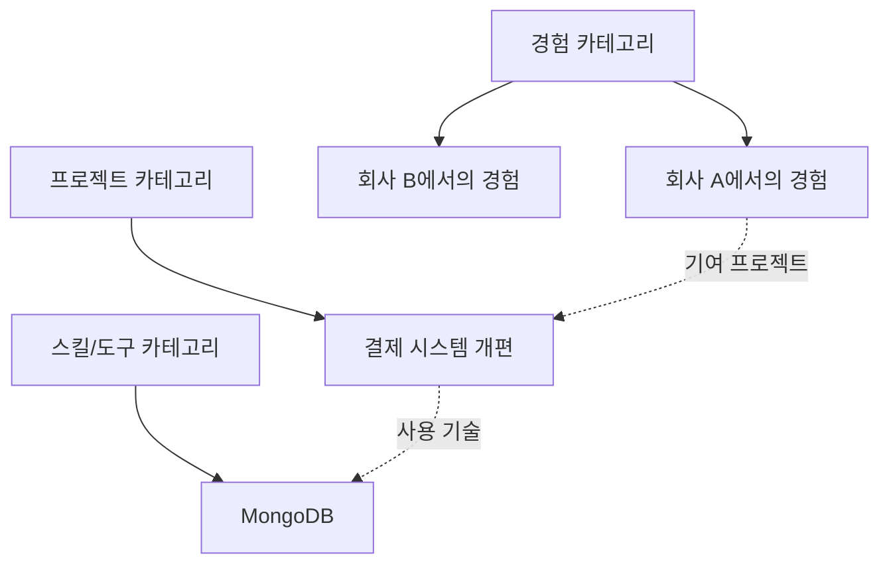
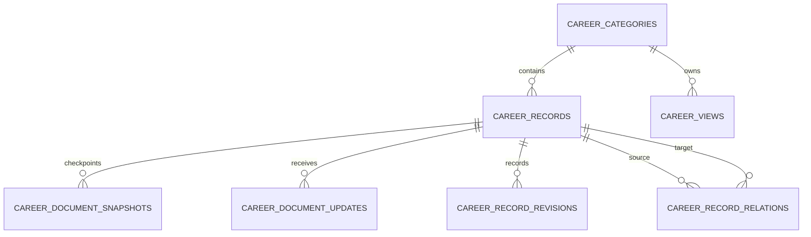
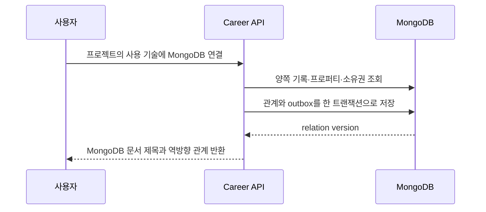
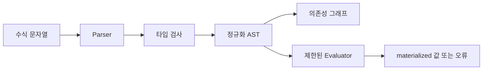
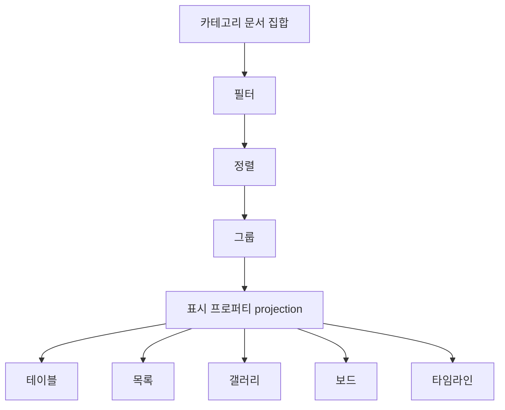
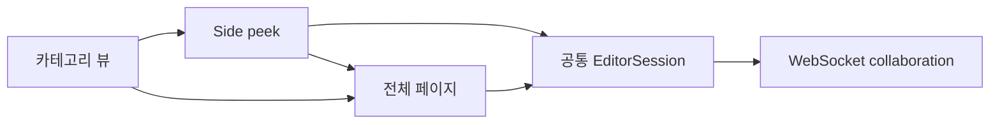
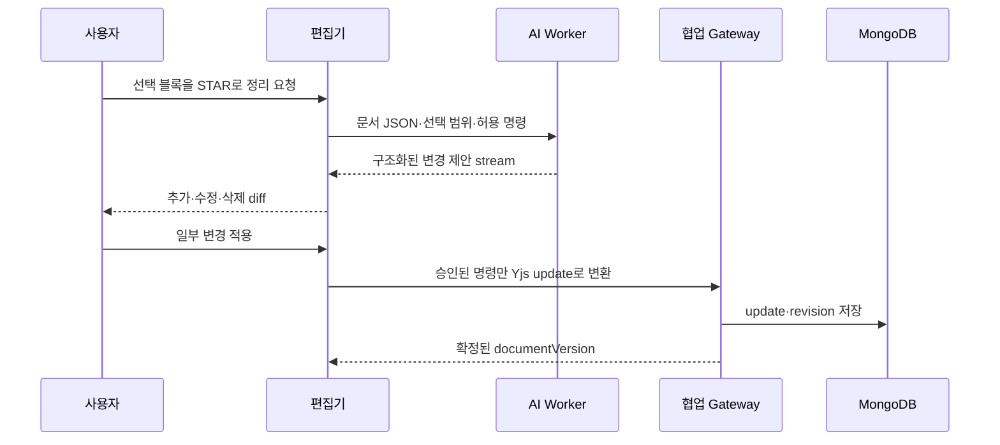
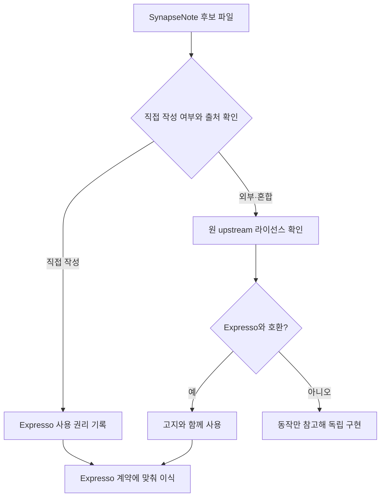
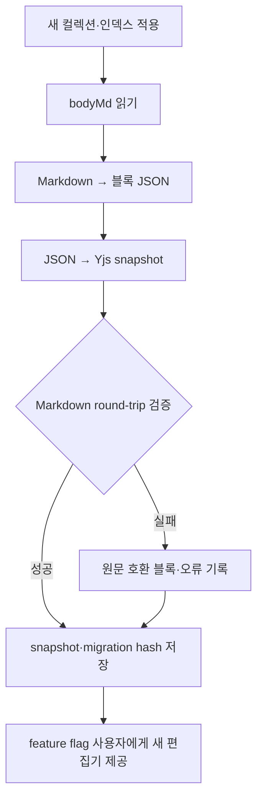

# 노션형 커리어 기록 편집기 설계

작성일: 2026-08-31  
상태: 구현 전 검토안  
기준 커밋: Expresso `753543965f9249f2927e1c617ca3ce4f5ff12515`, SynapseNote `3729f003d252b7d2817fe04a1a87b23635eb5f68`

이 문서는 MongoDB 전환 뒤 구현할 커리어 기록 편집기의 범위와 구조를 정합니다.
[MongoDB 마이그레이션 설계](mongodb-migration-design.md)는 저장소 전환을 다루고,
이 문서는 그 위에 놓이는 문서 편집, 데이터베이스 뷰, 관계·수식·롤업과 내부 AI
협업을 다룹니다.

구현은 `codex/career-record-editor` 브랜치와 격리 worktree에서 진행합니다. 전체
기능과 검증이 끝나기 전에는 `main`에 병합하지 않습니다. 이 문서가 승인되기 전에는
제품 코드를 변경하지 않습니다.

## 목적과 완료 경계

사용자는 경험, 프로젝트, 학력/이력, 스킬/도구 같은 카테고리에서 커리어 문서를
노션과 같은 방식으로 작성하고 관리합니다. 문서는 제목, 타입이 있는 프로퍼티와
블록 본문으로 구성됩니다. 카테고리는 문서를 묶는 데이터베이스이며, 하나의 문서는
한 카테고리에만 속합니다.

완료 시 다음 흐름이 하나의 제품 경험으로 동작해야 합니다.


완료 경계는 다음과 같습니다.

- 블록 본문, 프로퍼티와 저장된 뷰가 새로고침 뒤에도 같은 상태로 복원됩니다.
- 사용자와 내부 AI가 같은 문서를 편집해도 승인되지 않은 AI 변경은 저장되지 않습니다.
- 관계·수식·롤업은 순환 참조, 삭제와 동시 수정에서도 잘못된 값을 확정하지 않습니다.
- 기존 `bodyMd` 기록은 내용을 잃지 않고 새 문서로 열립니다.
- 기존 커리어 API 소비자는 호환 기간 동안 계속 동작합니다.
- 브라우저, 실제 MongoDB replica set, Worker와 운영과 같은 WebSocket 경로에서 검증합니다.

## 범위와 비범위

### 포함 범위

- 제목·프로퍼티·블록 본문으로 구성된 커리어 문서입니다.
- 경험, 프로젝트, 학력/이력, 자격/수상, 글/논문, 활동/리더십,
  스킬/도구와 사용자 정의 카테고리입니다.
- 테이블, 목록, 갤러리, 보드와 타임라인 뷰입니다.
- 프로퍼티의 생성, 이름·순서·타입 변경과 삭제 영향 확인입니다.
- 같은 카테고리와 다른 카테고리를 연결하는 관계형 프로퍼티입니다.
- 타입이 있는 수식과 관계 기반 롤업입니다.
- 사용자와 내부 AI 사이의 변경 제안, 실시간 표시, 적용과 되돌리기입니다.
- 기존 Markdown 본문의 무손실 변환과 단계적 전환입니다.
- 웹의 데스크톱·태블릿·모바일 편집 화면입니다.

### 비범위

- 여러 사용자의 실시간 공동 편집은 구현하지 않습니다.
- 커리어 기록 밖에서 임의 데이터베이스를 만드는 범용 노트 제품은 만들지 않습니다.
- 외부 MCP, 플러그인과 제3자 자동화 API는 제공하지 않습니다.
- 오프라인 우선 동기화와 장기간 오프라인 병합은 제공하지 않습니다.
- Notion 가져오기·내보내기는 포함하지 않습니다.
- 공개 커리어 문서의 공동 편집은 제공하지 않습니다.
- 모바일·데스크톱 네이티브 클라이언트 전용 편집기는 이번 범위에 포함하지 않습니다.

## 핵심 결정

| 항목 | 결정 |
| --- | --- |
| 문서 소속 | 한 문서는 한 카테고리에만 속합니다. |
| 카테고리 이동 | 대상 스키마에 맞춘 변환 미리보기를 확인한 뒤 이동할 수 있습니다. |
| 본문 원본 | 최신 JSON 스냅샷과 이후 Yjs 업데이트를 합친 상태가 원본입니다. |
| AI 전달 형식 | Yjs 바이너리가 아니라 검증된 JSON 문서와 선택 영역을 전달합니다. |
| 저장 단위 | 기록 메타데이터, 본문 스냅샷, 업데이트 이력과 관계를 분리합니다. |
| 동시 편집 | 사람 한 명과 내부 AI만 같은 세션에 참여합니다. |
| 충돌 처리 | 본문은 Yjs로 병합하고 스키마·프로퍼티·관계는 버전 조건부 변경으로 보호합니다. |
| 수식 실행 | `eval` 없이 파싱한 AST를 제한된 함수 집합으로 계산합니다. |
| 계산 결과 | 기록 문서에 materialized projection으로 저장해 뷰 조회에 사용합니다. |
| 기존 본문 | `bodyMd`를 즉시 삭제하지 않고 전환 기간의 읽기·복구 원본으로 유지합니다. |
| 출시 방식 | 기능 플래그 뒤에서 전체 검증한 뒤 한 번에 새 편집 화면으로 전환합니다. |

## 제품 정보 구조

카테고리는 노션의 데이터베이스에 해당합니다. 기록은 데이터베이스의 한 행이면서
본문을 가진 문서입니다. 문서 소속과 문서 간 관계는 구분합니다.



카테고리 이동은 문서의 소속을 바꾸는 작업입니다. 이동 전에 양쪽 프로퍼티의
이름과 타입을 비교합니다. 같은 타입은 자동 대응하고, 변환 가능한 타입은 결과를
미리 보여 줍니다. 대응하지 못한 값은 `unmappedProperties`에 보존하며 사용자가
버리기로 확인하기 전에는 삭제하지 않습니다. 본문과 관계는 이동 뒤에도 유지합니다.

## 블록 문서 모델

### 문서 표현

공개 계약은 ProseMirror와 특정 UI 라이브러리의 내부 타입을 직접 노출하지 않습니다.
`@expresso/editor`가 버전이 있는 중립 JSON 형식과 ProseMirror 변환을 소유합니다.
Web과 Backend가 이 패키지를 함께 사용합니다.

```ts
interface CareerDocument {
  schemaVersion: 1;
  type: "doc";
  content: CareerBlock[];
}

interface CareerBlock {
  id: string;
  type: CareerBlockType;
  attrs: Record<string, JsonValue>;
  content?: CareerBlock[];
  text?: readonly CareerTextSpan[];
}
```

모든 블록은 문서 안에서 바뀌지 않는 UUID를 갖습니다. AI 변경, 댓글이 아닌 내부
제안, 선택 영역과 변경 이력은 이 식별자를 사용합니다. 배열 위치를 영구 식별자로
사용하지 않습니다.

### 초기 블록 집합

| 블록 | 주요 동작 |
| --- | --- |
| 문단 | 인라인 서식, 링크, 줄바꿈을 지원합니다. |
| 제목 1–3 | 접기 없이 세 단계 제목을 지원합니다. |
| 글머리·번호 목록 | 중첩, 연속 번호와 목록 간 변환을 지원합니다. |
| 할 일 목록 | 완료 상태와 중첩을 지원합니다. |
| 인용 | 여러 문단을 포함할 수 있습니다. |
| 코드 | 언어 선택과 일반 텍스트 붙여넣기를 지원합니다. |
| 콜아웃 | 아이콘과 제한된 강조색을 지원합니다. |
| 구분선 | 내용 없이 한 블록으로 취급합니다. |
| 이미지·파일 | 기존 media 계약의 식별자를 참조합니다. |
| 표 | 행·열 추가, 삭제와 셀 탐색을 지원합니다. |
| 근거 참조 | 공고·다른 커리어 기록의 인용 범위와 출처를 보존합니다. |

슬래시 메뉴와 붙여넣기는 이 집합만 생성합니다. 알려지지 않은 미래 블록은 편집을
막지 않고 읽기 전용 호환 블록으로 표시합니다. 저장할 때 알 수 없는 원본 JSON을
삭제하지 않습니다.

### 편집 동작

- 빈 문단에서 `/`를 입력하면 블록 명령을 엽니다.
- 블록 손잡이로 이동, 복제, 변환과 삭제를 실행합니다.
- 선택 툴바에서 굵게, 기울임, 취소선, 코드와 링크를 적용합니다.
- Markdown 단축키와 HTML·Markdown 붙여넣기를 안전한 블록으로 변환합니다.
- 실행 취소는 현재 문서와 참여자에만 적용합니다.
- 자동 저장은 입력 burst가 끝난 뒤 전송하고 연결 복구 시 미확인 업데이트를 재전송합니다.
- 저장 상태는 `저장 중`, `저장됨`, `오프라인`, `충돌 확인 필요`로 구분합니다.

## 저장 모델

기존 컬렉션에 필드를 추가하고 계속 증가하는 값은 별도 컬렉션으로 분리합니다.
MongoDB의 16MB 문서 제한을 정상 문서 크기로 사용하지 않습니다.



### `career_records`

기존 제목, 카테고리, 상태, 출처와 사용자 프로퍼티를 유지합니다. 다음 필드를
추가합니다.

- `documentSchemaVersion`: 블록 문서 스키마 버전입니다.
- `documentVersion`: 서버가 확정한 본문 버전입니다.
- `latestSnapshotId`: 최신 완전 스냅샷입니다.
- `computedProperties`: 수식·롤업의 materialized 값과 계산 버전입니다.
- `unmappedProperties`: 카테고리 이동 중 보존한 미대응 값입니다.
- `editorMigratedAt`: `bodyMd` 변환이 검증된 시각입니다.

### `career_document_snapshots`

한 시점의 완전한 JSON 문서와 Yjs state vector를 저장합니다. `userId`, `recordId`,
`documentVersion`, `schemaVersion`, `content`, `stateVector`, `createdAt`과 생성 원인을
가집니다. 수동 복원 지점, migration, AI 변경 적용과 compaction에서 생성합니다.

### `career_document_updates`

스냅샷 이후의 Yjs update를 순서대로 저장합니다. `recordId + sequence`를 고유하게
만들고 update의 hash와 참여자 `user | ai | migration`을 기록합니다. 확인된 업데이트만
버전 증가에 포함합니다. 새 스냅샷이 충분히 오래 유지되고 백업된 뒤 이전 업데이트를
정리합니다.

### `career_record_revisions`

사용자가 이해할 수 있는 변경 이력입니다. 전체 Yjs update를 UI에 노출하지 않습니다.
제목·프로퍼티·블록 변경의 요약, actor, AI 제안 ID, 적용 전후 문서 버전과 복원
스냅샷을 기록합니다.

### `career_record_relations`

관계의 원본은 별도 문서입니다. `sourceRecordId`, `sourcePropertyId`,
`targetRecordId`, `inversePropertyId`, `createdBy`를 저장합니다. 관계 배열을 양쪽
기록에 중복 저장하지 않습니다. 뷰 응답에는 필요한 식별자와 제목을 projection으로
제공합니다.

## 프로퍼티 모델

프로퍼티는 표시 이름과 별개인 UUID를 갖습니다. 이름 변경으로 수식, 필터와 관계가
깨지지 않게 모든 내부 참조는 프로퍼티 ID를 사용합니다.

| 종류 | 저장 값 | 주요 검증 |
| --- | --- | --- |
| 제목 | 기록의 `title` | 카테고리마다 하나만 존재합니다. |
| 텍스트 | 문자열 | 길이 제한과 정규화를 적용합니다. |
| 숫자 | 숫자 | 유한값과 표시 형식을 확인합니다. |
| 단일 선택 | option ID 하나 | 정의된 option만 허용합니다. |
| 다중 선택 | option ID 배열 | 중복과 사라진 option을 처리합니다. |
| 날짜·기간 | 시작·종료·시간대 | 종료가 시작보다 빠르지 않아야 합니다. |
| 체크박스 | boolean | 세 번째 상태를 허용하지 않습니다. |
| URL·이메일·전화 | 문자열 | 표시와 안전한 링크 생성을 분리합니다. |
| 파일·미디어 | media ID 배열 | 소유권과 업로드 상태를 확인합니다. |
| 관계 | 별도 관계 문서 | 대상 카테고리와 소유권을 확인합니다. |
| 수식 | source + AST | 결과는 읽기 전용입니다. |
| 롤업 | 관계·대상·집계 설정 | 결과는 읽기 전용입니다. |
| 생성·수정 정보 | 서버 값 | 사용자가 덮어쓸 수 없습니다. |

프로퍼티 삭제 API는 사용 중인 기록 수, 수식·롤업 의존성, 저장된 뷰와 관계를 먼저
반환합니다. 사용자가 영향 범위를 확인한 뒤에만 삭제합니다. 삭제한 정의와 값을
복구 기간 동안 tombstone으로 보존합니다.

## 관계형 프로퍼티

관계는 같은 사용자 소유의 현재 기록만 연결합니다. 단일 관계와 복수 관계를
지원합니다. 양방향 관계를 고르면 대상 카테고리에 역방향 프로퍼티를 만들며 두
정의를 같은 트랜잭션으로 확정합니다.



관계 생성과 기록 삭제가 경쟁할 때 둘 중 하나만 성공해야 합니다. 삭제 영향에는
정방향·역방향 관계, 롤업 의존성과 포트폴리오 사용처가 포함됩니다. 휴지통 기록의
관계는 계산과 선택 결과에서 제외하지만 복원 전까지 삭제하지 않습니다.

## 수식과 롤업

SynapseNote의 직접 작성 코드에서 수식 parser, 타입 검사, evaluator, dependency graph,
rollup 정의와 conformance fixture를 이식합니다. Expresso 계약과 식별자에 맞게
변경하며 SynapseNote 런타임이나 파일 저장 구조에는 의존하지 않습니다.

### 수식 처리



- 문자열, 숫자, boolean, 날짜, 목록과 문서 참조를 지원합니다.
- 프로퍼티 참조, 조건식, 산술·비교·문자열·날짜 함수와 목록 함수를 제공합니다.
- 정의되지 않은 함수와 타입이 맞지 않는 연산은 저장 전에 거절합니다.
- `eval`, 동적 import, 네트워크, 파일과 현재 시스템 시각을 직접 사용하지 않습니다.
- 결과가 사용자 권한 밖의 관계 문서를 통해 새어 나오지 않게 해석 과정마다 소유권을
  유지합니다.
- 오류는 코드, 메시지와 수식 안의 위치를 저장해 편집기에서 표시합니다.

### 롤업 처리

관계 프로퍼티, 대상 프로퍼티와 집계 함수를 명시합니다. `count`, `unique_count`,
`sum`, `average`, `min`, `max`, `earliest`, `latest`, `percent_checked`, `show_unique`를
지원합니다. 대상 값 타입과 맞지 않는 집계는 정의 단계에서 거절합니다.

원본 값이 바뀌면 의존성 그래프에서 영향을 받는 현재 기록은 요청 안에서 계산하고,
관계를 따라 여러 기록으로 퍼지는 계산은 outbox와 Worker가 처리합니다. 모든 계산은
입력 버전을 기록합니다. 오래된 Worker 결과는 더 최신 버전을 덮지 못합니다.

## 저장된 뷰

뷰는 카테고리의 문서를 보는 projection입니다. 문서를 다른 컬렉션에 복사하지
않습니다. 각 뷰는 다음을 저장합니다.

- 이름, 종류와 순서입니다.
- 필터 tree와 다중 정렬입니다.
- 그룹 프로퍼티와 그룹 순서입니다.
- 표시 프로퍼티, 프로퍼티 순서와 열 너비입니다.
- 갤러리 카드의 표지와 표시 프로퍼티입니다.
- 보드의 숨긴 그룹과 카드 순서입니다.
- 타임라인의 시작·종료 프로퍼티와 축 범위입니다.



현재 [CareerBrowser](<../../services/web/src/app/(app)/career/[categorySlug]/CareerBrowser.tsx>)의
표시 전용 버튼을 실제 뷰 CRUD와 연결합니다. 셀 직접 편집, 행 생성, 다중 선택과
일괄 변경은 같은 mutation gateway를 사용합니다. 낙관적 UI가 실패하면 서버의 최신
값으로 해당 셀만 되돌리고 전체 화면을 비우지 않습니다.

## 편집 화면

문서는 데이터베이스 행, 오른쪽 미리보기와 전체 페이지에서 같은 편집기를 사용합니다.
세 화면이 별도 상태를 만들지 않고 하나의 editor session을 공유합니다.



넓은 화면에서는 목록과 side peek를 함께 보여 줍니다. 좁은 화면에서는 문서를 전면
sheet로 엽니다. 제목과 프로퍼티는 본문 위에 놓고, 숨길 수 있지만 별도 설정 화면으로
보내지 않습니다. 키보드만으로 문서 생성, 셀 편집, 블록 이동과 메뉴 닫기가 가능해야
합니다.

## 사용자와 AI의 편집 협업

AI는 사용자의 명시적 요청에만 현재 문서 세션에 참여합니다. 사용자의 타이핑을
그대로 덮지 않습니다. AI 결과는 먼저 변경 제안으로 생성하고, 사용자가 자동 적용을
명시한 범위에서만 같은 세션에 update를 보냅니다.



AI 입력에는 현재 문서 JSON, 선택한 블록, 필요한 관계 문서의 허용된 projection,
프로퍼티 정의와 사용자가 요청한 작업만 포함합니다. 전체 계정 데이터를 기본으로
전달하지 않습니다.

AI 출력은 자유로운 MongoDB update나 JSON Patch가 아닙니다. 다음 명령만 허용합니다.

- 블록 추가·수정·이동·삭제입니다.
- 인라인 텍스트와 서식 변경입니다.
- 사용자 프로퍼티 값 변경입니다.
- 관계 추가·삭제 제안입니다.
- 제목과 상태 변경입니다.

각 명령은 대상 블록·프로퍼티의 기존 값을 포함합니다. 기준 상태가 바뀌었으면 해당
명령만 충돌로 표시하고 나머지 제안은 검토할 수 있습니다. 적용한 AI 변경은 actor,
model, 요청 ID, 근거와 이전·이후 버전을 기록합니다. 사용자는 한 번의 작업 단위로
되돌릴 수 있습니다.

## 패키지와 모듈 경계

| 위치 | 책임 |
| --- | --- |
| 신규 `packages/editor` | 문서 JSON, 블록 schema, 변환, 편집 명령, AI 명령 검증과 Yjs adapter를 제공합니다. |
| `packages/contracts` | API·WebSocket 메시지, 프로퍼티, 뷰, 수식·롤업과 migration 계약을 제공합니다. |
| `packages/database` | 새 컬렉션 문서, validator, index와 migration을 소유합니다. |
| `services/backend/src/modules/career` | 소유권, 문서 bootstrap, 프로퍼티·관계·뷰 mutation과 이동을 담당합니다. |
| 신규 `services/backend/src/modules/career-editor` | WebSocket 세션, update 저장·compaction과 AI 제안 적용을 담당합니다. |
| `services/backend/src/worker` | 수식·롤업 fanout, snapshot compaction과 AI 제안을 처리합니다. |
| 신규 `services/web/src/features/career-editor` | Tiptap UI, 프로퍼티 편집기, 뷰와 AI diff UI를 제공합니다. |

`packages/editor`에는 React와 Expresso 도메인 화면을 넣지 않습니다. Web UI는 문서
명령과 계약을 소비합니다. Backend는 편집기 UI 파일을 import하지 않고 같은 문서
schema와 명령 검증만 사용합니다.

## API와 실시간 연결

기존 기록 API는 호환 기간 동안 유지합니다. 새 API는 기존 `/career` 경계 아래에
추가합니다.

| 기능 | 인터페이스 |
| --- | --- |
| 편집 bootstrap | 기록, 카테고리, 프로퍼티, 최신 JSON 문서와 session 정보를 반환합니다. |
| 본문 실시간 편집 | 인증된 WebSocket에서 Yjs sync와 저장 확인을 주고받습니다. |
| 프로퍼티 mutation | `If-Match`와 idempotency key를 사용합니다. |
| 관계 mutation | 관계 버전과 양쪽 소유권을 검증합니다. |
| 카테고리 이동 | preview와 commit을 별도 요청으로 제공합니다. |
| 수식 편집 | parse·typecheck·preview 결과를 저장 전에 반환합니다. |
| 뷰 관리 | 생성, 이름·설정·순서 변경, 복제와 삭제를 제공합니다. |
| AI 편집 | 제안 생성 stream, 제안 조회, 부분 적용과 거절을 제공합니다. |

WebSocket은 기존 `ex_session` httpOnly 쿠키로 인증합니다. 연결 뒤에도 모든 메시지의
record 소유권과 session nonce를 확인합니다. Origin을 고정하고 메시지 크기, 빈도,
한 문서의 동시 연결 수를 제한합니다. 연결이 끊겨도 REST bootstrap만으로 최신 확정
상태를 읽을 수 있어야 합니다.

## 동시성·오류 처리

| 상황 | 처리 |
| --- | --- |
| 사람의 동시 본문 입력 | Yjs update를 병합하고 서버 sequence를 부여합니다. |
| AI와 사람의 같은 블록 편집 | 기준 값이 달라진 AI 명령만 충돌로 남깁니다. |
| 프로퍼티 정의 동시 변경 | category version이 맞는 요청 하나만 성공합니다. |
| 관계 생성과 기록 삭제 경쟁 | 같은 트랜잭션과 reference version으로 둘 중 하나를 거절합니다. |
| 오래된 수식 Worker 결과 | 입력 버전 조건이 맞지 않으면 저장하지 않습니다. |
| WebSocket 재연결 | state vector 이후 update만 재전송하고 중복 hash는 무시합니다. |
| snapshot 중단 | 기존 snapshot과 update log를 원본으로 유지하고 다시 시도합니다. |
| 알 수 없는 블록 | 읽기 전용 호환 블록으로 보존하고 저장 시 원본을 유지합니다. |

문서 업데이트, revision과 필요한 outbox는 트랜잭션으로 확정합니다. AI 호출,
WebSocket 전송과 파일 업로드는 트랜잭션 안에서 실행하지 않습니다. 사용자에게
성공을 반환하기 전에 update가 MongoDB에 저장됐는지 확인합니다.

## 보안과 자원 제한

- 모든 기록·관계·뷰 조회 조건에 `userId`를 포함합니다.
- AI에 전달할 문서는 계약으로 projection하고 비밀 필드를 포함하지 않습니다.
- 붙여넣기 HTML, 링크와 embed URL을 allowlist 기반으로 정리합니다.
- 수식 parser의 깊이, AST node 수, 실행 step과 결과 크기를 제한합니다.
- 관계 traversal 깊이와 롤업 대상 수를 제한해 순환과 과도한 fanout을 막습니다.
- 문서, 단일 update, snapshot, 이미지와 파일 크기에 명시적 제한을 둡니다.
- WebSocket 메시지는 Zod 계약과 binary envelope를 검증합니다.
- AI 제안에는 서버가 만든 proposal ID와 만료 시각을 부여합니다.
- 감사 로그에는 문서 내용을 복제하지 않고 actor, 범위, 결과와 식별자만 기록합니다.

## SynapseNote 이식 원칙

SynapseNote는 GPL-3.0-or-later 저장소입니다. 저장소 소유권과 개별 파일의 저작권은
같은 문제가 아닙니다. 직접 작성한 데이터베이스 코드는 권리자가 Expresso에서
사용할 수 있는 별도 라이선스를 명시한 뒤 이식합니다. 외부에서 가져온 편집기
구현은 GPL 코드를 그대로 복사하지 않습니다.



이식 후보는 다음과 같습니다.

- 직접 작성한 `packages/core/src/database`의 schema, relation, formula, rollup과
  dependency graph입니다.
- Tiptap 확장 목록, 키보드 동작과 테스트 사례는 행동 기준으로 사용합니다.
- database view의 상태 경계와 cell editor 구성은 구조를 참고합니다.
- Yjs update, provider pool과 undo isolation의 실패 사례를 회귀 테스트로 재작성합니다.

이식하지 않는 것은 SynapseNote의 파일·Git 저장, desktop shell, MCP 서버, 범용 노트
탐색, 로컬 collaboration server와 디자인 토큰입니다. Expresso의 API, MongoDB,
세션과 디자인 시스템을 사용합니다. 새 의존성이 생기면 lockfile과 제3자 고지를
함께 갱신합니다.

## 기존 기록 전환

새 MongoDB migration은 additive 변경만 수행합니다. `bodyMd`를 migration 프로세스
안에서 대량 변환하지 않습니다. 변환기는 재실행 가능하고 기록별 checkpoint를
남깁니다.



변환 검증은 제목·목록·링크·코드·표·다국어·빈 문서와 200KB 경계 사례를 포함합니다.
원본 `bodyMd`, 변환된 JSON과 정규화한 Markdown의 hash를 기록합니다. 변환 실패는
해당 기록의 새 편집기 사용을 막지 않고 원문 호환 블록으로 엽니다. 사용자가 새
편집기에서 저장하기 전까지 `bodyMd`가 복구 기준입니다.

전환 뒤 기존 API가 `bodyMd`를 요청하면 최신 JSON 문서를 Markdown으로 직렬화해
반환합니다. 새 편집기에서 표현할 수 있지만 Markdown에 없는 정보는 별도 필드의
원본을 유지합니다. `bodyMd` 필드 제거는 운영 안정화 뒤 별도 작업으로 진행합니다.

## 기능 플래그와 출시

`CAREER_EDITOR_V2_ENABLED` 서버 플래그와 사용자별 rollout 결정을 사용합니다.
브랜치 내부 개발 단계에서는 운영 플래그를 변경하지 않습니다.

1. 새 컬렉션과 호환 API를 배포하되 기존 화면을 유지합니다.
2. 내부 검증 계정에서 문서 변환, 편집과 AI 협업을 검증합니다.
3. 기존 기록 전체를 backfill하고 불일치 0건을 확인합니다.
4. 검증 사용자의 새 편집기를 활성화합니다.
5. 브라우저·모바일 화면과 Worker 지연을 확인합니다.
6. 전체 사용자에게 새 편집기를 활성화합니다.
7. 안정화 기간 뒤 기존 쓰기 경로를 닫습니다.

새 편집기 활성화 전에 실패하면 feature flag를 끄고 기존 `bodyMd` 화면으로 돌아갑니다.
새 편집기에서 쓰기가 시작된 뒤에는 플래그만 내려 새 내용을 버리지 않습니다. 먼저
새 문서를 Markdown으로 projection하고 호환 경로에서 읽을 수 있는지 검증합니다.

## 성능 기준

운영과 같은 단일 노드 MongoDB replica set과 일반 사용자 네트워크에서 측정합니다.

| 항목 | 기준 |
| --- | ---: |
| 200KB 문서 bootstrap API p95 | 300ms 이하 |
| 100개 기록 뷰 API p95 | 300ms 이하 |
| 로컬 키 입력 처리 p95 | 50ms 이하 |
| 자동 저장 확인 p95 | 500ms 이하 |
| side peek 첫 편집 가능 시점 p75 | 1.5초 이하 |
| 관계 한 단계 롤업 100건 재계산 p95 | 1초 이하 |
| 1MB 문서 snapshot 생성 | 2초 이하 |

문서 본문과 100개 행을 한 번에 모두 React node로 유지하지 않습니다. 긴 문서와
테이블은 필요한 범위만 렌더링합니다. 계산 fanout과 snapshot compaction은 Worker
queue를 분리하고 사용자 입력 저장보다 낮은 우선순위로 실행합니다.

## 검증 전략

### 계약과 편집기 코어

- 모든 블록과 인라인 mark의 parse·serialize round-trip을 검증합니다.
- 알 수 없는 블록과 속성을 보존하는지 검증합니다.
- Markdown 변환의 property-based test와 고정 corpus를 실행합니다.
- AI 명령의 허용·거절, 부분 충돌과 idempotency를 검증합니다.
- SynapseNote formula conformance fixture를 Expresso 타입으로 옮겨 같은 결과를 확인합니다.

### 실제 MongoDB 통합

- snapshot과 update가 중간 실패 뒤 복구되는지 확인합니다.
- 같은 update 재전송이 버전을 두 번 올리지 않는지 확인합니다.
- 관계 생성·삭제, 기록 삭제·복원의 경쟁 조건을 실제 트랜잭션으로 검증합니다.
- 순환 수식·롤업, 오래된 Worker 결과와 대량 fanout을 검증합니다.
- 카테고리 이동 preview와 commit 사이의 스키마 변경을 거절하는지 확인합니다.

### Web과 접근성

- Tiptap DOM 테스트로 입력, 선택, 붙여넣기, slash menu와 undo를 확인합니다.
- 다섯 뷰의 셀 편집, 필터·정렬·그룹과 새로고침 복원을 확인합니다.
- side peek와 전체 페이지가 같은 session을 사용하는지 확인합니다.
- 키보드만으로 모든 편집 흐름을 완료하고 focus가 메뉴 뒤 원래 위치로 돌아오는지
  확인합니다.
- 375px, 768px, 1280px와 1440px에서 시각 회귀를 확인합니다.

### AI 협업

- 실제 AI를 자동으로 호출하지 않는 deterministic adapter로 제안·적용을 검증합니다.
- opt-in live test에서 streaming, 사용 중 직접 편집과 취소를 확인합니다.
- AI가 허용하지 않은 블록·프로퍼티·다른 사용자 기록을 변경하지 못하는지 확인합니다.
- 적용한 제안의 diff, revision과 undo 결과가 일치하는지 확인합니다.

### 전환과 복구

- 기존 `bodyMd` corpus를 변환하고 의미가 같은 Markdown으로 되돌릴 수 있는지 확인합니다.
- 같은 backfill을 두 번 실행해 snapshot이 중복되지 않는지 확인합니다.
- 기존 화면, 새 화면과 기존 API의 호환 기간을 함께 검증합니다.
- 백업에서 document snapshot, update, 관계와 계산 결과를 별도 MongoDB로 복원합니다.

## 완료 기준

- 이 문서의 포함 범위가 모두 코드와 테스트에 대응합니다.
- 현재 표시 전용인 새 문서·뷰·필터·정렬·속성·AI 버튼이 실제 동작합니다.
- 기존 기록 변환 보고서의 유실·불일치가 0건입니다.
- 모든 MongoDB migration을 빈 DB와 현재 운영 백업 복제본에서 재실행합니다.
- `pnpm typecheck`, `pnpm test`, `pnpm test:infra`와 production build가 통과합니다.
- 편집기 접근성, 브라우저 E2E, 성능 예산과 복원 리허설이 통과합니다.
- SynapseNote 이식 파일의 출처와 사용 권리를 저장소에 기록합니다.
- 별도 브랜치의 최종 결과를 사용자가 확인한 뒤에만 `main`에 병합합니다.
- 운영 기능 플래그와 migration 실행은 병합 승인과 구분해 다시 확인합니다.

## 후속 문서

이 설계가 승인되면 별도의 구현 계획에서 패키지와 파일별 작업, 계약 동결 순서,
테스트 명령, 병렬화 경계와 통합 순서를 작성합니다. 구현 계획은 이 문서의 범위를
늘리지 않으며, 새 요구사항은 이 설계를 먼저 변경한 뒤 반영합니다.
