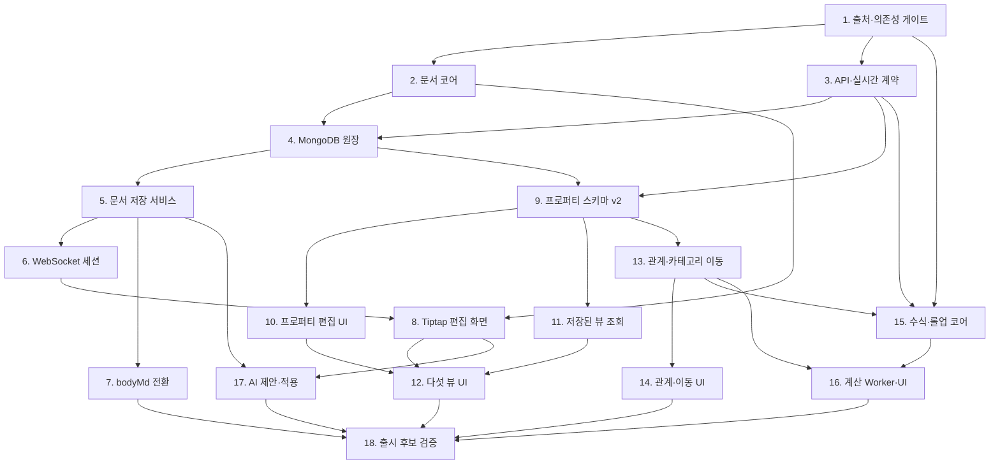

# 노션형 커리어 기록 편집기 Implementation Plan

> **For agentic workers:** REQUIRED SUB-SKILL: Use superpowers:subagent-driven-development (recommended) or superpowers:executing-plans to implement this plan task-by-task. Steps use checkbox (`- [ ]`) syntax for tracking.

**Goal:** 제목, 타입이 있는 프로퍼티, 블록 본문, 저장된 뷰, 관계·수식·롤업과 검토 가능한 AI 변경 제안을 한 카테고리 소속의 커리어 문서 경험으로 구현합니다.

**Architecture:** `@expresso/editor`가 버전이 있는 중립 JSON 문서와 순수 편집 명령을 소유하고, `@expresso/contracts`가 HTTP·WebSocket 계약을 소유합니다. Backend는 MongoDB 스냅샷과 Yjs update를 원장으로 관리하고 메타데이터 변경은 조건부 버전으로 보호하며, Web은 Tiptap을 같은 문서 세션에 연결합니다. 기능 플래그 안에서 기존 `bodyMd` API를 유지한 채 전환하고, 별도 브랜치의 전체 검증과 사용자 확인 뒤에만 `main`에 병합합니다.

**Tech Stack:** Node.js 24+, pnpm 11, TypeScript 7, Zod 4, Fastify 5, MongoDB 7 replica set, BullMQ 6, Next.js 16, React 19, Tiptap 3, ProseMirror, Yjs 13, Vitest 4, Playwright

**Spec:** [`docs/architecture/career-record-editor-design.md`](career-record-editor-design.md)

## Global Constraints

- 한 기록은 정확히 한 카테고리에 속하며 관계는 소속과 별도로 저장합니다.
- 본문 원본은 최신 JSON 스냅샷과 그 뒤의 Yjs update를 합친 상태입니다. `bodyMd`는 호환·복구 원본으로 유지합니다.
- 사용자와 내부 AI만 한 세션에 참여합니다. 여러 사용자의 공동 편집, 오프라인 우선 병합, 외부 MCP·플러그인 API는 범위에 넣지 않습니다.
- API와 WebSocket payload는 `packages/contracts`의 Zod 스키마에서 파생하며, Web은 수신값을 반드시 파싱합니다.
- 제품에서 사용하는 문서 JSON은 ProseMirror·Tiptap 내부 타입을 외부 계약으로 노출하지 않습니다.
- 프로퍼티와 관계 변경은 `If-Match` 또는 동등한 `expectedVersion` 조건을 요구합니다. 오래된 쓰기는 `409 VERSION_CONFLICT`로 거절합니다.
- 문서·update·첨부 입력에 설계의 크기·개수 제한을 적용하고, 소유권 검사를 통과하기 전에는 내용을 읽거나 수정하지 않습니다.
- 수식은 `eval`, `Function` 생성자와 동적 모듈 실행 없이 AST와 허용 함수만 계산합니다.
- SynapseNote 코드는 기준 커밋 `3729f003d252b7d2817fe04a1a87b23635eb5f68`에서 출처와 작성 권리를 확인한 파일만 이식합니다. GPL 편집기 코드는 동작 참고 뒤 새로 작성합니다.
- 색과 크기는 `services/web/src/styles/tokens.css`의 `--ex-*` 변수만 사용합니다.
- `CAREER_EDITOR_V2_ENABLED=false`가 기본이며, 운영 활성화와 `main` 병합은 각각 별도 승인 단계입니다.
- 성능 예산은 200KB bootstrap p95 300ms, 100개 기록 뷰 p95 300ms, 키 입력 p95 50ms, autosave ack p95 500ms, side peek 첫 편집 가능 p75 1.5s, 관계 rollup 100개 p95 1s, 1MB snapshot p95 2s입니다.
- 모든 구현 작업은 실패 테스트 확인 → 최소 구현 → 집중 테스트 → 관련 패키지 테스트 → 명사형 한국어 커밋 순서로 끝냅니다.
- 현재 요청에 따라 실행은 이 세션에서 `superpowers:executing-plans` 방식으로 진행하며, 작업 단위별 검토 지점을 유지합니다.

---

## 구현 지도



병렬 구현은 같은 마일스톤 안에서 쓰기 대상이 겹치지 않을 때만 허용합니다. Task 2와 3, Task 10과 11, Task 14와 15는 각각 선행 계약이 고정된 뒤 병렬로 진행할 수 있습니다. `packages/contracts/src/career.ts`, `services/backend/src/modules/career/routes.ts`, lockfile과 MongoDB migration registry는 한 작업자만 수정합니다.

## 파일 책임

| 경계 | 새 파일 또는 주 수정 파일 | 책임 |
| --- | --- | --- |
| 문서 코어 | `packages/editor/src/document.ts`, `commands.ts`, `markdown.ts`, `yjs.ts` | 중립 JSON, 검증, 명령 적용, Markdown 왕복, Yjs 변환 |
| 공용 계약 | `packages/contracts/src/career-editor.ts`, `career-properties.ts`, `career-views.ts`, `career-ai.ts` | HTTP·WebSocket 요청과 응답, 오류 코드 |
| MongoDB | `packages/database/src/documents/career-editor.ts`, `mongodb-migrations/0005/migration.ts` | 네 컬렉션, 인덱스, validator, 안정적인 property UUID |
| 본문 Backend | `services/backend/src/modules/career-editor/*` | bootstrap, update 중복 제거, snapshot, revision, WebSocket |
| 메타 Backend | `services/backend/src/modules/career/*` | 프로퍼티, 뷰, 관계, 카테고리 이동과 목록 query |
| 계산 | `services/backend/src/modules/career-computation/*`, `worker/processors/career-computation.ts` | 수식 AST, 의존성 그래프, rollup, materialized 결과 |
| Web 편집기 | `services/web/src/features/career-editor/editor/*`, `session/*` | Tiptap, Yjs 세션, 저장 상태, slash menu, side peek |
| Web 데이터베이스 | `services/web/src/features/career-editor/properties/*`, `views/*` | 타입별 셀, 저장된 다섯 뷰, 필터·정렬·그룹 |
| 전환·검증 | `scripts/operations/backfill-career-documents.mjs`, `services/web/e2e/career-editor.spec.ts` | idempotent backfill, E2E, 성능·복원 증거 |

## 마일스톤 1 — 출처, 문서 모델과 계약

### Task 1: SynapseNote 출처 기록과 패키지 경계 고정

**Files:**
- Create: `docs/architecture/career-editor-source-provenance.md`
- Create: `packages/editor/package.json`
- Create: `packages/editor/tsconfig.json`
- Create: `packages/editor/tsconfig.build.json`
- Create: `packages/editor/src/index.ts`
- Modify: `pnpm-lock.yaml`

**Interfaces:**
- Consumes: SynapseNote commit `3729f003d252b7d2817fe04a1a87b23635eb5f68` and Expresso package conventions.
- Produces: workspace package `@expresso/editor` and a file-by-file provenance decision of `owned-port`, `behavioral-reference`, or `excluded`.

```ts
// packages/editor/src/index.ts
export const PACKAGE_BOUNDARY = "@expresso/editor" as const;
```

- [ ] **Step 1: Write the provenance document before copying source.** Record commit, original path, destination path, original author, evidence of the user's authorship, license decision, and intended modifications for `database/schema.ts`, `relation.ts`, `rollup.ts`, and every `formula*.ts`; classify all `packages/app/src/editor/*` files as `behavioral-reference`.
- [ ] **Step 2: Add a package export smoke test.** Create `packages/editor/src/index.test.ts` with `expect(PACKAGE_BOUNDARY).toBe("@expresso/editor")`; run `pnpm --filter @expresso/editor test` and confirm it fails because the package does not exist.
- [ ] **Step 3: Create the package manifests and export.** Export `export const PACKAGE_BOUNDARY = "@expresso/editor" as const;`, add `build`, `typecheck`, and `test` scripts matching `@expresso/contracts`, and add only Zod as the initial runtime dependency.
- [ ] **Step 4: Install and verify the isolated package.** Run `pnpm install`, `pnpm --filter @expresso/editor typecheck`, `pnpm --filter @expresso/editor test`, and `pnpm --filter @expresso/editor build`; expect all commands to pass.
- [ ] **Step 5: Commit.** Run `git add docs/architecture/career-editor-source-provenance.md packages/editor pnpm-lock.yaml && git commit -m "chore: 커리어 편집기 패키지 경계와 출처 기록"`.

### Task 2: 중립 블록 문서와 순수 편집 명령

**Files:**
- Create: `packages/editor/src/document.ts`
- Create: `packages/editor/src/commands.ts`
- Create: `packages/editor/src/markdown.ts`
- Create: `packages/editor/src/yjs.ts`
- Create: `packages/editor/src/document.test.ts`
- Create: `packages/editor/src/commands.test.ts`
- Create: `packages/editor/src/markdown.test.ts`
- Modify: `packages/editor/src/index.ts`
- Modify: `packages/editor/package.json`

**Interfaces:**
- Consumes: Zod and opaque media/evidence identifiers.
- Produces: `CareerDocumentSchema`, `parseCareerDocument(input): CareerDocument`, `createEmptyCareerDocument(): CareerDocument`, `applyCareerCommands(document, commands): CareerDocument`, `markdownToCareerDocument(markdown): CareerDocument`, `careerDocumentToMarkdown(document): string`, `encodeDocumentAsYUpdate(document): Uint8Array`, and `decodeYDocument(update): CareerDocument`.

```ts
export interface CareerDocument {
  schemaVersion: 1;
  type: "doc";
  content: CareerBlock[];
}
export function applyCareerCommands(
  document: CareerDocument,
  commands: readonly CareerEditCommand[],
): CareerDocument;
```

- [ ] **Step 1: Write failing document tests.** Cover UUID uniqueness, every initial block type, marks, nested lists, unknown read-only block preservation, maximum depth 32, maximum 20,000 blocks, and rejection of duplicate block IDs.
- [ ] **Step 2: Run `pnpm --filter @expresso/editor test -- document.test.ts`; expect missing exports.**
- [ ] **Step 3: Implement the versioned schema.** Use `schemaVersion: z.literal(1)`, discriminated block schemas, `JsonValueSchema`, and a `superRefine` traversal that checks size, depth, unique IDs, allowed attributes and text spans.
- [ ] **Step 4: Write failing command tests.** Use commands `{type:"insertBlocks", afterBlockId, blocks}`, `{type:"replaceBlock", blockId, block}`, `{type:"deleteBlocks", blockIds}`, `{type:"moveBlock", blockId, afterBlockId}`, `{type:"setText", blockId, text}` and assert atomic rejection when any target is absent.
- [ ] **Step 5: Implement `CareerEditCommandSchema` and immutable `applyCareerCommands`.** Parse all commands before applying them, reject duplicate IDs introduced by a command, and reparse the final document.
- [ ] **Step 6: Write failing Markdown round-trip tests.** Include headings, nested ordered/unordered/task lists, links, code fences, tables, media references, evidence blocks and unsupported HTML converted to escaped text; require `careerDocumentToMarkdown(markdownToCareerDocument(source))` to preserve meaning across the fixed corpus and 500 deterministically generated valid documents.
- [ ] **Step 7: Implement Markdown conversion and Yjs adapter.** Keep unknown blocks in fenced `expresso-block` JSON, encode the canonical JSON into a named Yjs map, and decode through `CareerDocumentSchema`.
- [ ] **Step 8: Run `pnpm --filter @expresso/editor test && pnpm --filter @expresso/editor typecheck`; expect pass.**
- [ ] **Step 9: Commit.** Run `git add packages/editor && git commit -m "feat: 커리어 블록 문서 코어 추가"`.

### Task 3: HTTP와 WebSocket 계약 동결

**Files:**
- Create: `packages/contracts/src/career-editor.ts`
- Create: `packages/contracts/src/career-properties.ts`
- Create: `packages/contracts/src/career-views.ts`
- Create: `packages/contracts/src/career-ai.ts`
- Create: `packages/contracts/src/career-editor.test.ts`
- Modify: `packages/contracts/src/career.ts`
- Modify: `packages/contracts/src/index.ts`
- Modify: `packages/contracts/src/openapi.ts`
- Modify: `packages/contracts/package.json`

**Interfaces:**
- Consumes: `CareerDocumentSchema` and `CareerEditCommandSchema` from `@expresso/editor`.
- Produces: `CareerDocumentBootstrapSchema`, `CareerSocketClientMessageSchema`, `CareerSocketServerMessageSchema`, property/view/relation/move/formula/rollup schemas, `AiEditProposalSchema`, and OpenAPI paths under `/v1/career`.

```ts
export const CareerDocumentBootstrapSchema = z.strictObject({
  record: CareerRecordSchema,
  document: CareerDocumentSchema,
  snapshotVersion: z.number().int().nonnegative(),
  documentVersion: z.number().int().nonnegative(),
  stateVectorBase64: z.string().base64(),
  pendingUpdateCount: z.number().int().nonnegative(),
  sessionToken: z.string().min(32).max(4096),
});
```

- [ ] **Step 1: Add `@expresso/editor` as a workspace dependency and write failing strict-parse tests.** Reject extra keys, invalid UUIDs, oversized update payloads, unknown property types, unsafe formula expressions and AI commands outside the selected record.
- [ ] **Step 2: Run `pnpm --filter @expresso/contracts test -- career-editor.test.ts`; expect missing schemas.**
- [ ] **Step 3: Define document bootstrap and socket envelopes.** Bootstrap fields are `{record, document, snapshotVersion, documentVersion, stateVectorBase64, pendingUpdateCount, sessionToken}`. Client messages are `sync`, `update`, `awareness`, `ack`; server messages are `ready`, `update`, `ack`, `proposal`, `error`, each with `protocolVersion: 1`, `recordId`, `sessionId` and a monotonic sequence where applicable.
- [ ] **Step 4: Define stable property contracts.** `CareerPropertyDefinition` has UUID `id`, `key`, `name`, `type`, `required`, `system`, `config`, `order`, `version`, `deletedAt`; values are discriminated JSON objects so dates, ranges, files, relations, formula results and rollup results cannot be confused.
- [ ] **Step 5: Define view contracts.** Include recursive AND/OR filter trees, typed filter operands, ordered sorts, optional group and group order, visible property IDs and order, column widths, gallery cover/preview property IDs, board hidden groups/card order and timeline start/end property IDs/axis range.
- [ ] **Step 6: Define relation, category move and computation contracts.** Include inverse property ID, single/multiple cardinality, delete policy, `previewToken`, source/target schema versions, conversions, `unmappedProperties`, formula diagnostics and all ten rollup aggregations from the design.
- [ ] **Step 7: Define AI proposal contracts.** Use `{proposalId, recordId, baseDocumentVersion, selection, summary, commands, propertyChanges, createdAt, expiresAt}` plus preview/apply/reject/undo request schemas; forbid direct category, ownership and system property changes.
- [ ] **Step 8: Register OpenAPI schemas and paths, run `pnpm --filter @expresso/contracts test && pnpm --filter @expresso/contracts typecheck`, and expect pass.**
- [ ] **Step 9: Commit.** Run `git add packages/contracts pnpm-lock.yaml && git commit -m "feat: 커리어 편집기 공용 계약 추가"`.

## 마일스톤 2 — MongoDB 원장, 본문 저장과 전환

### Task 4: 편집기 컬렉션과 migration 0005

**Files:**
- Create: `packages/database/src/documents/career-editor.ts`
- Create: `packages/database/src/mongodb-migrations/0005/migration.ts`
- Modify: `packages/database/src/documents/career.ts`
- Modify: `packages/database/src/documents/index.ts`
- Modify: `packages/database/src/collections.ts`
- Modify: `packages/database/src/collection-specs.ts`
- Modify: `packages/database/src/mongo-migrations.ts`
- Modify: `packages/database/src/migrations.test.ts`
- Modify: `packages/database/src/schema.test.ts`

**Interfaces:**
- Consumes: Task 2 document types and Task 3 property/value types.
- Produces: collection types and handles for `career_document_snapshots`, `career_document_updates`, `career_record_revisions`, `career_record_relations`; extended `CareerRecordDocument` and category property definitions with UUIDs.

```ts
export interface CareerDocumentUpdateDocument {
  recordId: string;
  userId: string;
  clientId: string;
  clientSequence: number;
  serverSequence: number;
  update: Binary;
  byteLength: number;
  receivedAt: Date;
  compactedAt: Date | null;
}
```

- [ ] **Step 1: Add failing migration tests.** Assert four collections, JSON validators, unique update key `{recordId, clientId, clientSequence}`, unique relation key `{userId, sourceRecordId, sourcePropertyId, targetRecordId}`, snapshot index `{recordId, version:-1}`, update compaction index `{recordId, serverSequence:1}`, and revision TTL policy only for expired AI proposals rather than user revisions.
- [ ] **Step 2: Run `pnpm --filter @expresso/database test -- migrations.test.ts schema.test.ts`; expect version 0005 to be absent.**
- [ ] **Step 3: Add document interfaces and collection names.** Store update bytes as BSON Binary and enforce `byteLength <= 1_048_576`; store snapshots as canonical JSON plus state vector, schema version, server sequence, checksum and actor.
- [ ] **Step 4: Implement idempotent migration steps.** Create or `collMod` validators and indexes; add nullable editor fields to the validator without looping through records; give legacy property definitions deterministic UUIDv5 values derived from category ID and old key.
- [ ] **Step 5: Register `0005/career_record_editor` and include its source in the checksum.**
- [ ] **Step 6: Run database tests twice against an empty database with `pnpm infra:up`, `pnpm db:migrate`, `pnpm db:migrate`, then `pnpm --filter @expresso/database test`; expect the second migration run to make no changes.**
- [ ] **Step 7: Commit.** Run `git add packages/database && git commit -m "feat: 커리어 문서 MongoDB 원장 추가"`.

### Task 5: 문서 bootstrap, update와 compaction 서비스

**Files:**
- Create: `services/backend/src/modules/career-editor/service.ts`
- Create: `services/backend/src/modules/career-editor/repository.ts`
- Create: `services/backend/src/modules/career-editor/compaction.ts`
- Create: `services/backend/src/modules/career-editor/routes.ts`
- Create: `services/backend/src/modules/career-editor/errors.ts`
- Create: `services/backend/src/modules/career-editor/index.ts`
- Create: `services/backend/src/modules/career-editor/service.test.ts`
- Create: `services/backend/src/modules/career-editor/career-editor.integration.test.ts`
- Create: `services/backend/src/worker/processors/career-document-compaction.ts`
- Modify: `services/backend/src/api/build-app.ts`
- Modify: `services/backend/src/worker/create-queue-worker.ts`
- Modify: `services/backend/src/worker/main.ts`
- Modify: `services/backend/package.json`

**Interfaces:**
- Consumes: Mongo collections from Task 4 and contracts from Task 3.
- Produces: `CareerDocumentApi` with `bootstrap(userId, recordId)`, `appendUpdate(userId, input)`, `compact(recordId, expectedSequence)`, `createRevision(input)`, `restoreRevision(userId, revisionId, expectedVersion)` and authenticated REST routes.

```ts
export interface CareerDocumentApi {
  bootstrap(userId: string, recordId: string): Promise<CareerDocumentBootstrap>;
  appendUpdate(userId: string, input: AppendCareerUpdate): Promise<CareerUpdateAck>;
  compact(recordId: string, expectedSequence: number): Promise<CareerSnapshotResult>;
  restoreRevision(userId: string, revisionId: string, expectedVersion: number): Promise<CareerDocumentBootstrap>;
}
```

- [ ] **Step 1: Write failing unit tests with an in-memory repository.** Cover owner isolation, first open from `bodyMd`, duplicate client update acknowledgement without a second version increment, sequence gaps, 1MB update rejection, checksum mismatch, compaction threshold and stale compaction rejection.
- [ ] **Step 2: Run `pnpm --filter @expresso/backend test -- src/modules/career-editor/service.test.ts`; expect missing service.**
- [ ] **Step 3: Implement repository and service.** `appendUpdate` inserts with unique client tuple, obtains a per-record monotonic server sequence in the same transaction, returns the existing ack on duplicate, and never trusts a user ID from payload. Audit records contain actor, record ID, operation, byte count and result only, never document text or update bytes.
- [ ] **Step 4: Implement bootstrap.** Load latest snapshot and subsequent updates, merge and validate through `@expresso/editor`, create a transactional initial snapshot from `bodyMd` only when none exists, and return a short-lived signed session token bound to user and record.
- [ ] **Step 5: Implement compaction and its low-priority Worker processor.** Enqueue after 100 updates or 512KB, write the next snapshot before marking included updates compacted, retain revisions needed for undo, and recover safely if either write is retried. Keep this queue below interactive update and user-triggered generation queues.
- [ ] **Step 6: Add GET `/v1/career/records/:recordId/document`, POST `/document/updates`, GET `/document/revisions`, POST `/document/revisions/:revisionId/restore`; parse every response with contracts and return `404` instead of revealing another user's record.
- [ ] **Step 7: Run unit and actual replica-set integration tests.** Run `pnpm --filter @expresso/backend test -- src/modules/career-editor` and `pnpm test:infra`; expect transaction recovery and duplicate tests to pass.
- [ ] **Step 8: Commit.** Run `git add services/backend packages/editor/package.json pnpm-lock.yaml && git commit -m "feat: 커리어 문서 저장 서비스 추가"`.

### Task 6: 인증된 WebSocket 문서 세션

**Files:**
- Create: `services/backend/src/modules/career-editor/socket.ts`
- Create: `services/backend/src/modules/career-editor/session-registry.ts`
- Create: `services/backend/src/modules/career-editor/socket.test.ts`
- Create: `services/backend/src/modules/career-editor/socket.integration.test.ts`
- Modify: `services/backend/src/modules/career-editor/index.ts`
- Modify: `services/backend/src/api/build-app.ts`
- Modify: `services/backend/src/api/main.ts`
- Modify: `services/backend/package.json`
- Modify: `pnpm-lock.yaml`

**Interfaces:**
- Consumes: short-lived session token and `appendUpdate` from Task 5.
- Produces: `GET /v1/career/records/:recordId/session` WebSocket endpoint and `CareerDocumentSessionRegistry.publish(recordId, message)` for user and internal AI actors.

```ts
export interface CareerDocumentSessionRegistry {
  join(session: CareerSocketSession): () => void;
  publish(recordId: string, message: CareerSocketServerMessage, exceptSessionId?: string): void;
  count(userId: string, recordId: string): number;
}
```

- [ ] **Step 1: Add failing socket tests.** Cover missing/expired/wrong-record token, origin rejection, malformed envelope, binary over 1MB, two browser sockets for the same user, reconnect with last ack, heartbeat timeout, rate limit and AI proposal broadcast.
- [ ] **Step 2: Run the focused socket test and confirm the endpoint is missing.**
- [ ] **Step 3: Add Fastify-compatible WebSocket dependencies and register the plugin before routes.** The lockfile must resolve one `ws` line compatible with Node 24; record exact installed versions in the provenance document.
- [ ] **Step 4: Implement session registry and protocol.** Authenticate the upgrade with the existing `ex_session` httpOnly cookie and then validate the record-bound session nonce in the first `sync` message. Send missing server updates after its state vector/sequence, persist before broadcasting `update`, send `ack` to the origin, and accept awareness only for `actor: "user" | "ai"` without persisting it.
- [ ] **Step 5: Add limits.** Close with stable application codes for auth, protocol, size and rate errors; allow at most three sockets per user-record pair, 30 update frames/second burst and 5MB/minute.
- [ ] **Step 6: Run focused tests and `pnpm test:infra`; expect reconnect and authorization tests to pass through a real HTTP server and MongoDB replica set.**
- [ ] **Step 7: Commit.** Run `git add services/backend pnpm-lock.yaml docs/architecture/career-editor-source-provenance.md && git commit -m "feat: 커리어 문서 실시간 세션 추가"`.

### Task 7: 기존 `bodyMd` 전환과 호환 경로

**Files:**
- Create: `scripts/operations/backfill-career-documents.mjs`
- Create: `scripts/operations/backfill-career-documents.test.mjs`
- Create: `docs/operations/CAREER_EDITOR_MIGRATION.md`
- Modify: `services/backend/src/modules/career/mongo-records.ts`
- Modify: `services/backend/src/modules/career/routes.ts`
- Modify: `package.json`

**Interfaces:**
- Consumes: Markdown converter and bootstrap service from Tasks 2 and 5.
- Produces: `pnpm backfill:career-documents -- --dry-run|--apply --batch-size=100`, JSON report, and dual-read/dual-write compatibility rules.

```ts
export interface CareerBackfillReport {
  mode: "dry-run" | "apply";
  scanned: number;
  eligible: number;
  migrated: number;
  skipped: number;
  mismatches: Array<{ recordId: string; reason: string }>;
  writes: number;
}
```

- [ ] **Step 1: Write failing fixture tests.** Include empty Markdown, Korean text, tables, nested lists, code fences, media links, unsupported HTML and a record already migrated; assert a second run creates zero snapshots.
- [ ] **Step 2: Run `node --test scripts/operations/backfill-career-documents.test.mjs`; expect script import failure.**
- [ ] **Step 3: Implement dry-run and apply modes.** Stream by `_id`, convert and round-trip compare, write through the same repository transaction as bootstrap, set `editorMigratedAt`, and emit counts plus record IDs for conversion mismatch without modifying mismatches.
- [ ] **Step 4: Preserve old API behavior.** Legacy record reads derive `bodyMd` from the latest valid document after migration; legacy `bodyMd` writes create a new document revision under feature-flagged compatibility mode and never overwrite Yjs updates silently.
- [ ] **Step 5: Write the operation runbook.** Include backup, dry-run threshold of zero mismatches, apply, count/checksum queries, rollback by disabling the flag, and restoration of snapshot/update collections.
- [ ] **Step 6: Run fixture tests, backend career tests and a dry-run twice against seeded infrastructure; expect identical reports and zero writes.**
- [ ] **Step 7: Commit.** Run `git add scripts package.json services/backend/src/modules/career docs/operations/CAREER_EDITOR_MIGRATION.md && git commit -m "feat: 기존 커리어 본문 전환 경로 추가"`.

## 마일스톤 3 — 웹 편집기, 프로퍼티와 저장된 뷰

### Task 8: Tiptap 편집기와 Yjs 클라이언트 세션

**Files:**
- Create: `services/web/src/features/career-editor/session/CareerEditorSession.ts`
- Create: `services/web/src/features/career-editor/session/useCareerEditorSession.ts`
- Create: `services/web/src/features/career-editor/editor/CareerDocumentEditor.tsx`
- Create: `services/web/src/features/career-editor/editor/extensions.ts`
- Create: `services/web/src/features/career-editor/editor/SlashMenu.tsx`
- Create: `services/web/src/features/career-editor/editor/BlockHandle.tsx`
- Create: `services/web/src/features/career-editor/editor/SelectionToolbar.tsx`
- Create: `services/web/src/features/career-editor/editor/CareerDocumentEditor.module.css`
- Create: `services/web/src/features/career-editor/editor/CareerDocumentEditor.test.tsx`
- Create: `services/web/src/features/career-editor/session/CareerEditorSession.test.ts`
- Modify: `services/web/src/lib/api/endpoints.ts`
- Modify: `services/web/package.json`
- Modify: `pnpm-lock.yaml`

**Interfaces:**
- Consumes: bootstrap REST and WebSocket protocol from Tasks 3, 5 and 6.
- Produces: `CareerEditorSession` state `{status, documentVersion, lastAckSequence, proposal}` and `<CareerDocumentEditor recordId mode="peek"|"page" />`.

```ts
export type CareerSaveStatus = "saving" | "saved" | "offline" | "conflict";
export interface CareerEditorSessionState {
  status: CareerSaveStatus;
  documentVersion: number;
  lastAckSequence: number;
  proposal: AiEditProposal | null;
}
```

- [ ] **Step 1: Add jsdom tests that initially fail.** Test typing, marks, slash insertion, keyboard navigation, nested lists, paste sanitization, table navigation, undo scoped to the local user, unknown read-only blocks, save labels and focus restoration.
- [ ] **Step 2: Add session tests with a fake socket.** Require bootstrap parsing, queued update resend after reconnect, duplicate ack handling, exponential reconnect capped at 10 seconds and transitions among `저장 중`, `저장됨`, `오프라인`, `충돌 확인 필요`.
- [ ] **Step 3: Run the two focused tests; expect missing components.**
- [ ] **Step 4: Install Tiptap/ProseMirror/Yjs dependencies and record exact resolved versions.** Build an explicit extension list matching the design block set; do not import SynapseNote editor components.
- [ ] **Step 5: Implement the client session.** Keep unsent updates in memory, tag them with a stable client ID and increasing sequence, remove only acknowledged updates, and parse every server frame before mutating Yjs state.
- [ ] **Step 6: Implement editor controls.** Use stable block IDs, safe paste transforms, media references rather than embedded binary data, token-only CSS, keyboard focus return and ARIA menu semantics.
- [ ] **Step 7: Run `pnpm --filter @expresso/web test -- src/features/career-editor` and `pnpm --filter @expresso/web typecheck`; expect pass.**
- [ ] **Step 8: Commit.** Run `git add services/web pnpm-lock.yaml docs/architecture/career-editor-source-provenance.md && git commit -m "feat: 커리어 블록 편집기와 동기화 클라이언트 추가"`.

### Task 9: 안정적인 프로퍼티 스키마 v2와 영향 확인

**Files:**
- Create: `services/backend/src/modules/career/property-schema.ts`
- Create: `services/backend/src/modules/career/property-schema.test.ts`
- Create: `services/backend/src/modules/career/property-schema.integration.test.ts`
- Modify: `services/backend/src/modules/career/properties.ts`
- Modify: `services/backend/src/modules/career/service.ts`
- Modify: `services/backend/src/modules/career/routes.ts`
- Modify: `services/backend/src/modules/career/index.ts`

**Interfaces:**
- Consumes: property contracts and UUID-backed category documents from Tasks 3 and 4.
- Produces: `CareerPropertySchemaService.previewChange`, `applyChange`, `restoreProperty`, and routes for create/reorder/rename/type-change/delete/restore with impact and `expectedVersion`.

```ts
export interface CareerPropertySchemaService {
  previewChange(userId: string, categoryId: string, change: CareerPropertySchemaChange): Promise<CareerPropertyChangePreview>;
  applyChange(userId: string, categoryId: string, expectedVersion: number, idempotencyKey: string, input: ApplyCareerPropertyChange): Promise<CareerCategory>;
  restoreProperty(userId: string, categoryId: string, propertyId: string, expectedVersion: number): Promise<CareerCategory>;
}
```

- [ ] **Step 1: Write failing tests for every property type.** Cover default values, option IDs, date ranges, file ownership, single/multiple relations, immutable metadata, formula/rollup read-only values, rename without data rewrite, type conversion matrix and tombstone restoration.
- [ ] **Step 2: Write stale-version and concurrent-delete integration tests, then run focused tests and confirm missing methods.**
- [ ] **Step 3: Implement preview.** Return affected record count, convertible count, lossy examples capped at 20, dependent views/formulas/rollups and a signed preview token bound to category schema version.
- [ ] **Step 4: Implement apply.** Verify preview token, `If-Match` and `Idempotency-Key`, return the first accepted result on retries, update schema and affected values transactionally where bounded, enqueue large conversion batches through the outbox, retain deleted definitions as tombstones and increment category version once.
- [ ] **Step 5: Replace the legacy `CareerApi` type alias with an explicit interface exported from `career/index.ts`; keep existing method signatures while adding v2 methods.**
- [ ] **Step 6: Run backend unit, integration and contract tests; expect old category APIs and new v2 APIs to pass together.**
- [ ] **Step 7: Commit.** Run `git add services/backend/src/modules/career && git commit -m "feat: 커리어 프로퍼티 스키마 변경 절차 추가"`.

### Task 10: 타입별 프로퍼티 편집 UI

**Files:**
- Create: `services/web/src/features/career-editor/properties/PropertyList.tsx`
- Create: `services/web/src/features/career-editor/properties/PropertyValueEditor.tsx`
- Create: `services/web/src/features/career-editor/properties/PropertySchemaDialog.tsx`
- Create: `services/web/src/features/career-editor/properties/property-editors.tsx`
- Create: `services/web/src/features/career-editor/properties/properties.module.css`
- Create: `services/web/src/features/career-editor/properties/PropertyValueEditor.test.tsx`
- Create: `services/web/src/features/career-editor/properties/PropertySchemaDialog.test.tsx`
- Modify: `services/web/src/features/career-editor/editor/CareerDocumentEditor.tsx`
- Modify: `services/web/src/lib/api/endpoints.ts`

**Interfaces:**
- Consumes: v2 property contracts and Task 9 preview/apply endpoints.
- Produces: `PropertyValueEditor({definition, value, onCommit})` and schema dialog with explicit loss confirmation.

```tsx
export interface PropertyValueEditorProps {
  definition: CareerPropertyDefinition;
  value: CareerPropertyValue | null;
  onCommit(value: CareerPropertyValue | null): Promise<void>;
  disabled?: boolean;
}
export function PropertyValueEditor(props: PropertyValueEditorProps): React.ReactNode;
```

- [ ] **Step 1: Write failing DOM tests for title, text, number, select, multiselect, date/range, checkbox, URL/email/phone, file/media and read-only metadata/formula/rollup values.**
- [ ] **Step 2: Add schema dialog tests for keyboard reorder, option editing, type-change preview, dependent item display, exact loss confirmation and `409` refresh behavior.**
- [ ] **Step 3: Run focused tests and confirm components are missing.**
- [ ] **Step 4: Implement typed editors with draft-local state and commit-on-blur/Enter semantics.** Never coerce invalid input silently; show the contract issue next to the field and preserve the draft.
- [ ] **Step 5: Implement schema dialog and API client parsing.** A delete or lossy conversion remains disabled until preview response and confirmation match; restore uses tombstone ID.
- [ ] **Step 6: Run web focused tests, typecheck and a keyboard-only manual pass at 375px, 768px and 1280px.**
- [ ] **Step 7: Commit.** Run `git add services/web/src/features/career-editor services/web/src/lib/api/endpoints.ts && git commit -m "feat: 커리어 프로퍼티 편집 화면 추가"`.

### Task 11: 저장된 뷰 query와 조건부 변경

**Files:**
- Create: `services/backend/src/modules/career/views.ts`
- Create: `services/backend/src/modules/career/view-query.ts`
- Create: `services/backend/src/modules/career/views.test.ts`
- Create: `services/backend/src/modules/career/views.integration.test.ts`
- Modify: `services/backend/src/modules/career/routes.ts`
- Modify: `services/backend/src/modules/career/service.ts`
- Modify: `packages/database/src/documents/career.ts`

**Interfaces:**
- Consumes: view/filter contracts, stable property IDs and materialized property projection.
- Produces: `CareerViewService.create/update/delete/reorder/list`, `CareerViewQuery.compile(config): MongoPipeline`, and cursor-paginated `queryView`.

```ts
export interface CareerViewQuery {
  compile(category: CareerCategory, view: CareerView): Document[];
  query(userId: string, viewId: string, cursor: string | null, limit: number): Promise<CareerViewPage>;
}
```

- [ ] **Step 1: Write failing compiler tests.** Cover nested AND/OR filters, each property type/operator, null placement, stable `_id` tie-break, group order, hidden groups, board card order, gallery cover, timeline interval/axis range, deleted property diagnostics and rejection of regex injection.
- [ ] **Step 2: Add actual MongoDB tests for 100 records, cross-page stability, saved config restoration and stale view version.**
- [ ] **Step 3: Run focused tests; expect missing compiler.**
- [ ] **Step 4: Implement an allow-listed pipeline compiler.** Map property UUIDs to escaped storage paths, anchor normalized search terms, cap filters at 20 and sorts at 10, project only visible/card/group/timeline fields, and use opaque signed cursors.
- [ ] **Step 5: Implement create, update, duplicate, delete, reorder and query routes.** Every mutation uses view/category version conditions, returns Zod-parsed data and prevents a view from referring to another category's property.
- [ ] **Step 6: Run unit, integration and 100-record performance tests; record p95 and require it to be at most 300ms locally against warmed replica-set data.**
- [ ] **Step 7: Commit.** Run `git add services/backend/src/modules/career packages/database/src/documents/career.ts && git commit -m "feat: 커리어 저장 뷰 조회 추가"`.

### Task 12: 테이블·목록·갤러리·보드·타임라인 화면

**Files:**
- Create: `services/web/src/features/career-editor/views/CareerViewShell.tsx`
- Create: `services/web/src/features/career-editor/views/TableView.tsx`
- Create: `services/web/src/features/career-editor/views/ListView.tsx`
- Create: `services/web/src/features/career-editor/views/GalleryView.tsx`
- Create: `services/web/src/features/career-editor/views/BoardView.tsx`
- Create: `services/web/src/features/career-editor/views/TimelineView.tsx`
- Create: `services/web/src/features/career-editor/views/ViewToolbar.tsx`
- Create: `services/web/src/features/career-editor/views/CareerViewShell.test.tsx`
- Create: `services/web/src/features/career-editor/views/views.module.css`
- Create: `services/web/src/app/(app)/career/records/[recordId]/page.tsx`
- Create: `services/web/src/app/(app)/career/records/[recordId]/page.module.css`
- Modify: `services/web/src/app/(app)/career/[categorySlug]/CareerBrowser.tsx`
- Modify: `services/web/src/app/(app)/career/[categorySlug]/DocumentPanel.tsx`
- Modify: `services/web/src/app/(app)/career/[categorySlug]/page.tsx`

**Interfaces:**
- Consumes: Task 8 editor, Task 10 property cells and Task 11 view query/CRUD.
- Produces: one shared `CareerViewShell` and side-peek/full-page navigation using the same record session key.

```tsx
export interface CareerViewShellProps {
  category: CareerCategory;
  initialView: CareerView;
  initialPage: CareerViewPage;
}
export function CareerViewShell(props: CareerViewShellProps): React.ReactNode;
```

- [ ] **Step 1: Write failing DOM tests.** Create/edit a row from all five views; persist nested filters, sorts, group order, visible property order, column widths, gallery cover/card fields, board hidden groups/card order and timeline fields/axis range; duplicate a view; support selection and bulk status change; open side peek, promote to full page and preserve editor state.
- [ ] **Step 2: Add accessibility assertions for grid/list semantics, roving tabindex, drag alternatives, focus restoration, labeled filters and board/timeline keyboard movement.**
- [ ] **Step 3: Run focused tests and confirm the shell is missing.**
- [ ] **Step 4: Implement shared data controller and five renderers.** Only render current cursor pages, virtualize table/board lists above 100 visible cards, keep optimistic cell patches keyed by record version and rollback on contract or conflict errors.
- [ ] **Step 5: Replace display-only controls in `CareerBrowser` and `DocumentPanel` and add the full-page record route.** Side peek and full page acquire the same `CareerEditorSession` from a record-keyed provider; closing the peek releases it only after pending updates are acknowledged or explicitly kept offline.
- [ ] **Step 6: Run web tests, typecheck and production build.** Verify 375px, 768px, 1280px and 1440px layouts without introducing CSS values outside tokens.
- [ ] **Step 7: Commit.** Run `git add services/web/src/features/career-editor -- "services/web/src/app/(app)/career" && git commit -m "feat: 커리어 기록 다섯 가지 저장 뷰 추가"`.

## 마일스톤 4 — 관계, 이동, 수식과 롤업

### Task 13: 관계형 프로퍼티와 카테고리 이동

**Files:**
- Create: `services/backend/src/modules/career/relations.ts`
- Create: `services/backend/src/modules/career/category-move.ts`
- Create: `services/backend/src/modules/career/relations.test.ts`
- Create: `services/backend/src/modules/career/relations.integration.test.ts`
- Create: `services/backend/src/modules/career/category-move.test.ts`
- Modify: `services/backend/src/modules/career/routes.ts`
- Modify: `services/backend/src/modules/career/service.ts`
- Modify: `services/backend/src/modules/career/mongo-links.ts`

**Interfaces:**
- Consumes: relation/move contracts, relation collection and property versions.
- Produces: `RelationService.replaceTargets`, `removeForRecord`, `CategoryMoveService.preview`, `commit` and their authenticated routes.

```ts
export interface RelationService {
  replaceTargets(userId: string, recordId: string, propertyId: string, targetIds: readonly string[], expectedVersion: number): Promise<CareerRecord>;
}
export interface CategoryMoveService {
  preview(userId: string, recordId: string, targetCategoryId: string): Promise<CareerCategoryMovePreview>;
  commit(userId: string, recordId: string, input: CommitCareerCategoryMove): Promise<CareerRecord>;
}
```

- [ ] **Step 1: Write failing relation tests.** Cover single/multiple cardinality, same/cross-category target constraints, inverse synchronization, duplicate idempotency, target soft-delete, restore, cross-user denial and concurrent replace.
- [ ] **Step 2: Write failing move tests.** Cover exact match, safe conversion, lossy conversion, unmapped preservation, relation retention, body retention and source/target schema change between preview and commit.
- [ ] **Step 3: Run focused tests and confirm new services are missing.**
- [ ] **Step 4: Implement transactional relation replacement.** Lock by expected record version, validate all targets before writes, insert/delete source edges and inverse edges in one transaction, and emit a computation outbox event after commit.
- [ ] **Step 5: Implement move preview/commit.** Sign a token containing record/source/target/schema versions and conversion hash; commit must reproduce the hash, preserve unmapped values and update category ownership exactly once.
- [ ] **Step 6: Run actual replica-set race tests and existing legacy link tests; expect both relation systems to coexist through the compatibility period.**
- [ ] **Step 7: Commit.** Run `git add services/backend/src/modules/career && git commit -m "feat: 커리어 관계형 속성과 카테고리 이동 추가"`.

### Task 14: 관계 선택과 카테고리 이동 UI

**Files:**
- Create: `services/web/src/features/career-editor/properties/RelationEditor.tsx`
- Create: `services/web/src/features/career-editor/properties/RelationEditor.test.tsx`
- Create: `services/web/src/features/career-editor/move/MoveCategoryDialog.tsx`
- Create: `services/web/src/features/career-editor/move/MoveCategoryDialog.test.tsx`
- Modify: `services/web/src/features/career-editor/properties/property-editors.tsx`
- Modify: `services/web/src/features/career-editor/editor/CareerDocumentEditor.tsx`

**Interfaces:**
- Consumes: Task 13 endpoints.
- Produces: searchable single/multiple relation control and a preview-first move dialog.

```tsx
export interface RelationEditorProps {
  recordId: string;
  definition: CareerRelationPropertyDefinition;
  value: readonly CareerRelationTarget[];
  onCommit(targetIds: readonly string[]): Promise<void>;
}
```

- [ ] **Step 1: Write failing tests for debounced target search, selected chip removal, inverse label display, inaccessible record omission, conflict refresh and keyboard completion.**
- [ ] **Step 2: Write move dialog tests for matched/converted/unmapped tables, irreversible discard confirmation, stale preview refresh and retained body/relations summary.**
- [ ] **Step 3: Run focused tests and confirm missing components.**
- [ ] **Step 4: Implement the relation editor with server-side search and selected-ID hydration; never download an entire target category to the browser.**
- [ ] **Step 5: Implement the move dialog and refresh the category route after commit while reusing the open document session under the unchanged record ID.**
- [ ] **Step 6: Run focused tests, typecheck and keyboard/manual responsive checks.**
- [ ] **Step 7: Commit.** Run `git add services/web/src/features/career-editor && git commit -m "feat: 커리어 관계와 카테고리 이동 화면 추가"`.

### Task 15: 타입이 있는 수식과 롤업 코어

**Files:**
- Create: `packages/editor/src/formula/tokenizer.ts`
- Create: `packages/editor/src/formula/parser.ts`
- Create: `packages/editor/src/formula/types.ts`
- Create: `packages/editor/src/formula/evaluator.ts`
- Create: `packages/editor/src/formula/dependencies.ts`
- Create: `packages/editor/src/formula/functions.ts`
- Create: `packages/editor/src/formula/formula.test.ts`
- Create: `packages/editor/src/formula/conformance.test.ts`
- Create: `packages/editor/src/rollup.ts`
- Create: `packages/editor/src/rollup.test.ts`
- Create: `packages/editor/src/__fixtures__/synapsenote-formula-conformance.json`
- Modify: `packages/editor/src/index.ts`
- Modify: `docs/architecture/career-editor-source-provenance.md`

**Interfaces:**
- Consumes: user-authored SynapseNote database implementation where provenance permits and property/value contracts from Task 3.
- Produces: `parseFormula(source): FormulaAst`, `typecheckFormula(ast, schema): FormulaDiagnostic[]`, `evaluateFormula(ast, context): CareerPropertyValue`, `buildDependencyGraph(definitions)`, `detectCycles(graph)`, `aggregateRollup(kind, values)`.

```ts
export function parseFormula(source: string): FormulaAst;
export function typecheckFormula(ast: FormulaAst, schema: CareerPropertySchema): FormulaDiagnostic[];
export function evaluateFormula(ast: FormulaAst, context: ReadonlyMap<string, CareerPropertyValue | null>): CareerPropertyValue | null;
export function aggregateRollup(kind: CareerRollupAggregation, values: readonly CareerPropertyValue[]): CareerPropertyValue | null;
```

- [ ] **Step 1: Freeze the conformance fixture before porting code.** Include literals, property references by UUID, arithmetic/comparison/boolean operators, date operations, null propagation, all allowed functions, parse errors, type errors and cycles.
- [ ] **Step 2: Write failing rollup tests for count, unique_count, sum, average, min, max, earliest, latest, percent_checked and show_unique with empty/null/deleted targets.**
- [ ] **Step 3: Run `pnpm --filter @expresso/editor test -- src/formula src/rollup.test.ts`; expect missing modules.**
- [ ] **Step 4: Port only files classified `owned-port`.** Preserve the expression grammar and conformance behavior, replace SynapseNote domain types with Expresso UUID property types, add Korean comments for non-obvious parser rules, and record destination commit/path in provenance.
- [ ] **Step 5: Enforce execution limits.** Maximum source 4,000 characters, AST depth 64, 2,000 nodes, evaluation budget 10,000 operations; property access comes only from the supplied context map and function dispatch from a frozen allow-list.
- [ ] **Step 6: Implement dependency graph and rollup pure functions; return structured diagnostics rather than throwing user-authored syntax errors across the API boundary.**
- [ ] **Step 7: Run editor tests, typecheck, conformance tests and a source scan `rg -n "eval\\(|new Function|Function\\(" packages/editor/src/formula`; expect tests pass and scan has no executable occurrences.**
- [ ] **Step 8: Commit.** Run `git add packages/editor docs/architecture/career-editor-source-provenance.md && git commit -m "feat: 커리어 수식과 롤업 계산 코어 추가"`.

### Task 16: 계산 Worker와 수식·롤업 UI

**Files:**
- Create: `services/backend/src/modules/career-computation/service.ts`
- Create: `services/backend/src/modules/career-computation/repository.ts`
- Create: `services/backend/src/modules/career-computation/service.test.ts`
- Create: `services/backend/src/modules/career-computation/computation.integration.test.ts`
- Create: `services/backend/src/worker/processors/career-computation.ts`
- Create: `services/web/src/features/career-editor/properties/FormulaEditor.tsx`
- Create: `services/web/src/features/career-editor/properties/RollupEditor.tsx`
- Create: `services/web/src/features/career-editor/properties/FormulaEditor.test.tsx`
- Modify: `services/backend/src/worker/create-queue-worker.ts`
- Modify: `services/backend/src/worker/main.ts`
- Modify: `services/web/src/features/career-editor/properties/property-editors.tsx`

**Interfaces:**
- Consumes: Task 15 pure computation, Task 13 relation events and outbox infrastructure.
- Produces: `CareerComputationService.recompute(event)`, versioned `computedProperties` projections and formula/rollup property configuration UI.

```ts
export interface CareerComputationEvent {
  eventId: string;
  userId: string;
  recordId: string;
  changedPropertyIds: string[];
  sourceRecordVersion: number;
}
export interface CareerComputationService {
  recompute(event: CareerComputationEvent): Promise<"applied" | "stale" | "duplicate">;
}
```

- [ ] **Step 1: Write failing service tests.** Cover dependency order, cycle diagnostics, relation fanout, coalesced events, deleted dependency, stale worker result rejection, retry idempotency and at most one record version increment per accepted projection.
- [ ] **Step 2: Write actual MongoDB/BullMQ tests for 100 related records and require p95 completion within 1 second on the documented local fixture.**
- [ ] **Step 3: Run focused tests and confirm missing processor.**
- [ ] **Step 4: Implement outbox consumption and recomputation.** Carry source record/property versions in each event, recompute only the affected dependency closure, compare versions before the final update, and enqueue a fresh event instead of writing stale results.
- [ ] **Step 5: Write failing UI tests for formula diagnostics, property autocomplete by stable ID, cycle display, relation/property/aggregation selection and read-only computed values.**
- [ ] **Step 6: Implement formula and rollup editors, parsing server diagnostics through contracts and preserving the draft until a schema change succeeds.**
- [ ] **Step 7: Run backend unit/integration tests, worker tests, web focused tests and typecheck.**
- [ ] **Step 8: Commit.** Run `git add services/backend/src/modules/career-computation services/backend/src/worker services/web/src/features/career-editor && git commit -m "feat: 커리어 계산 Worker와 편집 화면 추가"`.

## 마일스톤 5 — AI 협업, 전환과 출시 후보

### Task 17: AI 변경 제안, 부분 적용과 undo

**Files:**
- Create: `services/backend/src/modules/career-editor/ai-proposals.ts`
- Create: `services/backend/src/modules/career-editor/ai-adapter.ts`
- Create: `services/backend/src/modules/career-editor/ai-proposals.test.ts`
- Create: `services/backend/src/modules/career-editor/ai-proposals.integration.test.ts`
- Create: `services/web/src/features/career-editor/ai/AiProposalPanel.tsx`
- Create: `services/web/src/features/career-editor/ai/AiProposalDiff.tsx`
- Create: `services/web/src/features/career-editor/ai/AiProposalPanel.test.tsx`
- Modify: `services/backend/src/modules/career-editor/routes.ts`
- Modify: `services/backend/src/modules/career-editor/socket.ts`
- Modify: `services/web/src/features/career-editor/editor/CareerDocumentEditor.tsx`

**Interfaces:**
- Consumes: validated JSON commands, revisions, live session and internal AI module configuration.
- Produces: `AiProposalService.create/preview/apply/reject/undo`, deterministic test adapter and proposal/diff UI.

```ts
export interface AiProposalService {
  create(userId: string, input: CreateAiEditProposal): Promise<AiEditProposal>;
  apply(userId: string, proposalId: string, input: ApplyAiEditProposal): Promise<CareerDocumentBootstrap>;
  reject(userId: string, proposalId: string): Promise<void>;
  undo(userId: string, proposalId: string, expectedVersion: number): Promise<CareerDocumentBootstrap>;
}
```

- [ ] **Step 1: Write failing backend tests with a deterministic adapter.** Cover selected block context, streamed proposal progress, forbidden command rejection, cross-record/property denial, base-version drift, partial command selection, idempotent apply/reject, cancellation and undo revision equality.
- [ ] **Step 2: Run focused backend tests and confirm service is missing.**
- [ ] **Step 3: Implement proposal creation.** Send canonical JSON and selected block IDs rather than Yjs bytes, validate adapter output with contracts, persist proposals separately from durable document updates and broadcast only a preview to the bound session.
- [ ] **Step 4: Implement apply and undo.** Rebase only when all referenced stable block/property IDs still exist; otherwise return a conflict diff. Apply selected commands atomically, create before/after revision checksums, publish the resulting Yjs update and restore through the revision service.
- [ ] **Step 5: Write failing UI tests.** Require streaming status, block/property diff, per-change checkbox, apply/reject/cancel, live human edit conflict, focus preservation and undo confirmation.
- [ ] **Step 6: Implement the proposal panel.** AI edits use a separate undo origin, never enter the durable document before apply, and visually identify the internal AI actor without exposing a multi-user sharing control.
- [ ] **Step 7: Run backend/web focused tests and the opt-in live adapter test only when its existing AI provider flag and key are present; deterministic tests must pass without a key.**
- [ ] **Step 8: Commit.** Run `git add services/backend/src/modules/career-editor services/web/src/features/career-editor && git commit -m "feat: 커리어 AI 변경 제안과 되돌리기 추가"`.

### Task 18: 기능 플래그, 브라우저 E2E, 성능·복원과 최종 검증

**Files:**
- Create: `services/web/playwright.config.ts`
- Create: `services/web/e2e/career-editor.spec.ts`
- Create: `services/web/e2e/career-editor.visual.spec.ts`
- Create: `services/backend/src/modules/career-editor/performance.test.ts`
- Create: `scripts/operations/verify-career-editor-restore.mjs`
- Create: `docs/operations/CAREER_EDITOR_RELEASE_CHECKLIST.md`
- Modify: `services/backend/src/config/runtime-config.ts`
- Modify: `services/backend/src/config/runtime-config.test.ts`
- Modify: `services/backend/.env.example`
- Modify: `services/web/src/app/(app)/career/[categorySlug]/page.tsx`
- Modify: `services/web/package.json`
- Modify: `.github/workflows/backend-ci.yml`
- Modify: `.github/workflows/web-ci.yml`
- Modify: `scripts/operations/deploy.sh`
- Modify: `pnpm-lock.yaml`

**Interfaces:**
- Consumes: all previous tasks.
- Produces: disabled-by-default rollout gate, repeatable E2E/performance/restore evidence and a release candidate that can be reviewed without merging.

```ts
export const CareerEditorFeatureConfigSchema = z.strictObject({
  CAREER_EDITOR_V2_ENABLED: z.enum(["true", "false"]).default("false").transform((value) => value === "true"),
});
```

- [ ] **Step 1: Write the release checklist before enabling the route.** It must name exact commands, expected collection counts/checksums, flag states, monitoring queries, rollback steps and the separate approvals for merge and production activation.
- [ ] **Step 2: Add `CAREER_EDITOR_V2_ENABLED` parsing with default `false` and tests that old UI/API remain active when false and the complete new experience is active when true.**
- [ ] **Step 3: Add `@playwright/test`, Playwright fixtures and failing E2E.** Cover create/edit/reload, all block types, every property family, five saved views, relation, move, formula, rollup, reconnect, AI preview/apply/undo, side peek/full page, keyboard-only flow and 375/768/1280/1440 screenshots.
- [ ] **Step 4: Add performance tests with fixed fixtures.** Measure every budget from Global Constraints after one warmup and 30 samples, print p50/p75/p95 and fail on the specified percentile.
- [ ] **Step 5: Implement the restore verifier.** Restore `career_records`, document snapshots/updates/revisions/relations and views to a separate database, rebuild computed projections, compare owner/category/record counts and canonical document checksums, and exit nonzero on any mismatch.
- [ ] **Step 6: Wire CI in dependency order.** Contracts/editor/database build → migration → typecheck → unit tests → MongoDB/Redis integration → WebSocket/E2E → production build. Keep AI live tests opt-in and deterministic AI tests mandatory.
- [ ] **Step 7: Run the full local gate.** Run `pnpm install --frozen-lockfile`, `pnpm typecheck`, `pnpm test`, `pnpm infra:up`, `pnpm db:migrate`, `pnpm test:infra`, `pnpm --filter @expresso/web exec playwright test`, `pnpm build`, backfill dry-run twice and restore verification; save command outputs and timings in the release checklist.
- [ ] **Step 8: Run security and source scans.** Verify no session token is readable from browser storage, no cross-user fixture succeeds, no unbounded Mongo query or binary body is accepted, no `eval` path exists, and every SynapseNote-derived destination is present in provenance.
- [ ] **Step 9: Commit the release candidate.** Run `git add .github services scripts docs/operations package.json pnpm-lock.yaml && git commit -m "test: 커리어 편집기 출시 후보 검증 추가"`.
- [ ] **Step 10: Push the feature branch and stop before merge.** Run `git push -u origin codex/career-record-editor`, present the release checklist and browser evidence to the user, and merge to `main` only after an explicit approval in a later turn. Production flag activation remains a second explicit action after deployment health checks.

## 작업별 검증 표

| 변경 범위 | 최소 집중 검증 | 통합 게이트 |
| --- | --- | --- |
| `packages/editor` | `pnpm --filter @expresso/editor test` | `pnpm typecheck && pnpm test` |
| `packages/contracts` | `pnpm --filter @expresso/contracts test` | Backend·Web typecheck |
| `packages/database` | migration/schema tests, migration 2회 실행 | `pnpm test:infra` |
| Backend 본문·관계·계산 | 모듈 unit + actual MongoDB integration | `pnpm test:infra` |
| Web 편집기·뷰 | Vitest jsdom + keyboard assertions | Playwright + `pnpm build` |
| 전환·복구 | backfill dry-run 2회 + checksum | 별도 DB restore rehearsal |
| 출시 후보 | 전체 명령과 성능 percentile | 사용자 검토 뒤 merge 승인 |

## 설계 추적표

| 설계 절 | 구현 작업 | 주 검증 |
| --- | --- | --- |
| 블록 문서 모델·편집 동작 | Task 2, 8 | parse/serialize, generated round-trip, Tiptap DOM, 키보드 |
| snapshot·update·revision 저장 | Task 4–7 | migration 재실행, actual MongoDB transaction, backfill 멱등성 |
| 프로퍼티 모델 | Task 3, 9, 10 | 타입별 계약, 영향 preview, tombstone 복원, DOM 편집 |
| 관계형 프로퍼티·카테고리 이동 | Task 13, 14 | 삭제 경쟁, 양방향 원자성, stale preview, unmapped 보존 |
| 수식·롤업 | Task 15, 16 | SynapseNote conformance, cycle, stale Worker, fanout 성능 |
| 저장된 다섯 뷰 | Task 3, 11, 12 | filter tree, stable cursor, 설정 복원, 직접 셀 편집 |
| 사용자와 AI 편집 협업 | Task 3, 6, 17 | deterministic adapter, 부분 적용, 충돌, revision undo |
| 동시성·보안·자원 제한 | Task 4–6, 9, 13, 15–18 | owner 격리, version conflict, 크기·빈도·실행 제한, 감사 로그 |
| 기존 기록 전환·기능 플래그 | Task 7, 18 | Markdown corpus, dual compatibility, disabled default, rollback |
| 접근성·반응형·성능·복원 | Task 8, 10, 12, 14, 18 | 4개 viewport, Playwright, percentile budget, 별도 DB 복원 |
| 비범위 유지 | Task 1, 6, 17, 18 | 다중 사용자·범용 DB·외부 API·Notion 입출력 surface 부재 확인 |

## 완료 판정

- Task 1–18의 체크박스와 커밋이 모두 존재하고, 작업별 집중 테스트 결과가 해당 커밋에 대응합니다.
- 설계의 포함 범위가 E2E 또는 unit/integration 테스트 하나 이상에 연결되고, 비범위 기능을 여는 UI·API가 없습니다.
- 기존 `bodyMd` corpus 전환 보고서의 유실과 불일치가 0건이며 같은 backfill의 두 번째 실행은 쓰기 0건입니다.
- 빈 DB와 운영 백업 복제본에서 migration, 전환, 복원 리허설이 모두 통과합니다.
- 전체 typecheck, test, 실제 인프라 통합 테스트, Playwright, production build와 성능 예산이 통과합니다.
- `codex/career-record-editor` 브랜치가 원격에 있고 `main`에는 아직 병합되지 않은 상태에서 사용자가 결과를 확인합니다.
