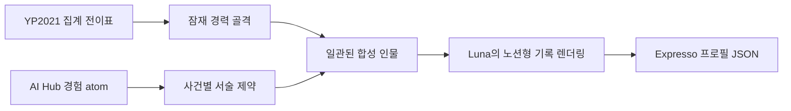
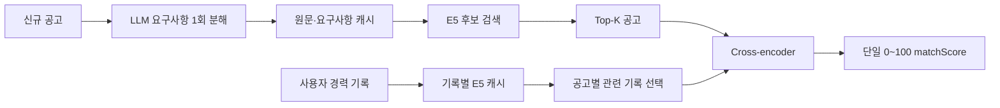

# Expresso에는 비용 효율적인 독자 채용 적합도 모델이 필요하다

> 작성일: 2026-09-02  
> 대상: P5 ML Platform에 처음 참여하는 팀원  
> 범위: 합성 프로필 생성, 초기 추천 모델 실험, 다음 데이터·모델 아키텍처

## 결론

Expresso가 제공해야 하는 것은 공고와 프로필에 같은 단어가 얼마나 많이 나오는지를 보여주는
검색 점수가 아니다. 사용자가 쌓아 둔 경력 기록이 공고의 필수·우대 요구와 핵심 업무를 얼마나
구체적으로 뒷받침하는지 0~100 사이의 일관된 값으로 계산해야 한다.

이 판단을 매번 LLM에 맡기면 프로필 수와 공고 수의 곱만큼 호출 비용과 응답 시간이 증가한다.
반대로 TF-IDF나 임베딩 cosine만 사용하면 연차, 필수 조건, 부분 충족, 비슷한 표현 사이의
상호작용을 충분히 읽지 못한다. 따라서 P5의 목표는 LLM을 없애는 것이 아니라, LLM을 데이터
생성과 공고 전처리에 제한하고 반복되는 적합도 추론은 전용 모델로 대체하는 것이다.

현재까지의 파일럿은 이 방향에 투자할 근거를 만들었다. 동결된 다국어 E5 임베딩 위에 작은
MLP를 학습했을 때 문자 TF-IDF보다 teacher 기준 NDCG@10이 0.1337 높아졌다. 작은 데이터와
단순한 구조에서도 학습된 랭커가 단어 중복 이상의 순위 신호를 얻었다는 뜻이다. 다음 단계는
같은 파일럿을 반복하는 것이 아니라, 실제 사용자에 가까운 합성 프로필과 0~100 라벨을 만든 뒤
프로필–공고를 함께 읽는 cross-encoder로 정밀도를 높이는 것이다.

## 우리가 만들려는 모델

모델의 입력과 출력은 단순하다.

```text
입력 1: 채용 공고 원문과 구조화된 필수·우대 요구사항
입력 2: 사용자가 작성한 Expresso 경력 기록
출력: 0~100 사이의 단일 matchScore
```

`matchScore`는 합격 확률이 아니다. 회사 내부 평가 기준, 지원자 경쟁률, 면접 결과는 알 수
없기 때문이다. 이 점수는 **현재 프로필에 기록된 근거가 공고 요구를 뒷받침하는 정도**다.
사용자에게 두 종류의 점수나 별도의 확률을 보여주지 않는다.

서비스에는 기록이 거의 없는 사용자도 존재할 수 있다. 이런 프로필은 데이터 오류가 아니며
리젝하지 않는다. 모델은 기록되지 않은 능력을 없다고 단정하지 않고, 현재 확인할 수 있는
근거가 적다는 의미에서 낮은 점수를 낸다.

## 왜 TF-IDF와 cosine만으로는 부족한가

### TF-IDF와 BM25

TF-IDF와 BM25는 공고와 프로필에 같은 단어가 함께 등장하는지를 빠르게 계산한다. 구현이 쉽고
설명 가능하며 강한 기준선이지만 다음 판단에는 약하다.

- `대규모 트래픽 운영`과 `트래픽이 거의 없는 개인 프로젝트`의 차이
- `3년 이상 실무 경험 필수`와 `교육 과정에서 학습`의 차이
- 필수 기술 하나가 빠진 경우와 우대 기술 하나가 빠진 경우의 차이
- 같은 기술을 언급했지만 실제로 사용한 경우와 관심만 표현한 경우의 차이
- 표현은 다르지만 같은 역할과 문제 해결을 설명하는 문장

### 독립 임베딩 cosine

bi-encoder는 프로필과 공고를 각각 한 번씩 벡터로 만들기 때문에 대량 검색에 적합하다. 그러나
두 문서를 따로 압축한 다음 cosine을 계산하므로, 공고의 특정 요구와 프로필의 특정 기록이 어떤
관계인지 세밀하게 비교하기 어렵다. 긴 프로필을 하나의 평균 벡터로 만들면 관련 없는 기록이
핵심 기록을 희석할 수도 있다.

### LLM 직접 판정

LLM은 복잡한 공고를 읽고 근거를 비교하는 데 유용하다. 하지만 모든 사용자–공고 쌍을 LLM으로
채점하면 호출량이 서비스 사용량에 비례해 계속 증가한다. 모델과 프롬프트 버전에 따라 점수가
흔들릴 수 있고, 일괄 재계산에도 큰 비용이 든다.

따라서 세 방법을 역할별로 나눈다. E5는 싼 후보 검색, LLM은 오프라인 교사와 공고 1회 분해,
cross-encoder는 반복 가능한 최종 적합도 판정을 맡는다.

## 지금까지의 합성 프로필 생성 방식

### 사용한 원천

첫 합성 프로필은 AI Hub 71592 채용면접 인터뷰 데이터의 질문, 답변, 요약을 사용했다. 면접
답변에서 실제로 수행했거나 학습한 경험만 근거 atom으로 추출하고, Luna가 이를 Expresso 기록
형식으로 변환했다.

생성 흐름은 다음과 같았다.

1. 직군과 신입·경력 구간별 AI Hub 파일에서 실제 경험 표현이 많은 답변을 선택했다.
2. 한 프로필에 여러 답변 atom을 입력했다.
3. Luna가 0~6개의 기록을 만들었다.
4. 각 기록을 Expresso의 일곱 시스템 카테고리 중 하나에 배치했다.
5. 사용자에게 보이는 기록은 제목, 프로퍼티, 본문으로 만들었다.
6. AI Hub 원문과의 연결은 사용자 기록 밖의 provenance에 저장했다.

가정, 포부, 지원 동기만 있는 답변은 경력으로 만들지 않았다. 기록이 부족한 프로필도 유효하게
취급했고, 기록 간 관계, `claims`, 합성 스킬 숙련도는 제거했다.

### 만들어진 데이터

| 항목 | 결과 |
| --- | ---: |
| 합성 프로필 | 30개 |
| 전체 경력 기록 | 109개 |
| 프로필당 기록 수 | 평균 3.63개 |
| 기록 수 표준편차 | 1.30개 |
| 기록 수 범위 | 1~6개 |
| 기록당 프로퍼티 | 평균 2.06개 |
| 프로퍼티가 빈 기록 | 4개 |
| 본문 길이 | 평균 121자, 55~177자 |

이 방식은 짧은 시간 안에 Expresso JSON 계약을 만족하는 한국어 프로필을 만들고, 모든 기록을
원문 근거로 역추적할 수 있게 했다는 점에서 유용했다. 덕분에 데이터 준비, 교사 라벨 생성,
GPU 학습, 기준선 비교까지 전체 경로를 실제로 실행할 수 있었다.

그러나 모델 학습용 데이터로 확대하기에는 구조적 한계가 있었다.

- 서로 다른 면접 답변을 묶은 결과라 한 사람의 시간 흐름이라기보다 답변 모음처럼 보였다.
- 기록 수가 모두 1~6개라 장기간 서비스를 사용한 프로필을 표현하지 못했다.
- 실제 사용자가 작성할 수준보다 프로퍼티가 과도하게 정리되어 있었다.
- AI Hub 직군과 질문 구성이 프로필 전체 분포를 결정했다.
- 교육, 취업, 이직, 훈련, 자격 취득 사이의 현실적인 선후 관계를 만들 근거가 부족했다.

이 문제는 프롬프트 문구만 고쳐서는 해결되지 않는다. 자연어를 쓰기 전에 한 사람의 경력
골격부터 별도로 생성해야 한다.

## 이전 합성 데이터로 수행한 모델 파일럿

### 데이터와 라벨

30개 프로필마다 서로 다른 공고 20개를 붙여 총 600개의 프로필–공고 쌍을 만들었다. 프로필은
train 20개, valid 5개, test 5개로 나눴고 공고도 split을 넘지 않도록 분리했다. 사용한 고유
공고는 train 371개, valid 78개, test 79개로 총 528개다.

Luna는 프로필 하나와 공고 20개를 한 번에 보고 각 쌍에 0~3 teacher 라벨을 만들었다. 호출은
프로필당 한 번, 총 30회로 제한했다.

| 기존 라벨 | 의미 | 개수 |
| ---: | --- | ---: |
| 0 | 관련 근거가 약함 | 290 |
| 1 | 일부 관련 근거 | 168 |
| 2 | 비교적 강한 관련 근거 | 142 |
| 3 | 가장 강한 관련 근거 | 0 |

이 라벨은 합격 여부가 아니라 초기 관련성 실험용 등급이었다. 3점 사례가 하나도 없었기 때문에
상위 적합 사례를 구분하는 데이터는 사실상 없었다.

### 학습한 모델

초기 모델은 `intfloat/multilingual-e5-base`를 동결한 bi-encoder 구조다.

1. 프로필과 공고를 각각 768차원 벡터로 변환했다.
2. 두 벡터 `p`, `j`로 `[p, j, |p-j|, p*j]`를 만들었다.
3. hidden dimension 256의 작은 MLP가 관련성 점수를 예측했다.
4. JTH 지원 이력 52,674쌍으로 3 epoch 사전학습했다.
5. Expresso 합성 train 400쌍으로 8 epoch 미세조정했다.

encoder를 동결했기 때문에 RTX 5080 16GB 한 장에서 빠르게 학습할 수 있었고, 성능 변화가 작은
랭커 학습에서 오는지 확인하기 쉬웠다.

### 평가 결과

NDCG@10은 관련성이 높은 공고가 상위 10개 안에서 얼마나 앞에 배치되는지 측정한다. MAP은
관련 공고 전체의 순위 일관성을, Recall@10은 관련 공고 중 상위 10개에 들어온 비율을 본다.
아래 값은 모두 **사람 정답이 아닌 Luna teacher 라벨 기준 test 결과**다.

| 모델 | NDCG@10 | MAP | Recall@10 | hard negative 정확도 |
| --- | ---: | ---: | ---: | ---: |
| token overlap | 0.5554 | 0.3422 | 0.3946 | 0.4216 |
| word TF-IDF | 0.5313 | 0.3025 | 0.3679 | 0.4294 |
| char TF-IDF | 0.5567 | **0.4607** | 0.3696 | 0.5336 |
| BM25 | 0.5247 | 0.2958 | 0.3821 | 0.4039 |
| 고정 E5 cosine | 0.5153 | 0.3701 | 0.4304 | 0.4990 |
| E5 + 학습 MLP | **0.6904** | 0.4556 | **0.5750** | **0.5840** |

학습 MLP는 가장 강한 기준선인 문자 TF-IDF보다 NDCG@10이 0.1337, 상대값으로 약 24.0%
높았다. Recall@10은 0.2054 높았고 hard negative 정확도도 0.0504 높았다. 즉, 학습된 랭커가
키워드 중복만으로는 잡기 어려운 순위 신호를 얻었다. 이것이 독자 모델 개발을 계속할 가장 직접적인
실험 근거다. 프로필 단위 bootstrap에서 NDCG@10 차이의 95% 구간도 0.0552~0.2122로
양수였지만, test 프로필이 5개라는 점을 고려해 효과 크기 자체를 확정값으로 사용하지는 않는다.

동시에 다음 모델에서는 보완할 지점도 명확해졌다. MAP은 문자 TF-IDF보다 0.0052 낮았으므로
모든 관련 공고의 순서를 일관되게 개선한 것은 아니다. 고정 E5 cosine만으로는 문자 TF-IDF를
넘지 못해, 독립 벡터 사이의 단순 유사도보다 두 입력을 함께 읽는 구조가 필요하다.

사람 라벨은 아직 0건이고 test 프로필은 5개뿐이다. 3점 라벨이 없어서 MRR@10과 AUC도 계산할
수 없었다. 따라서 이 결과를 제품 품질 수치로 공개하지 않는다. 다만 전체 학습 경로가 동작하고,
단순 기준선보다 개선 가능한 신호가 존재한다는 개발 판단에는 충분히 사용할 수 있다.

## 새 합성 프로필 방식

새 방식의 목적은 더 그럴듯한 문장을 만드는 것이 아니다. 독자 모델이 실제 서비스에서 만나게 될
경력의 길이, 시간 흐름, 기록 누락, 작성 습관을 학습하도록 데이터 생성 구조를 바꾸는 것이다.

### 청년패널조사의 역할

새로 수집한 고용조사분석시스템 청년패널조사 YP2021은 네 차수의 Stata 파일로 구성되어 있다.

| 조사차수 | 전체 행 | 변수 | 조사 참여자 |
| --- | ---: | ---: | ---: |
| 1차 | 12,213 | 1,360 | 12,213 |
| 2차 | 12,213 | 1,522 | 10,721 |
| 3차 | 12,213 | 1,540 | 10,108 |
| 4차 | 12,213 | 1,549 | 9,665 |

패널 ID로 조사차수를 연결하면 최종 학력, 재학 여부, 일자리 시작·종료, 현재·과거 일자리,
산업, 직업, 이직, 직업교육훈련, 자격 취득의 시간 흐름을 볼 수 있다. 이 정보는 자연어 본문을
제공하지는 않지만 현실적인 경력 구조를 만드는 데 적합하다.

한 응답자의 행을 그대로 자연어 프로필로 바꾸지는 않는다. 그렇게 하면 공개 조사 응답자의
전체 궤적을 재현할 수 있고, 합성 데이터라기보다 가명 처리된 실제 기록에 가까워진다. 대신
최소 20명 이상인 집계 셀에서 다음 조건부 분포를 만든다.

- 학력·재학 상태에서 첫 취업으로 이어지는 전이
- 경력 단계별 일자리 개수와 이직 간격
- 산업과 직업 대분류의 결합
- 직업교육훈련과 자격 취득의 빈도와 시점
- 재학 중 일자리와 졸업 후 일자리의 차이

이 분포에서 새로운 타임라인을 샘플링하고, 날짜는 사건 사이 간격만 유지한 채 이동한다. 원본
패널 ID, 가구 ID, 성별, 출생, 나이, 지역, 가족, 건강, 임금, 소득, 자산은 Luna 입력과 추천
모델 특징에서 제외한다.

### 생성 파이프라인



YP2021은 교육·경험·훈련·자격의 골격을 제공한다. AI Hub는 골격에 맞는 상황·행동·결과 표현을
제공한다. Luna는 이미 완성된 한 사람의 골격을 받아 제목, 기본 프로퍼티, 본문을 작성한다.
따라서 Luna가 서로 다른 면접 답변을 임의로 한 인물처럼 조립하는 책임을 갖지 않는다.

### 프로필 길이

기존 30개 프로필은 평균 3.63개로 모두 짧았다. 다음 생성 배치는 전체 기록 수를 다음 절단
정규분포로 배정한다.

```text
targetRecordCount = clip(round(Normal(mean=9, std=4)), min=1, max=20)
```

30개처럼 작은 배치에서도 분포가 우연히 한쪽으로 몰리지 않도록 정규분포 분위수를 균등하게
배정한 뒤 seed로 프로필에 섞는다. 다음 30개 배치는 1~18개, 총 271개 기록을 목표로 한다.
평균은 9.03개, 표준편차는 4.06개다.

이 값은 실제 사용자 통계라고 주장하는 수치가 아니다. 기록이 거의 없는 사용자부터 장기간
사용한 사용자까지 한 번에 시험하기 위한 초기 학습 분포다. 실제 서비스 기록 수가 쌓이면
실측 분포로 교체한다. 0건 프로필은 생성 목표와 별개로 평가 fixture에 반드시 포함한다.

### 본문 중심의 노션형 기록

기존 데이터는 기록당 프로퍼티가 평균 2.06개였고, 프로퍼티가 비어 있는 기록은 109개 중
4개뿐이었다. 실제 사용자는 역할, 행동, 결과를 모두 별도 필드에 정리하기보다 제목을 붙이고
본문에 메모나 문단을 작성할 가능성이 높다.

새 배치는 다음 분포를 목표로 한다.

| 기록당 프로퍼티 | 목표 비율 |
| ---: | ---: |
| 0개 | 65% |
| 1개 | 30% |
| 2개 | 5% |
| 3개 이상 | 0% |

경험에는 역할·조직, 프로젝트에는 역할·기술, 학력에는 기관·과정·기간처럼 기본 필드만 후보로
둔다. `task`, `action`, `result`, `outcome`, `achievements`, `competencies`, `metrics`는
프로퍼티로 반복하지 않고 본문에 작성한다. 본문은 짧은 메모, 한두 문단, 불릿을 섞어 노션을
사용하는 감각에 가깝게 만든다.

사용자 기록은 끝까지 `title`, `properties`, `bodyMd` 세 부분으로 유지한다. 출처 연결과 합성
과정은 바깥 provenance에 보존하되 모델 입력에는 넣지 않는다.

## 새 라벨이 필요한 이유

기존 0~3 라벨은 모델 경로를 확인하는 데는 충분했지만 제품 점수로 쓰기에는 너무 거칠다. 특히
3점 사례가 하나도 없어 강한 적합도를 학습하지 못했다. 다음 라벨은 처음부터 0~100 사이의
`matchScore`로 다시 만든다.

| 점수 구간 | 현재 기록으로 확인되는 의미 |
| --- | --- |
| 0~19 | 핵심 직무가 다르거나 뒷받침할 근거가 거의 없음 |
| 20~39 | 주변 경험은 있으나 주요 요구를 직접 뒷받침하지 못함 |
| 40~59 | 일부 주요 요구에 근거가 있으나 중요한 공백이 큼 |
| 60~79 | 다수의 주요 요구를 직접 뒷받침하고 공백이 제한적임 |
| 80~100 | 필수 요구와 핵심 책임 대부분에 구체적인 근거가 있음 |

LLM teacher는 공고 원문, 분해된 요구사항, 프로필 기록을 보고 이 점수를 만든다. 기존 0~3 값을
0~100으로 선형 변환하지 않는다. 표현은 비슷하지만 필수 조건 하나가 빠진 사례, 연차만 다른
사례, 학습 경험과 실무 경험이 혼동되기 쉬운 사례를 hard negative로 의도적으로 포함한다.

독자 모델은 pointwise 점수 회귀와 같은 후보군 안의 pairwise 순위 학습을 함께 사용할 수 있다.
내부 손실이 두 개여도 사용자에게 내보내는 값은 보정된 `matchScore` 하나다.

## 향후 모델 아키텍처

### 전체 운영 흐름



### 공고 요구사항 분해

새 공고가 서비스에 들어오면 LLM이 원문에서 필수 요구, 우대 요구, 책임, 근무 조건을 한 번
분리한다. 각 요구에는 원문 인용, 정규화 문장, 직무·기술 개념, 명시된 최소 연차, 필요한
근거 종류를 저장한다.

분해 결과는 공고 원문 해시, 프롬프트 버전, LLM 버전으로 캐시한다. 같은 공고를 사용자마다
다시 분해하지 않는다. LLM 사용 비용은 공고 수에 비례하고, 사용자–공고 쌍 수에는 비례하지
않게 된다.

### E5 후보 검색과 기록 선택

모든 공고를 cross-encoder에 넣지 않는다. E5 bi-encoder가 먼저 사용자와 가까운 공고
Top-50을 찾고, 품질 비교 시 Top-100까지 실험한다. 이 단계는 임베딩을 미리 계산하고 캐시할
수 있어 싸고 빠르다.

프로필도 전체를 한 문자열로 합치지 않는다. 기록별 E5 임베딩을 저장하고 공고 요구사항과 가장
관련 있는 기록을 고른다. 필수 요구와 연결된 기록을 우선하며 중복을 제거해 최대 8개를
cross-encoder 입력에 넣는다. 긴 프로필에서도 관련 없는 기록 때문에 입력이 잘리거나 핵심
근거가 희석되는 문제를 줄인다.

### Cross-encoder 재랭커

cross-encoder는 공고 원문, 분해된 요구사항, 선택된 경력 기록을 한 번에 읽는다. 프로필과
공고를 따로 벡터로 압축하는 방식과 달리 다음 상호작용을 직접 학습할 수 있다.

- 특정 필수 요구를 뒷받침하는 기록이 실제로 있는가
- 같은 기술이 학습, 프로젝트, 실무 중 어떤 맥락에서 사용됐는가
- 요구 연차와 기록된 기간이 어느 정도 맞는가
- 우대 조건은 부족하지만 핵심 책임은 수행해 본 적이 있는가
- 비슷한 단어가 있어도 사실상 다른 직무인가

첫 후보는 다국어 `BAAI/bge-reranker-v2-m3` 0.6B다. 입력 길이는 1,536 token으로 시작한다.
더 작은 다국어 MiniLM은 저지연 대안과 비교 기준으로 유지한다.

## RTX 5080 비용 검토

현재 600쌍을 RTX 5080 16GB에서 측정했다. 입력은 프로필, 공고 원문, 요구사항 view를 합친
형태였고 token 길이는 중앙값 943, 95백분위 1,244, 최댓값 1,385였다.

| 모델 | 최대 token | 입력 잘림 | 추론 처리량 | 학습 처리량 | 학습 peak VRAM |
| --- | ---: | ---: | ---: | ---: | ---: |
| mMiniLMv2 0.1B | 512 | 100% | 1,787 pair/s | 225 pair/s | 1.48 GiB |
| BGE reranker v2 m3 0.6B | 512 | 100% | 195 pair/s | 33.8 pair/s | 5.30 GiB |
| BGE reranker v2 m3 0.6B | 1,024 | 36% | 95.5 pair/s | 15.9 pair/s | 5.35 GiB |
| BGE reranker v2 m3 0.6B | 1,536 | 0% | 88.2 pair/s | 11.5 pair/s | 5.33 GiB |

BGE 1,536 token은 현재 데이터에서 600쌍 GPU forward에 약 6.8초가 걸렸다. 산술적으로 한
사용자의 Top-50은 약 0.57초, Top-100은 약 1.13초다. 이 값에는 tokenization, 큐 대기,
네트워크와 애플리케이션 처리가 포함되지 않으므로 실제 API SLO는 별도로 측정해야 한다.

학습 처리량만 환산하면 10,000쌍 3 epoch는 약 43분, 30,000쌍은 약 2.2시간,
100,000쌍은 약 7.2시간이다. 검증과 checkpoint 저장을 더해도 5080 한 장으로 수만 쌍 규모의
모델 연구를 반복할 수 있다.

이 수치가 보여주는 결론은 명확하다. cross-encoder를 모든 공고에 적용하면 비싸지만, E5가
고른 Top-K에만 적용하면 전용 GPU 한 장으로 개발과 제한된 온라인 추론을 시작할 수 있다.
LLM으로 같은 50~100개 쌍을 매번 판정하는 것보다 비용 구조도 예측 가능하다.

## 연구 및 구현 계획

### 1단계. 합성 데이터 v4

먼저 모델이 학습할 대상을 바꾼다.

- YP2021 조사차수별 변수 사전과 특수 결측 코드 매핑
- 보호 필드 제거와 최소 셀 크기 20의 집계 전이표
- 결정적 경력 골격 샘플러
- 절단 정규분포 기록 수 할당기
- 본문 중심·희소 프로퍼티 Luna 프롬프트와 JSON Schema
- 30개 보강 프로필과 길이·프로퍼티·누수 보고서

30개 배치에서 구조를 확인한 뒤 500개 프로필, 2,000개 이상의 한국어 기록으로 확대한다.
평가에는 0건, 1~2건, 3~8건, 9건 이상 프로필 slice를 모두 둔다.

### 2단계. 0~100 라벨과 평가셋

- 공고 요구사항 분해 schema와 캐시 키 확정
- 쉬운 부정, 부분 적합, hard negative, 강한 적합 후보군 구성
- LLM teacher의 0~100 rubric과 프롬프트 버전 관리
- 공고–프로필 또는 요건–근거 학습 쌍 10,000개 이상 생성
- 사람 검수 적합도 사례 100개 이상 확보
- profile family, 공고 군집, AI Hub atom 군집 기준 split

사람 라벨은 LLM teacher가 실제 사용자 판단과 같은 방향인지 확인하고 점수를 보정하는 기준이다.
모든 합성 쌍을 사람이 채점하려는 것이 아니라, teacher와 전용 모델의 편향을 발견할 최소 골드셋을
만드는 데 집중한다.

### 3단계. 모델 비교

같은 후보군과 0~100 라벨에서 다음 실험을 수행한다.

| 비교 축 | 후보 |
| --- | --- |
| 기준선 | token overlap, word/char TF-IDF, BM25, E5 cosine |
| 재랭커 | mMiniLMv2, BGE reranker v2 m3 |
| 입력 길이 | 512, 1,024, 1,536 token |
| 선택 기록 수 | 4, 8, 12개 |
| 후보 공고 수 | Top-20, Top-50, Top-100 |
| 학습 손실 | 점수 회귀, pairwise, 회귀+pairwise |

주 지표는 NDCG@10이다. MAP, Recall@10, pairwise accuracy, MAE, Spearman correlation,
calibration error를 함께 본다. E5 후보 검색의 Recall과 cross-encoder 재랭킹 개선량도 분리해,
검색 실패와 재랭킹 실패를 혼동하지 않는다.

모델 채택 조건은 사람 라벨 기준으로 문자 TF-IDF, BM25, 고정 E5보다 NDCG@10이 높고,
0~100 점수의 MAE와 보정 오차가 허용 범위에 들어오며, Top-K 온라인 지연 예산을 만족하는 것이다.

### 4단계. 서비스 연결

- 신규 공고 수집 시 요구사항 분해 job 실행
- 공고·기록 임베딩의 내용 해시 기반 캐시
- GPU 재랭킹 worker와 batch API
- 사용자, 공고, 프로필 버전, 모델 버전을 포함한 점수 캐시
- 새 기록이나 공고 버전 변경 시 필요한 점수만 무효화
- `matchScore` 단일 응답 계약과 사용자 문구 적용
- 모델·데이터 버전별 품질과 지연 모니터링

운영에서는 LLM이 공고마다 한 번만 호출되고, 반복 요청은 E5와 cross-encoder가 처리한다.
프로필이 바뀌지 않은 사용자의 동일 공고 점수는 캐시에서 반환한다.

## 주요 위험과 통제

| 위험 | 통제 |
| --- | --- |
| 합성 문체를 모델이 암기 | profile family와 문체 변형을 같은 split에 묶고 사람 작성 표본으로 평가 |
| AI Hub 직군 편향 | YP2021 경력 구조와 실제 공고 분포를 별도 축으로 사용 |
| 실제 조사 응답자 재현 | 행 단위 변환 금지, 최소 셀 20 집계, 날짜 이동, 원본 ID 제거 |
| 프로필 길이가 라벨 지름길이 됨 | 같은 family의 길이 고정, 길이 slice별 평가 |
| 긴 입력에서 핵심 근거가 잘림 | 요구사항별 기록 선택, 최대 8개, token 잘림률 측정 |
| LLM teacher 편향 | 순서 반전, hard negative, 사람 골드셋으로 일치도·보정 확인 |
| 점수가 합격 확률로 오해됨 | 계약과 UI 모두 “현재 기록 기반 공고 적합도”로 고정 |
| 온라인 비용 증가 | 공고 분해 1회, 임베딩·점수 캐시, E5 Top-K 이후에만 재랭킹 |

## 현재 상태와 바로 다음 작업

완료된 것은 AI Hub 수집·변환, Luna 합성 프로필 30개, 600개 teacher 라벨, 기준선 하네스,
동결 E5+MLP 파일럿, RTX 5080 cross-encoder 처리량 측정이다. 이를 통해 데이터에서 GPU 학습과
평가까지 이어지는 전체 개발 경로는 확보했다.

다음 작업은 cross-encoder 학습이 아니라 **합성 데이터 v4 구현**이다. YP2021 변수 매핑과
경력 골격 샘플러를 만들고, 30개 프로필을 새 규칙으로 다시 생성해 다음 조건을 확인해야 한다.

- 기록 수 평균·표준편차가 목표에서 각각 0.5개 이내
- 프로퍼티 0·1·2개 비율이 목표에서 각각 5%p 이내
- 기록당 프로퍼티 3개 이상 0건
- 보호·민감 필드와 원본 조사 ID 노출 0건
- 시간 역전과 중복 사건 0건
- 같은 profile family와 원천 atom의 split 누수 0건

이 게이트를 통과하면 0~100 라벨을 만들고, 500개 프로필·10,000쌍 규모에서 기준선과
cross-encoder를 같은 조건으로 비교한다.

## 관련 문서와 재현 위치

- [이전 합성 프로필 생성 v3](./synthetic-profile-generation-v3.md)
- [새 합성 프로필 생성 v4](./synthetic-profile-generation-v4.md)
- [초기 추천 모델 파일럿 v0](./match-pilot-v0.md)
- [공고 적합도 cross-encoder v1](./match-score-cross-encoder-v1.md)
- [검색 기준선과 평가 하네스](./retrieval-evaluation-harness.md)

실험 원본은 로컬 `var/ml-data/experiments/match-pilot-v0/`에 있으며 Git에는 포함되지 않는다.
평가 수치는 `evaluation/metrics.json`, 라벨 분포는 `data/label-coverage.json`, 학습 환경과 입력
해시는 `model/run-manifest.json`, cross-encoder 처리량은
`benchmarks/cross-encoder-probe-results.json`에서 재현할 수 있다. 초기 모델 평가에 사용한
코드와 데이터 계약의 기준 커밋은 `aa96ea8da34e11a51a9d8ac391f1e2753cd5c231`이다.
