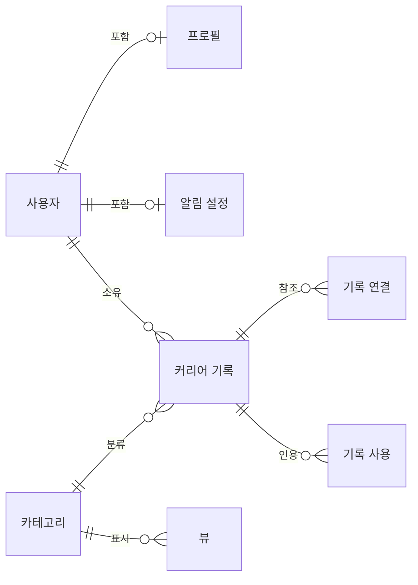
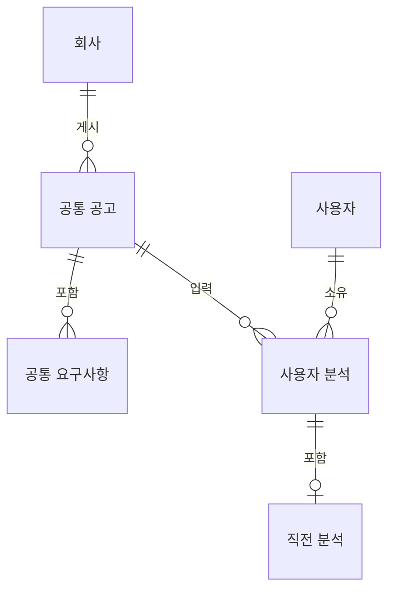
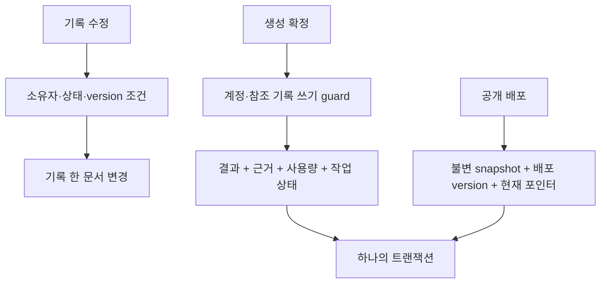

# MongoDB 컬렉션 대응표

작성일: 2026-08-28

이 문서는 [구현 계획](mongodb-migration-plan.md)의 저장 모델 기준입니다. 현재 `main`의 `c3db7e5`와 SQL 마이그레이션 `0001`–`0016`을 조사했습니다. 아직 MongoDB 스키마를 구현한 상태는 아닙니다.

## 포함과 참조

74개 제품 테이블 중 사용자와 수명이 같은 프로필·알림 설정, 분석 한 건에 하나인 분석 이력은 부모 문서에 포함합니다. 나머지는 개별 식별자, 조회, 변경 또는 삭제 경계가 있어 별도 컬렉션으로 둡니다. 제품 데이터는 71개 컬렉션이며 아래 운영용 컬렉션은 별도입니다. 컬렉션 수를 줄이는 것 자체를 목표로 삼지 않습니다.

공통 공고와 사용자 분석은 다음처럼 구분합니다.

그림의 선은 논리적 관계입니다. MongoDB가 외래 키를 대신 검사한다는 뜻은 아닙니다. 프로필·알림 설정·직전 분석은 부모 문서에 포함하며 별도 컬렉션이 아닙니다. 공통 요구사항은 공고에 연결된 별도 컬렉션입니다. 카테고리별 컬렉션을 만들지 않습니다.

## 테이블별 대응

`Txx`는 구현 계획의 작업 번호입니다. 보존으로 표시하지 않은 사용자 데이터는 새 환경으로 이관하지 않습니다. 초기화한 영역의 기능은 그대로 구현합니다.

| 현재 테이블 | MongoDB 저장 위치 | 작업 | 과거 데이터 처리 |
| --- | --- | --- | --- |
| `plan` | `plans` | T02 | 초기 데이터 |
| `user` | `users` | T04 | 초기화 |
| `account_deletion_request` | `account_deletion_requests` | T15 | 초기화 |
| `account_deletion_event` | `account_deletion_events` | T15 | 초기화 |
| `company` | `companies` | T07 | 보존 |
| `job_posting` | `job_postings` | T07 | 보존 |
| `job_analysis` | `job_analyses` | T08 | 초기화 |
| `brew` | `brews` | T08 | 초기화 |
| `template` | `templates` | T10 | 초기 데이터 |
| `portfolio` | `portfolios` | T11 | 초기화 |
| `deployment` | `deployments` | T13 | 초기화 |
| `analytics_event_receipt` | `analytics_event_receipts` | T14 | 초기화 |
| `annotation` | `annotations` | T14 | 초기화 |
| `interview_session` | `interview_sessions` | T09 | 초기화 |
| `job_posting_requirement` | `job_posting_requirements` | T07 | 보존 |
| `question` | `questions` | T09 | 초기화 |
| `category` | `career_categories` | T05 | 시스템 정의 재생성 · 사용자 정의 초기화 |
| `record` | `career_records` | T05 | 초기화 |
| `answer` | `answers` | T09 | 초기화 |
| `answer_record_change` | `answer_record_changes` | T09 | 초기화 |
| `recipe` | `recipes` | T10 | 초기화 |
| `recipe_section` | `recipe_sections` | T10 | 초기화 |
| `portfolio_section` | `portfolio_sections` | T11 | 초기화 |
| `block` | `blocks` | T11 | 초기화 |
| `brew_job` | `brew_jobs` | T08 | 초기화 |
| `brew_source` | `brew_sources` | T08 | 초기화 |
| `career_profile` | `users.profile` | T05 | 포함 문서 · 초기화 |
| `category_view` | `career_views` | T05 | 초기화 |
| `company_research_item` | `company_research_items` | T08 | 초기화 |
| `consent` | `consents` | T04 | 초기화 |
| `visit_event` | `visit_events` | T14 | 초기화 |
| `conversion_event` | `conversion_events` | T14 | 초기화 |
| `dashboard_view` | `dashboard_views` | T14 | 초기화 |
| `deployment_slug_redirect` | `deployment_slug_redirects` | T13 | 초기화 |
| `derived_metric` | `derived_metrics` | T14 | 초기화 |
| `export_asset` | `export_assets` | T13 | 초기화 |
| `export_job` | `export_jobs` | T13 | 초기화 |
| `generated_page` | `generated_pages` | T12 | 초기화 |
| `generation_job` | `generation_jobs` | T11 | 초기화 |
| `recipe_item` | `recipe_items` | T10 | 초기화 |
| `recipe_evidence_path` | `recipe_evidence_paths` | T10 | 초기화 |
| `generation_sentence_evidence` | `generation_sentence_evidence` | T11 | 초기화 |
| `usage_counter` | `usage_counters` | T04 | 초기화 |
| `generation_usage_ledger` | `generation_usage_ledger` | T11 | 초기화 |
| `identity_oauth_account` | `identity_oauth_accounts` | T04 | 초기화 |
| `identity_session` | `identity_sessions` | T04 | 초기화 |
| `insight` | `insights` | T14 | 초기화 |
| `interest` | `interests` | T08 | 초기화 |
| `job_analysis_history` | `job_analyses.history` | T08 | 포함 문서 · 초기화 |
| `job_source` | `job_sources` | T07 | 보존 |
| `layout_spec` | `layout_specs` | T12 | 초기화 |
| `match_score` | `match_scores` | T08 | 초기화 |
| `media_asset` | `media_assets` | T13 | 초기화 |
| `media_variant` | `media_variants` | T13 | 초기화 |
| `metric_daily` | `metrics_daily` | T14 | 초기화 |
| `notification` | `notifications` | T14 | 초기화 |
| `notification_preference` | `users.notificationPreferences` | T14 | 포함 문서 · 초기화 |
| `platform_outbox` | `outbox_events` | T03 | 초기화 |
| `portfolio_edit_proposal` | `portfolio_edit_proposals` | T12 | 초기화 |
| `portfolio_snapshot` | `portfolio_snapshots` | T12 | 초기화 |
| `recent_search` | `recent_searches` | T07 | 초기화 |
| `recipe_revision` | `recipe_revisions` | T10 | 초기화 |
| `recipe_unused_source` | `recipe_unused_sources` | T10 | 초기화 |
| `record_link` | `record_links` | T06 | 초기화 |
| `record_usage` | `record_usages` | T06 | 초기화 |
| `requirement_coverage` | `requirement_coverages` | T08 | 초기화 |
| `revision` | `revisions` | T06 | 초기화 |
| `saved_search` | `saved_searches` | T14 | 초기화 |
| `scheduled_job_definition` | `scheduled_job_definitions` | T15 | 초기 데이터 |
| `scheduled_job_run` | `scheduled_job_runs` | T15 | 초기화 |
| `section_view` | `section_views` | T14 | 초기화 |
| `skill` | `skills` | T06 | 초기화 |
| `skill_evidence` | `skill_evidence` | T06 | 초기화 |
| `widget` | `widgets` | T14 | 초기화 |

## 필드 규칙

- `id`는 `_id`로, 참조 필드는 `userId`, `categoryId`처럼 camelCase로 바꿉니다. API는 기존 필드명과 UUID를 유지합니다.
- 기존 UUID 기본 키는 문자열을 그대로 씁니다. `career_profile`처럼 부모 키가 기본 키인 데이터는 포함 문서로 옮깁니다. `scheduled_job_definitions`는 기존 `job_key`를 문자열 `_id`로 씁니다. UUID가 아닌 내부 키를 억지로 UUID로 바꾸지 않습니다.
- 복합 기본 키만 있는 `requirement_coverages`는 `_id = userId + ':' + requirementId`로 만듭니다. 두 UUID 열에도 unique 인덱스를 둡니다. `analytics_event_receipts`의 `_id`는 기존 `event_id`입니다.
- `users.profile`은 기존 프로필 필드를, `notificationPreferences`는 계약에 정의된 알림 종류별 값을 보관합니다. 임의 입력을 MongoDB 필드 경로로 사용하지 않습니다. 분석 이력은 `job_analyses.history`에 포함하며 무한 배열로 만들지 않습니다.
- 날짜만 나타내는 값은 `YYYY-MM-DD` 문자열로 유지합니다. 시점은 BSON Date로 저장하고 기존 ISO 응답으로 직렬화합니다. MySQL 마이크로초가 있는 보존 필드는 원본 문자열도 보관해 밀리초 변환에 따른 손실을 검증 보고서에서 구분합니다.
- 기존 DECIMAL 값은 Decimal128로 저장합니다. API에서 숫자로 반환하던 필드는 범위를 확인한 뒤 기존 숫자 형식으로 변환합니다. 차감 횟수는 정수입니다. 근거 없이 소수 정밀도를 낮추지 않습니다.
- `null`, 필드 미존재, 빈 문자열, 빈 배열을 구분합니다. 원문·프로퍼티 JSON은 내용을 임의로 정규화하지 않습니다. 검색용 파생 값은 별도 필드에 저장합니다.
- 시스템 카테고리는 이번 작업에서 기존 7개 정의와 불변 정책을 유지합니다. 사용자별 수정 가능한 시작 템플릿은 후속 편집기 작업입니다.

## 운영용 컬렉션

| 컬렉션 | 필수 필드와 용도 | 작업 |
| --- | --- | --- |
| `schema_migrations` | `_id: version`, name, checksum, state, completedSteps, appliedAt를 기록합니다. | T02 |
| `migration_locks` | 고정 `_id`, owner, token, expiresAt로 실행자를 식별합니다. 만료만 보고 실행권을 넘기지 않습니다. | T02 |
| `snapshot_chunks` | payloadId, userId, part, bytes, sha256을 저장합니다. `(payloadId, part)`는 고유합니다. | T12 |
| `analytics_rate_limits` | 방문자·대상·기간별 카운터와 expiresAt을 저장합니다. 원자적 한도 검사에 사용합니다. | T14 |
| `import_runs` | 원본 스키마 해시, 테이블별 필드 목록, 검증 결과와 완료 여부를 기록합니다. | T16 |
| `import_checkpoints` | 실행·테이블별 마지막 키와 처리 건수를 기록합니다. | T16 |

마이그레이션 점유가 만료되면 새 실행은 즉시 DDL을 시작하지 않습니다. 이전 실행의 종료와 진행 중 명령의 종료를 확인한 뒤 새 token을 발급합니다. DDL에는 문서 조건부 쓰기와 같은 fencing을 걸 수 없으므로, 애매한 상태에서는 자동 인계를 멈춥니다.

## 핵심 인덱스

모든 기존 unique·check 제약은 최종 SQL 스키마를 기준으로 별도 목록을 생성합니다. 아래 표는 그중 조회와 동시성에 중요한 기준입니다. 모든 컬렉션의 기본 collation을 무조건 바꾸지 않습니다.

| 대상 | 인덱스와 처리 |
| --- | --- |
| `users` | email의 대소문자·악센트 비교를 기존 테스트와 맞춥니다. 정규화 키 또는 collation을 선택한 뒤 같은 비교 규칙을 조회에도 사용합니다. |
| `identity_oauth_accounts` | `(provider, providerAccountId)`, `(userId, provider)` unique입니다. |
| `identity_sessions` | tokenHash unique와 `(userId, expiresAt)`입니다. TTL은 정리용이며 인증은 expiresAt·revokedAt을 직접 검사합니다. |
| `career_records` | `(userId, deletedAt, categoryId, updatedAt, _id)`와 실제 목록 정렬별 인덱스입니다. 공개 version과 참조 경쟁용 referenceVersion을 구분합니다. |
| `career_categories` · `career_views` | 시스템 key와 뷰의 `(userId, categoryId, name)` 고유성을 유지합니다. 사용자가 정의한 key의 고유 범위를 새로 강화하지 않습니다. |
| `record_links` · `record_usages` | `(userId, fromRecordId, toRecordId, relation)`, `(userId, recordId, blockId)` unique입니다. 역방향 조회 인덱스도 둡니다. |
| `job_sources` · `job_postings` | `(provider, token)`, 값이 있는 `(source, externalId)`의 고유성을 유지합니다. 원문 검색과 facets는 같은 조건식을 사용합니다. |
| `match_scores` · `requirement_coverages` | 사용자·공고 또는 사용자·요구사항별 unique입니다. |
| `brews` · `brew_sources` | 사용자 목록과 `(userId, brewId, recordId)` unique입니다. 선택 순번 unique는 선택된 행만 포함합니다. 최소 1개 선택 제약은 복원하지 않습니다. |
| `generation_usage_ledger` | `(userId, generationJobId, reason)` unique입니다. 완료·실패·환급 시 중복 차감 여부를 검증합니다. |
| `recipes` · `generated_pages` | 사용자·brew·version, 포트폴리오·revision의 unique를 유지합니다. 자유 생성 연결은 `0012`·`0014`를 반영합니다. |
| `deployments` | subdomain, 값이 있는 customDomain, `(userId, portfolioId, version)` unique입니다. |
| `layout_specs` · `export_assets` · `dashboard_views` | 선택된 레이아웃, 활성 이력서, 기본 뷰의 unique는 해당 상태만 포함합니다. |
| `outbox_events` | idempotencyKey unique, `(state, availableAt, _id)`, `(state, leaseUntil)`입니다. 작업 갱신에는 leaseToken도 조건으로 씁니다. |
| `scheduled_job_runs` | `(jobKey, scheduledFor)` unique입니다. 실행 상태 전이와 함께 재실행을 제어합니다. |
| `metrics_daily` | `(userId, deploymentId, date, metricKey)` unique입니다. |

nullable unique는 값이 있을 때만 partialFilterExpression에 포함합니다. 배열 내부의 unique 인덱스가 한 문서 안의 중복 원소까지 막아 준다고 가정하지 않습니다. 포함 문서의 중복은 도메인 코드가 검사합니다.

## 원자적 변경 단위

계정 삭제와 경쟁하는 사용자 변경은 identity 모듈의 `requireActiveUser`를 사용합니다. 기록 인용과 삭제는 career 모듈의 `assertActiveRecordsForWrite`를 사용합니다. 두 함수는 같은 세션에서 실제 guard 필드를 갱신합니다. 소유권을 읽기만 한 트랜잭션으로 참조 무결성을 대신하지 않습니다.

## 최신 마이그레이션 반영

`0003`–`0009`의 규칙을 그대로 합치는 것만으로는 부족합니다. `0013`에서 출처와 권장 분량을 완화했고, `0015`에서 선택 재료가 0개여도 되도록 바뀌었습니다. 제거된 제약을 MongoDB에서 되살리지 않습니다. `0016`의 디자인 30종을 seed와 기존 템플릿 테스트에 함께 반영합니다.
