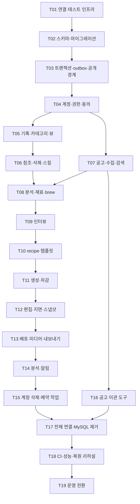
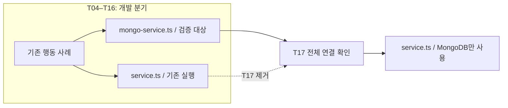
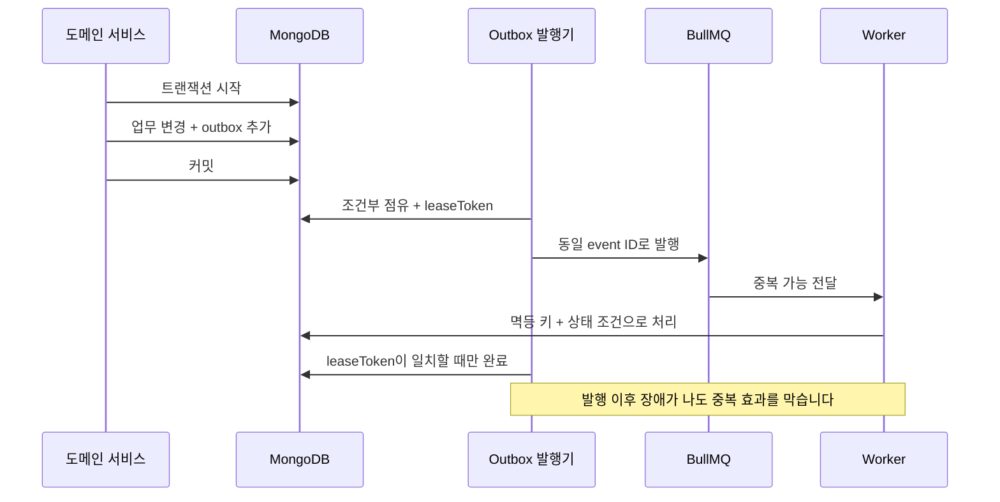
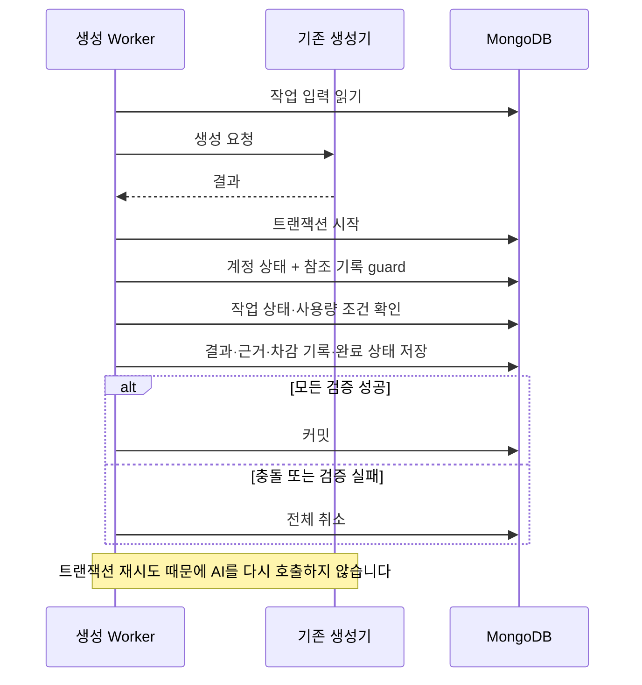
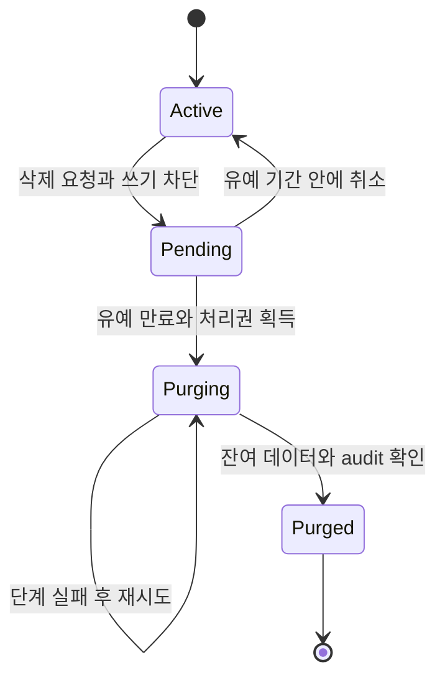
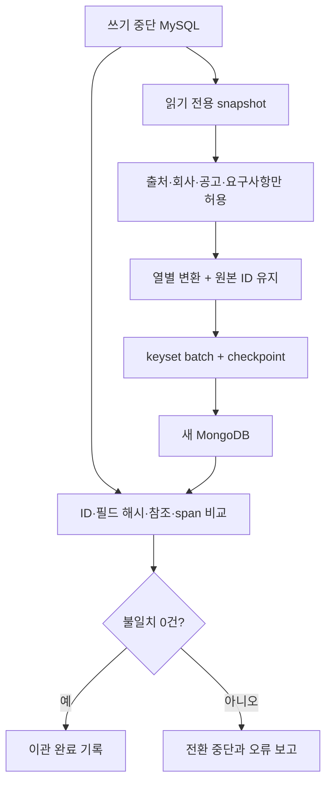
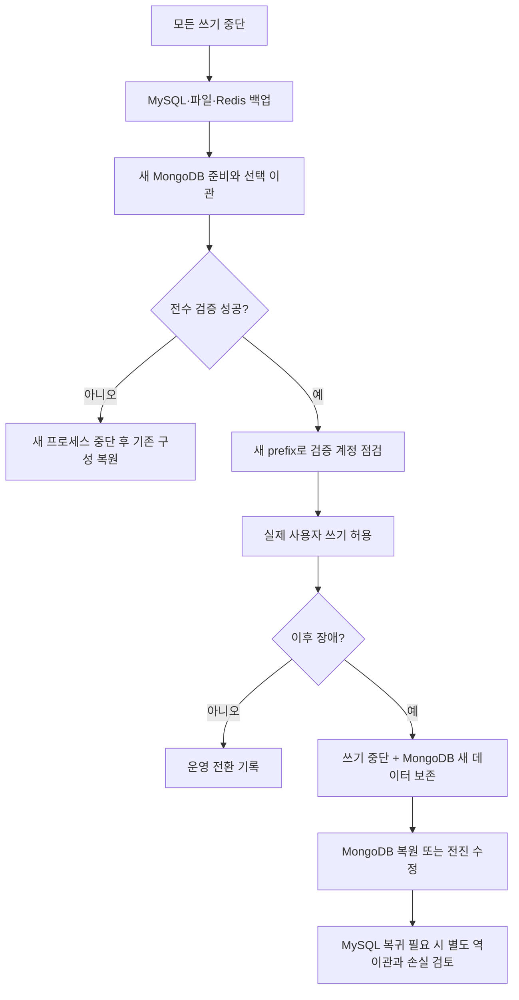

# MongoDB 백엔드 마이그레이션 구현 계획

> **For agentic workers:** REQUIRED SUB-SKILL: Use superpowers:subagent-driven-development (recommended) or superpowers:executing-plans to implement this plan task-by-task. Steps use checkbox (`- [ ]`) syntax for tracking.

**Goal:** 기존 API를 유지하면서 모든 백엔드 저장 경로를 MongoDB로 전환하고, 공고 자산의 이관과 복원을 검증합니다.

**Architecture:** 공식 MongoDB 드라이버를 사용합니다. 컬렉션과 마이그레이션은 `packages/database`가 소유하고, 도메인 모듈은 기존 공개 메서드를 유지합니다. API·Worker는 모든 도메인 전환을 확인한 뒤 한 번에 새 저장소로 연결합니다.

**Tech Stack:** Node.js 24 이상, pnpm 11, TypeScript, Zod, Fastify, MongoDB 8.0 계열 replica set, MongoDB Node.js 드라이버 7.5.0, Redis/BullMQ, Vitest입니다.

**Spec:** [승인된 설계](mongodb-migration-design.md), [74개 테이블의 컬렉션 대응표](mongodb-collection-map.md)를 함께 읽습니다.

작성일: 2026-08-28. 조사 기준은 `main`의 `c3db7e5`입니다. 이 문서는 구현 계획이며 작업 체크박스는 아직 완료하지 않았습니다.

2026-08-29부터 [병렬 실행 명세](../../coordination/mongodb/coordination/execution-spec.json), [실행 체크리스트](../../coordination/mongodb/docs/IMPLEMENTATION_CHECKLIST.md), [진행 대시보드](../../coordination/mongodb/coordination/dashboard/index.html)로 구현 상태를 관리합니다. 이 문서의 승인된 요구사항은 작업별 brief에 보존하며, 실제 완료 여부는 실행 체크리스트와 증거를 기준으로 확인합니다.

## 공통 제약

- 이전 범위는 백엔드 전체입니다. 커리어 블록 편집기, 관계형 프로퍼티·수식·롤업의 새 기능, Yjs와 외부 MCP/API는 포함하지 않습니다.
- 공식 MongoDB Node.js 드라이버를 사용합니다. Mongoose와 SQL 호환 계층은 도입하지 않습니다.
- `packages/contracts`의 Zod 계약, UUID, 응답 형식을 유지합니다. 첫 번째 작업에서는 현재 `bodyMd` 계약을 유지합니다.
- 컬렉션·인덱스·검증 규칙·마이그레이션은 `packages/database`가 소유합니다. 서비스 시작 시 스키마를 변경하지 않습니다.
- 기존 Oracle Cloud 서버의 인증된 단일 노드 replica set으로 시작합니다. 자동 장애 전환은 제공하지 않습니다.
- Redis/BullMQ와 파일·객체 저장소를 유지합니다. 세션 토큰은 `httpOnly` 쿠키 `ex_session`에만 둡니다.
- 보존 대상은 `job_source`, `company`, `job_posting`, `job_posting_requirement`와 공고의 공통 분석 필드입니다. 사용자 데이터와 생성 결과는 초기화합니다.
- 전환 중단 시간에는 제한을 두지 않습니다. 이전 MySQL·파일·큐를 검증 전에 지우지 않습니다. Redis 전체 삭제와 운영 데이터에 대한 테스트 실행을 금지합니다.
- AI 호출은 기본 `off`를 유지합니다. 현재 모듈별 중단·폴백 동작을 변경하지 않습니다. 검증은 기존 stub을 사용하며 유료 AI를 자동 호출하지 않습니다.
- 주석은 한국어입니다. 커밋 제목은 `{tag}: {간결한 명사형 설명}`입니다. 문서는 `docs/architecture/`와 `docs/operations/`에 둡니다.
- 각 작업은 기존 테스트의 행동 검증을 보존합니다. 스키마 설정을 그대로 반복하는 테스트나 전환 후 중복되는 테스트는 남기지 않습니다.

## 실행 방식과 확인 지점

이번 전면 이전은 하나의 기능 작업입니다. 도메인별 커밋은 가능하지만 부분적으로 전환한 API를 운영에 배포하지 않습니다. 무중단 이중 쓰기, 변경 데이터 캡처, RDB로의 자동 역이관은 만들지 않습니다.



선은 선행 결과에 대한 의존입니다. 병렬 에이전트 실행을 자동으로 승인하는 그림은 아닙니다. 실제 작업 방식은 실행 전에 선택합니다.

| 확인 지점 | 필요한 증거 | 금지 사항 |
| --- | --- | --- |
| 기반: T01–T03 | replica set 트랜잭션, 마이그레이션 재실행, outbox 실패 복구 테스트 | 단위 mock 통과만으로 도메인 이전을 시작하지 않습니다. |
| 도메인: T04–T15 | 각 모듈의 기존 행동 검증과 새 동시성 검증 | 계약 변경으로 테스트를 맞추지 않습니다. |
| 통합: T16–T18 | 전체 타입 검사·테스트·부하·이관·복원 보고서 | 미완성 분기를 `main`에 합치지 않습니다. |
| 운영: T19 | 대상 서버·백업·중단 범위를 확인한 실제 전환 기록 | 계획 작성 요청을 운영 데이터 변경 승인으로 해석하지 않습니다. |

### 개발 중 두 구현의 경계

도메인을 옮기는 동안 기존 `service.ts`는 비교 기준으로 유지합니다. 새 구현은 같은 디렉터리의 `mongo-service.ts`에 작성합니다. 이는 개발 중 검증을 위한 배치이며 런타임의 이중 쓰기나 실패 시 MySQL 폴백이 아닙니다.

기존 통합 테스트 파일에 MongoDB fixture 구간을 추가합니다. 공통 검증 본문을 재사용하고, 준비·정리·직접 DB 검사만 저장소에 맞게 바꿉니다. 기존 사례를 빠짐없이 MongoDB로 옮긴 뒤 MySQL 구간을 제거합니다. T17에서 새 구현을 정식 `service.ts`로 바꾸고 이전 구현을 제거합니다. 중간 작업도 기존 실행 경로의 타입 검사와 테스트를 깨뜨리지 않아야 합니다.



## 파일과 인터페이스

경로는 저장소 루트 기준입니다. `신규`는 아직 없는 파일을 뜻합니다. 도메인 작업의 파일은 아래 작업별 목록에서 확정합니다.

| 위치 | 책임 |
| --- | --- |
| 신규 `packages/database/src/documents/*.ts` | 대응표의 영역별 저장 문서 타입입니다. 도메인별 파일명은 아래 T02에 정합니다. |
| 신규 `packages/database/src/collections.ts`, `collection-specs.ts` | 타입이 있는 컬렉션 접근과 검증 규칙·인덱스 명세입니다. |
| 신규 `packages/database/src/mongo-migrate.ts`, `mongo-migrations.ts` | 실행 이력·점유와 순서가 고정된 마이그레이션을 담당합니다. |
| 신규 `services/backend/src/platform/mongodb.ts`, `mongo-transaction.ts`, `mongo-outbox.ts` | 연결과 공통 저장 동작을 제공합니다. |
| 신규 `services/backend/test/support/mongodb.ts` | 테스트마다 격리 DB를 만들고 자신이 만든 DB만 정리합니다. |
| 신규 `infra/compose.mongodb.yaml`, `infra/mongodb/init-replica-set.js` | 개발·CI에서 검증할 MongoDB와 초기화 절차입니다. |
| 신규 `scripts/operations/migrate-mysql-to-mongodb.mjs` | 보존 데이터만 읽어 이관하는 명령입니다. |
| 신규 `scripts/operations/mongodb-import/*.mjs` | 원본 읽기, 변환, 검증, 체크포인트를 분리합니다. |

공통 타입은 T01과 T03에서 아래 이름으로 만듭니다. 이후 작업은 이름을 새로 만들지 않습니다.

```ts
// services/backend/src/platform/mongodb.ts
import type { Db, MongoClient } from "mongodb";
import type { ReadinessCheck } from "../modules/system/readiness.js";
export interface MongoContext { client: MongoClient; db: Db }
export interface MongoResource extends MongoContext {
  readinessCheck: ReadinessCheck;
  close(): Promise<void>;
}
export interface MongoResourceOptions { databaseName?: string }
// 구현 함수의 공개 서명입니다.
export declare function createMongoResource(
  uri: string, options?: MongoResourceOptions,
): MongoResource;
```

```ts
// services/backend/src/platform/mongo-transaction.ts
import type { ClientSession } from "mongodb";
import type { MongoContext } from "./mongodb.js";
export interface MongoTransaction extends MongoContext { session: ClientSession }
export declare function inTransaction<T>(
  context: MongoContext,
  action: (tx: MongoTransaction) => Promise<T>,
): Promise<T>;
```

도메인별 새 클래스의 첫 인자는 `MongoContext`입니다. 다른 생성자 인자와 공개 메서드의 인자·반환 타입은 기존 클래스를 유지합니다. 새 클래스 이름은 기존 이름 앞에 `Mongo`를 붙입니다. `JobBoardService`의 새 파일은 `jobs/mongo-board-service.ts`, 수집 서비스는 `jobs/ingest/mongo-service.ts`입니다. 나머지는 모듈 안의 `mongo-service.ts`입니다.

## T01 · 연결과 격리 테스트 환경

**파일:** 신규 `services/backend/src/platform/mongodb.ts`, `services/backend/src/platform/mongodb.integration.test.ts`, `infra/compose.mongodb.yaml`, `infra/mongodb/init-replica-set.js`, `infra/mongodb/prepare-keyfile.sh`, `scripts/test-infra.mjs`. 수정 `services/backend/package.json`, `packages/database/package.json`, `package.json`, `pnpm-lock.yaml`, `infra/.env.example`, `infra/README.md`.

**입출력:** 입력은 MongoDB URI입니다. 출력은 `MongoResource`와 마이그레이션용 연결을 준비한 replica set입니다.

- [ ] 현재 MySQL 기준으로 `pnpm typecheck`, `pnpm test`, `pnpm test:infra` 결과를 기록합니다. 앞서 Windows에서 실패한 `platform/ai/codex.test.ts` 4건이 재현되는지 별도로 기록합니다. 이를 MongoDB 실패로 섞거나 테스트를 삭제해 숨기지 않습니다.
- [ ] 아래 트랜잭션 취소 테스트를 먼저 추가하고 연결 구현이 없어 실패하는지 확인합니다. 테스트 DB의 probe 컬렉션은 테스트 준비 단계에서 만듭니다.

```ts
it("취소한 트랜잭션의 문서를 남기지 않는다", async () => {
  const session = resource.client.startSession();
  try {
    await expect(session.withTransaction(async () => {
      await resource.db.collection("probe").insertOne({ value: 1 }, { session });
      throw new Error("abort-probe");
    })).rejects.toThrow("abort-probe");
    expect(await resource.db.collection("probe").countDocuments()).toBe(0);
  } finally { await session.endSession(); }
});
```

- [ ] 두 패키지에 `mongodb@7.5.0`을 `--save-exact`로 추가합니다. 이는 [공식 릴리스](https://www.mongodb.com/docs/drivers/node/current/reference/release-notes/)와 npm의 Node 요구 버전 `>=20.19.0`을 확인한 버전입니다. 서버는 `mongo:8.0`을 받아 실제 digest를 Compose에 고정합니다. 태그만 고정했다고 보고하지 않습니다.
- [ ] keyfile을 저장소 밖의 권한 제한 파일로 준비합니다. replica set 이름은 `rs0`, 포트는 `57017`로 사용합니다. 현재 API·Worker·CI 테스트는 호스트 프로세스이므로 멤버 주소를 `localhost:57017`로 맞춥니다. MongoDB 컨테이너 내부 포트도 같습니다. API를 컨테이너로 옮기면 이 주소를 그대로 재사용하지 않습니다.
- [ ] 초기화는 인증 가능한 MongoDB에 접속한 뒤 `rs.status()`를 확인하고, 아직 구성되지 않은 경우에만 `rs.initiate()`를 실행합니다. primary 확인 후 런타임 계정과 마이그레이션 계정을 별도 권한으로 만듭니다. 재실행 시 계정·설정을 중복 생성하지 않습니다.
- [ ] `createMongoResource`는 `MongoClient`와 `db`를 만들되 스키마를 변경하지 않습니다. 접속 실패 시 프로세스 전체를 생성 단계에서 종료하지 않고 readiness에서 실패하게 합니다. 드라이버 로그에 URI·비밀번호를 출력하지 않습니다.

```ts
const client = new MongoClient(uri, { serverSelectionTimeoutMS: 3_000 });
const db = client.db(options?.databaseName);
const readinessCheck = {
  name: "mongodb",
  async run() {
    const hello = await db.command({ hello: 1 });
    if (hello.setName !== "rs0" || !hello.isWritablePrimary) {
      throw new Error("MongoDB primary is unavailable");
    }
  },
};
```

- [ ] `scripts/test-infra.mjs`는 Node로 pnpm을 실행해 Windows에서도 환경변수를 전달합니다. 개발 중 `--mongo`는 `TEST_MONGODB_URL`을 사용하고 MySQL용 `TEST_DATABASE_URL`은 자식 프로세스에서 제거합니다. 최종 연결 이후에는 `TEST_DATABASE_URL`을 MongoDB URI로 사용합니다. 제공된 테스트 URL이 없을 때만 로컬 테스트 기본값을 사용합니다.
- [ ] runner의 나머지 인자는 Vitest 파일 필터로 전달합니다. 예를 들어 `node scripts/test-infra.mjs --mongo src/modules/career/career.integration.test.ts`는 계약·database 빌드 후 그 파일만 실행합니다. 인자가 없으면 실제 인프라 suite 전체를 실행합니다.
- [ ] `pnpm --filter @expresso/backend exec vitest run src/platform/mongodb.integration.test.ts`를 테스트 URI와 함께 실행합니다. 인증 실패, standalone, 트랜잭션 취소, 프로세스 재시작 후 데이터 유지도 통과해야 합니다. 커밋은 `feat: MongoDB 연결과 테스트 인프라 추가`입니다.

## T02 · 컬렉션·마이그레이션·초기 데이터

**파일:** 신규 `packages/database/src/documents/{identity,career,jobs,brew,recipe,portfolio,publishing,analytics,operations}.ts`, `collections.ts`, `collection-specs.ts`, `mongo-migrate.ts`, `mongo-migrations.ts`, `mongo-cli.ts`, `migration-lease.ts`, `packages/database/src/mongodb-migrations/{0001_collections,0002_seed}.ts`, `services/backend/test/support/mongodb.ts`. 수정 `packages/database/src/index.ts`, `migrations.test.ts`, `schema.test.ts`, 패키지 빌드 설정. 축약한 파일명은 `packages/database/src/` 아래입니다.

**입출력:** `migrateMongo({ databaseUrl, databaseName? })`는 기존 `MigrateResult`의 `{ applied, existing }`를 반환합니다. `mongoCollections(db)`는 대응표 컬렉션의 타입이 있는 접근자를 반환합니다. 접근자 키는 컬렉션 이름을 camelCase로 바꾼 `careerRecords`, `jobAnalyses`, `generationUsageLedger` 등의 이름입니다. `createMongoFixture(label)`은 `{ resource, dispose }`를 반환합니다.

- [ ] 최종 SQL 스키마와 모든 마이그레이션의 check·unique·트리거를 대조합니다. `0013`·`0015`에서 제거한 제약은 제외합니다. 대응표의 74개 원본 이름이 모두 포함되고 중복되지 않는지 검사합니다.
- [ ] 기존 `migrations.test.ts`에 MongoDB 재실행, 적용 후 체크섬 변경, 중간 단계 실패, 점유 중복 테스트를 추가합니다. 기존 SQL 마이그레이션 테스트는 T17까지 비교 기준으로 유지합니다.

```ts
it("같은 마이그레이션을 두 번 적용하지 않는다", async () => {
  const first = await migrateMongo({ databaseUrl, databaseName });
  const second = await migrateMongo({ databaseUrl, databaseName });
  expect(first.applied.length).toBeGreaterThan(0);
  expect(second.applied).toEqual([]);
  expect(second.existing).toEqual(first.applied);
});
```

- [ ] 저장 타입은 SQL의 최종 열 정의와 계약의 타입을 조합합니다. 요청·응답 타입을 재정의하지 않습니다. 예를 들어 `CareerRecordDoc`은 계약의 `CareerRecord`에서 `id`, `updatedAt`을 제외하고 `_id`, BSON 날짜, userId, deletedAt, purgeAfter, referenceVersion을 추가합니다. 날짜의 변환은 경계 함수로 분리합니다.

```ts
import type { CareerRecord } from "@expresso/contracts";
export type CareerRecordDoc = Omit<CareerRecord, "id" | "updatedAt"> & {
  _id: string; userId: string; updatedAt: Date;
  deletedAt: Date | null; purgeAfter: Date | null; referenceVersion: number;
};
```
- [ ] 대응표의 71개 제품 컬렉션과 운영용 컬렉션을 등록합니다. 기본 타입·enum·필수 필드는 validator로, 고유성은 unique·partial index로 구현합니다. 검증 실패와 중복 키를 구분해서 상위 모듈의 기존 오류로 매핑할 수 있게 합니다.
- [ ] `MongoMigration`은 `{ version, name, checksum, steps }`, 각 step은 `{ id, run(db): Promise<void> }`로 정의합니다. 단계가 성공한 뒤에만 completedSteps를 기록합니다. 적용된 파일의 체크섬은 빌드 산출물이 아닌 원본 마이그레이션 파일 바이트에서 계산합니다.
- [ ] 점유에는 owner·token·expiresAt을 기록합니다. DDL의 자동 fencing이 불가능하므로 만료된 실행이 살아 있는지 모르면 인계를 중단합니다. 실행 종료·진행 중 명령 종료를 확인한 복구 명령만 token을 갱신하게 합니다. TTL 삭제로 잠금이 안전해진다고 가정하지 않습니다.
- [ ] seed에 플랜, 기존 7개 시스템 카테고리, 예약 작업 정의, 기존 템플릿과 `0016` 디자인 30종을 포함합니다. 고정 ID·코드를 유지하고 `$setOnInsert` 또는 명시한 변경 단계로 반복 실행을 처리합니다.
- [ ] fixture는 `expresso_test_` 뒤에 난수 이름을 붙이고 그 이름으로만 DB를 만듭니다. `dispose`는 자신이 생성한 이름을 다시 확인하고 drop합니다. 실행 시 받은 운영 DB명은 삭제하지 않습니다. runtime 계정과 별개인 테스트 관리 계정으로 migrate·drop합니다.
- [ ] `pnpm --filter @expresso/database test`와 실제 MongoDB schema 구간을 실행합니다. 필수 필드 누락, null unique, 대소문자, 잘못된 프로퍼티, seed 재실행을 확인합니다. 커밋은 `feat: MongoDB 스키마와 마이그레이션 추가`입니다.

## T03 · 트랜잭션·Outbox·모듈 공개 경계

**파일:** 신규 `services/backend/src/platform/mongo-transaction.ts`, `mongo-outbox.ts`; 수정 `outbox.integration.test.ts`, `queue.integration.test.ts`. 각 도메인 `index.ts`를 새로 만들거나 확장하고 `api/build-app.ts`, 도메인 `routes.ts`, Worker processor의 서비스 타입 import를 공개 진입점으로 바꿉니다.

**입출력:** `inTransaction`은 앞의 공통 서명입니다. `addMongoOutboxEvent(tx, input)`은 기존 `OutboxEvent`를 반환합니다. `MongoOutboxDispatcher`는 `{ context, queue, batchSize?, maxAttempts?, lockTimeoutSeconds? }`를 받아 기존 `pollOnce()` 결과를 반환합니다. input은 기존 `OutboxEventInput`에 내부 필드 `userId: string | null`을 추가한 형태입니다.

- [ ] 도메인 변경 후 오류가 나면 outbox도 남지 않는 테스트와 발행 성공 후 DB 갱신 실패 시 재전달 테스트를 기존 suite에 추가합니다.

```ts
await expect(inTransaction(resource, async (tx) => {
  await addMongoOutboxEvent(tx, {
    topic: "job.normalize", payload: { jobAnalysisId },
    idempotencyKey: "normalize-test-0001", userId,
  });
  throw new Error("abort-domain-change");
})).rejects.toThrow("abort-domain-change");
expect(await mongoCollections(resource.db).outboxEvents.countDocuments()).toBe(0);
```

- [ ] `client.withSession`과 `session.withTransaction`으로 구현합니다. 옵션은 `readConcern: { level: 'snapshot' }`, `writeConcern: { w: 'majority', j: true }`, `readPreference: 'primary'`입니다. 세션 안에서는 순서대로 await합니다.

```ts
return context.client.withSession((session) => session.withTransaction(
  () => action({ ...context, session }),
  {
    readConcern: { level: "snapshot" },
    writeConcern: { w: "majority", j: true },
    readPreference: "primary",
  },
));
```

- [ ] Outbox 추가는 idempotencyKey로 upsert합니다. 이미 있는 키의 topic·payload가 다르면 성공으로 숨기지 않습니다. 같은 DB 세션을 모든 쓰기에 전달합니다.
- [ ] 발행기는 pending 또는 만료된 publishing 이벤트 하나를 `findOneAndUpdate`로 점유합니다. 새 leaseToken·leaseUntil을 기록하고 완료·실패 갱신 조건에 `_id`와 leaseToken을 모두 포함합니다. 이전 발행기가 뒤늦게 결과를 덮지 못하게 합니다. queue.add는 트랜잭션 밖에서 호출합니다.
- [ ] 도메인 진입점은 공개 메서드 타입만 노출합니다. 예를 들어 `CareerApi = Pick<CareerService, keyof CareerService>`를 내보내고 라우트는 구체 클래스의 private 필드에 결합하지 않게 합니다. 새 구현은 API 타입에 대입해 서명을 검사합니다. 테스트는 기존 클래스와 새 클래스 모두 주입할 수 있어야 합니다.
- [ ] 다른 도메인 서비스를 받는 생성자도 `ConsentApi`, `RecipeApi`처럼 해당 진입점이 노출한 공개 메서드 타입을 받게 합니다. 요청·응답 계약은 바꾸지 않습니다. 에러 타입·공유 순수 함수도 새 구현이 이전 SQL 서비스 파일을 import하지 않도록 공개 파일로 분리합니다.
- [ ] 재점유, 중복 전달, DLQ, 지수 backoff, 동시 발행기 테스트를 실행합니다. 트랜잭션 안의 `Promise.all`과 외부 AI·큐 호출이 없어야 합니다. 커밋은 `feat: MongoDB 트랜잭션과 Outbox 추가`입니다.



## T04 · 계정·권한·동의

**파일:** 신규 `modules/identity/mongo-service.ts`, `mongo-user-guard.ts`, `modules/entitlements/mongo-service.ts`, `modules/consent/mongo-service.ts`. 수정 각 모듈의 기존 통합 테스트, `identity/{auth,google}.integration.test.ts`, `entitlements/service.test.ts`, 공개 진입점. 모두 `services/backend/src/` 아래입니다.

**입출력:** 기존 `IdentityService`, `EntitlementService`, `ConsentService`의 공개 메서드를 유지합니다. identity 진입점은 `requireActiveUser(tx: MongoTransaction, userId: string): Promise<void>`를 제공합니다.

- [ ] 기존 가입·로그인·OAuth·세션·권한·동의 사례를 Mongo fixture에서도 실행합니다. 같은 이메일의 동시 가입은 한 건만 성공해야 합니다.

```ts
const identity = new MongoIdentityService(resource);
const signup = { email: "same@example.com", password: "test-password-123", displayName: "테스트" };
const results = await Promise.allSettled([identity.signup(signup), identity.signup(signup)]);
expect(results.filter((r) => r.status === "fulfilled")).toHaveLength(1);
```

- [ ] email·OAuth·tokenHash unique를 사용합니다. 비밀번호 해시와 토큰 생성 코드는 기존 구현을 재사용합니다. 계정과 최초 세션 생성은 같은 트랜잭션으로 처리합니다.
- [ ] `requireActiveUser`는 `_id`, `deletionRequestedAt: null`로 사용자를 찾아 `$inc: { lifecycleVersion: 1 }`을 적용합니다. 일치하지 않으면 기존 비활성 계정 오류를 냅니다. 사용자 변경 트랜잭션과 계정 삭제가 같은 문서에서 충돌하도록 합니다.
- [ ] 세션 검증은 만료·폐기·계정 삭제 상태를 직접 확인합니다. TTL 완료 시점에 의존하지 않습니다. 동의는 활성 scope unique를 지키고 철회와 작업 시작의 경쟁을 테스트합니다.
- [ ] 사용량 기간은 기존 KST 월 경계 계산을 유지합니다. 플랜·한도·능력 판정의 기존 순수 함수를 재사용합니다. 원자적 사용량 변경은 T11과 연결합니다.
- [ ] 기존 identity·entitlements·consent 테스트 파일을 실행합니다. 쿠키, 타인 세션 폐기, Google 계정 연결 보호, 월 경계가 통과해야 합니다. 커밋은 `feat: 계정 권한 동의 MongoDB 전환`입니다.

## T05 · 기록·카테고리·뷰·프로필

**파일:** 신규 `modules/career/mongo-service.ts`, `mongo-records.ts`, `mongo-categories.ts`; 수정 `career.integration.test.ts`, `record-list.integration.test.ts`, `career-profile.integration.test.ts`. `properties.ts`, `record-cleaner.ts`의 순수 로직을 재사용합니다.

**입출력:** `MongoCareerService(context)`는 이 단계에서 기존 `CareerApi`의 CRUD·목록·뷰·프로필 메서드를 제공합니다. 프로필 저장은 `users.profile`을 갱신합니다. 여기서는 직접 메서드 테스트만 추가하고 API에 주입하지 않습니다. T06에서 나머지 링크·삭제·스킬 메서드를 구현한 뒤 공개 API 타입과 HTTP 통합 사례 전체를 검사합니다. 임시 성공 응답이나 미구현 stub은 넣지 않습니다.

- [ ] 기존 fixture 안에서 동시 편집 테스트를 추가합니다. `record`, `userId`, `service`는 해당 suite에서 준비한 MongoDB 기록과 서비스입니다.

```ts
const results = await Promise.allSettled([
  service.updateRecord(userId, record.id, record.version, { title: "A" }),
  service.updateRecord(userId, record.id, record.version, { title: "B" }),
]);
expect(results.filter((r) => r.status === "fulfilled")).toHaveLength(1);
expect(results.find((r) => r.status === "rejected")).toMatchObject({
  reason: { statusCode: 412 },
});
```

- [ ] 기록 수정은 `userId`, `_id`, `deletedAt: null`, `version`을 조건으로 갱신하고 `$inc: { version: 1 }`을 적용합니다. 입력 객체를 `$set`에 통째로 전달하지 않고 계약에 정의된 필드만 선택합니다.
- [ ] 사용자 쓰기는 `inTransaction` 안에서 `requireActiveUser`를 먼저 호출합니다. 계정 삭제와 경쟁하는 기록 생성·수정·뷰·프로필 변경을 읽기 검사만으로 처리하지 않습니다.
- [ ] 프로퍼티 값은 기존 `validateCareerProperties`로 검증합니다. 동적 필터·정렬의 연산자는 허용 목록에서 만들며 클라이언트의 `$where`, `$expr`, 정규식을 그대로 실행하지 않습니다. 사용자 프로퍼티 키와 MongoDB 경로를 혼동하지 않습니다.
- [ ] 기록 목록은 필터, 기간, 빈 기록, 연결·인용 수, cursor의 동점 ID 순서를 유지합니다. 목록과 요약은 같은 `$match`를 공유하는 `$facet` 또는 snapshot 읽기를 사용합니다.
- [ ] 기존 7개 시스템 카테고리와 사용자 카테고리를 유지합니다. 후속 편집기의 기본 카테고리 편집 기능을 앞당겨 넣지 않습니다. 본문 길이 200,000자·다국어·null 프로퍼티를 검증합니다.
- [ ] career 세 통합 테스트 파일을 실행합니다. 타인 조회와 수정, stale version, 정렬·cursor 경계가 통과해야 합니다. 커밋은 `feat: 커리어 기록 조회 편집 MongoDB 전환`입니다.

## T06 · 기록 참조·삭제 제한·스킬

**파일:** 신규 `modules/career/mongo-record-guard.ts`, `mongo-links.ts`, `mongo-skills.ts`; 수정 `mongo-service.ts`, `career.integration.test.ts`, `career.test.ts`, `packages/database/src/schema.test.ts`, career 공개 진입점.

**입출력:** `assertActiveRecordsForWrite(tx: MongoTransaction, userId: string, recordIds: readonly string[]): Promise<void>`를 career 진입점에서 제공합니다. 기존 `trashRecord`, `restoreRecord`, 링크·스킬 메서드의 계약을 유지합니다.

- [ ] 인용 추가와 삭제를 동시에 실행하는 실제 DB 테스트를 추가합니다. 결과에서 삭제된 기록과 새 인용이 동시에 존재하지 않아야 합니다. 부모를 읽기만 하는 구현으로는 이 테스트를 통과시키지 않습니다.
- [ ] guard는 중복을 제거하고 정렬한 ID를 순서대로 갱신합니다. 공개 편집 version 대신 내부 referenceVersion을 증가시킵니다.

```ts
for (const recordId of [...new Set(recordIds)].sort()) {
  const result = await tx.db.collection<CareerRecordDoc>("career_records").updateOne(
    { _id: recordId, userId, deletedAt: null },
    { $inc: { referenceVersion: 1 } },
    { session: tx.session },
  );
  if (result.matchedCount !== 1) throw new CareerError(404, "career record not found");
}
```

위 코드는 `_id`가 문자열인 저장 타입으로 컬렉션을 선언한 뒤 사용합니다. 드라이버 기본 ObjectId 타입을 강제 캐스팅해 숨기지 않습니다.

- [ ] 삭제는 같은 guard를 갱신한 뒤 인용을 확인합니다. 인용이 있으면 기존 오류를 반환합니다. 인용되지 않은 연결 블록은 기존 detached 동작을 유지합니다. 휴지통·복원·purgeAfter는 현재 정책 그대로입니다.
- [ ] 인터뷰·recipe·생성·배포의 기록 연결 쓰기는 이 공개 guard를 사용하게 합니다. 소유권이 맞지 않는 연결은 거절합니다. 링크·사용 기록·스킬 근거의 unique를 보존합니다.
- [ ] `recomputeSkill`은 기존 계산 함수를 재사용하고 근거 교체·삭제를 같은 변경 단위로 확정합니다. `CareerApi` 전체와의 타입 대입 검사를 실행합니다.
- [ ] 기존 schema 테스트의 소유권·인용·삭제 행동 검증을 서비스 통합 테스트로 옮깁니다. DB 직접 쓰기가 도메인 검증까지 자동 수행한다고 주장하지 않습니다. 커밋은 `feat: 기록 참조 삭제 스킬 정합성 전환`입니다.

## T07 · 공고 원본·수집·검색

**파일:** 신규 `modules/jobs/mongo-service.ts`, `mongo-board-service.ts`, `mongo-queries.ts`, `ingest/mongo-service.ts`. 수정 `jobs.integration.test.ts`, `board.integration.test.ts`, `board-company-filter.integration.test.ts`, `ingest/ingest.integration.test.ts`, `ingest/posting-facts.integration.test.ts`. 모듈 경로는 `services/backend/src/` 기준입니다.

**입출력:** 기존 `JobMarketService`, `JobBoardService`, `JobIngestService` 공개 API를 유지합니다. 새 수집 서비스의 adapter·facts reader·logo reader는 기존 인터페이스를 그대로 받습니다.

- [ ] 기존 공고 원본 보존·중복 수집·회사 필터·분석 필드 사례를 Mongo fixture로 옮깁니다. 긴 다국어 원문과 빈 분석 배열이 재수집 후 그대로 남는지 확인합니다.
- [ ] `(source, externalId)`가 있는 공고와 dedupe hash를 사용하는 공고의 기존 경로를 각각 구현합니다. `job_sources`·`companies`·`job_postings`의 식별자를 재수집 때 바꾸지 않습니다. HTTP 수집과 AI 분석은 DB 트랜잭션 밖에서 실행합니다.
- [ ] 검색은 입력을 정규식 문자열로 해석하지 않고 escape합니다. 기존 contains 검색·대소문자·회사 이름 비교와 결과가 같은지 고정 fixture로 비교합니다. Atlas 전용 검색 기능을 의존성으로 넣지 않습니다.
- [ ] 목록·facets는 공통 필터 builder를 사용합니다. match score가 없는 항목, null 마감일, 날짜 정렬, 페이지 동점 순서, 관심 공고 조건을 각각 기존 사례로 검증합니다. 회사 join은 필요한 필드만 `$lookup`하고 목록 반환 전에 계약으로 파싱합니다.

```ts
// 기존 board 통합 suite의 응답 검증을 Mongo fixture에도 적용합니다.
const firstIds = firstPage.data.map((row) => row.id);
const secondIds = secondPage.data.map((row) => row.id);
expect(new Set([...firstIds, ...secondIds]).size)
  .toBe(firstIds.length + secondIds.length);
```

`firstPage`와 `secondPage`는 기존 suite가 같은 검색 조건으로 받은 연속 페이지의 계약 파싱 결과입니다. 테스트 이름만 바꾸고 DB 검증을 생략하지 않습니다.

- [ ] 공통 요구사항의 sourceSpan을 원문과 대조합니다. 회사 로고의 바이너리·파일 참조는 기존 응답을 유지합니다. 최근 검색의 저장과 정리는 사용자 범위 안에서 수행합니다.
- [ ] 위 5개 통합 테스트를 실행하고 검색 explain 결과를 기록합니다. 인덱스를 새로 만들면 T02의 버전별 마이그레이션으로 추가합니다. 커밋은 `feat: 공고 수집 검색 MongoDB 전환`입니다.

## T08 · 사용자 분석·재료·Brew 작업

**파일:** 신규 `modules/job-analysis/mongo-service.ts`, `modules/materials/mongo-service.ts`, `modules/company-research/mongo-service.ts`, `modules/brew-jobs/mongo-service.ts`. 수정 각 기존 통합 테스트와 `modules/jobs/jobs.integration.test.ts`, 관련 Worker processor 타입 import.

**입출력:** 기존 분석·재료·회사 조사·brew 작업 메서드를 유지합니다. `requireActiveUser`, `assertActiveRecordsForWrite`, `addMongoOutboxEvent`를 공개 경계로 사용합니다.

- [ ] 분석 작업 중복 전달, 직전 분석 이력, 영향받는 brew·recipe, 재료 0개, 선택 최대 10개 사례를 Mongo fixture로 옮깁니다.

```ts
// 기존 분석 fixture의 extractor와 analysisId를 사용합니다.
await service.process(analysisId, extractor);
const first = await mongoCollections(resource.db).jobAnalyses.findOne({ _id: analysisId });
await service.process(analysisId, extractor);
const second = await mongoCollections(resource.db).jobAnalyses.findOne({ _id: analysisId });
expect(second?.resultVersion).toBe(first?.resultVersion);
```

실제 구현에서는 T02의 타입이 있는 `mongoCollections` 접근자를 사용합니다. 각 문서의 `_id`는 문자열입니다.

- [ ] 분석 시작·실패·완료는 상태와 targetVersion을 조건으로 갱신합니다. 완료 결과, 요구사항, coverage·match score, 직전 history를 같은 결과 버전으로 저장합니다. 오래된 작업 결과가 새 분석을 덮지 못하게 합니다.
- [ ] `job_analyses.history`에는 직전 한 세대만 보관합니다. 원문과 공통 요구사항은 사용자 삭제에 따라 지우지 않습니다.
- [ ] 재료 선택 갱신은 brew 문서를 guard로 쓰고 선택 순번을 재계산합니다. 후보가 있어도 선택 0개를 허용합니다. `0015`에서 제거된 최소 선택 조건을 복원하지 않습니다.
- [ ] brew 작업 등록과 outbox 추가를 같은 트랜잭션으로 처리합니다. 회사 조사 항목은 선택한 공고의 근거 ID와 소유권을 검증합니다. 사용자별 분석 생성은 같은 공고를 복제하지 않습니다.
- [ ] 관련 suite와 `test/e2e/job-analysis.test.ts`, `test/e2e/brewing-flow.test.ts`를 Mongo fixture로 실행하여 Worker 연결까지 확인합니다. 커밋은 `feat: 분석 재료 Brew 작업 MongoDB 전환`입니다.

## T09 · 인터뷰와 답변의 기록 반영

**파일:** 신규 `modules/interview/mongo-service.ts`, `mongo-answers.ts`. 수정 `interview.integration.test.ts`, `worker/processors/record-cleanup.ts`, `services/backend/test/e2e/career-vertical-slice.test.ts`, `services/backend/test/e2e/brewing-flow.test.ts`, interview 공개 진입점.

**입출력:** `MongoInterviewService`는 기존 질문 생성기·기록 정리기·동의 의존성을 받습니다. `start`, 답변 저장, 질문 교체, pause·resume, 기록 정리 결과의 공개 계약을 유지합니다.

- [ ] 기존 grounded question, 순번 교체, 일시 정지·재개, 답변 멱등 저장 사례를 실행합니다. 같은 질문의 답변은 한 개, 같은 답변에서 파생한 변경도 한 개여야 합니다.

```ts
expect(await mongoCollections(resource.db).answers.countDocuments({ userId, questionId })).toBe(1);
expect(await mongoCollections(resource.db).answerRecordChanges.countDocuments({ userId, answerId })).toBe(1);
```

두 검증은 기존 답변 API를 같은 idempotency key로 두 번 호출한 뒤 추가합니다. DB에 직접 한 행을 넣은 다음 세는 테스트로 대체하지 않습니다.

- [ ] 질문 배정은 interview session의 버전 guard와 활성 orderNo unique를 함께 사용합니다. 교체 질문과 기존 답변을 다른 세션으로 연결하지 못하게 합니다.
- [ ] 답변·정리 작업·outbox 저장을 같은 트랜잭션으로 묶습니다. 정리 결과 적용 시 사용자의 최신 기록 version을 다시 확인합니다. 작업 중 사용자 편집을 덮지 않습니다.
- [ ] 원문 quote와 sourceSpan을 검사하고, AI가 응답에 없는 숫자를 추가하는 기존 거절 테스트를 유지합니다. 이 단계에서는 블록 편집기나 Yjs를 추가하지 않습니다.
- [ ] 인터뷰 suite와 `test/e2e/career-vertical-slice.test.ts`, `test/e2e/brewing-flow.test.ts`를 실행하고 record-cleanup 처리·재시도 사례를 기존 suite에서 검증합니다. 커밋은 `feat: 인터뷰 답변 기록 반영 MongoDB 전환`입니다.

## T10 · Recipe와 템플릿

**파일:** 신규 `modules/recipe/mongo-service.ts`, `mongo-revisions.ts`, `modules/templates/mongo-service.ts`. 수정 `recipe.integration.test.ts`, `templates/templates.test.ts`, recipe·templates 공개 진입점.

**입출력:** 기존 recipe 생성·수정·diff·복원과 template 목록·선택 API를 유지합니다. planner·render는 저장소를 알지 않는 기존 구현을 재사용합니다.

- [ ] 빈 advisory evidence, 권장 분량 0, 사용자 잠금, 최근 50개 revision, 디자인 카탈로그 사례를 먼저 Mongo fixture로 옮깁니다.

```ts
await recipeService.generate(userId, brewId, "recipe-generate-0001");
expect(await mongoCollections(resource.db).recipes.countDocuments({ userId, brewId })).toBe(1);
expect(await mongoCollections(resource.db).templates.countDocuments({
  code: { $regex: "^designprompts-" },
})).toBe(30);
```

- [ ] recipe·section·item·evidence path의 원래 ID를 유지하고 참조를 별도 문서로 저장합니다. 빈·무효 advisory 링크를 전체 생성 실패로 바꾸지 않습니다. 강제 근거 검증과 참고 근거를 기존 코드처럼 구분합니다.
- [ ] 사용자가 수정한 항목의 잠금과 version 조건을 검사합니다. revision은 별도 컬렉션에 저장하고 보존 개수를 넘으면 오래된 것부터 정리합니다. 전체 snapshot을 recipe 배열에 무한히 추가하지 않습니다.
- [ ] 템플릿 seed의 30종 코드·ID·style과 현재 카탈로그의 값이 일치하는지 기존 테스트를 확장합니다. 신규 목록에서 숨긴 과거 템플릿 행도 기존 포트폴리오 읽기를 위해 유지합니다.
- [ ] recipe·templates 테스트와 계약 검사를 실행합니다. 커밋은 `feat: Recipe 템플릿 MongoDB 전환`입니다.

## T11 · 생성 결과와 사용량 확정

**파일:** 신규 `modules/generation/mongo-service.ts`, `mongo-completion.ts`, `mongo-usage.ts`. 수정 `generation.integration.test.ts`, `worker/processors/generation.ts`, `services/backend/test/e2e/generation-edit.test.ts`, `services/backend/test/resilience/fault-injection.test.ts`. `writer.ts`, `validator.ts`, 레이아웃 designer는 유지합니다.

**입출력:** 기존 submit·status·process·free HTML 준비·완료·실패 메서드를 유지합니다. 사용량 기록의 unique는 `(userId, generationJobId, reason)`입니다.

- [ ] 같은 작업의 동시 완료, 완료 직전 예외, 취소·실패·환급 재실행 테스트를 추가합니다. free HTML 경로도 같은 기준으로 검증합니다.

```ts
const results = await Promise.allSettled([
  service.process(generationJobId, writer),
  service.process(generationJobId, writer),
]);
expect(results.some((r) => r.status === "fulfilled")).toBe(true);
expect(await mongoCollections(resource.db).generationUsageLedger.countDocuments({
  userId, generationJobId, reason: "success",
})).toBe(1);
```

`success`는 현재 일반 생성과 free HTML 완료 경로가 사용하는 차감 사유입니다. 새로운 환급 기능은 추가하지 않고 현재 존재하는 실패·취소·차감 보정 동작만 이전합니다.

- [ ] AI·레이아웃 계산은 트랜잭션 밖에서 수행합니다. 확정 시 계정 상태와 모든 참조 기록을 같은 세션에서 다시 guard합니다. 순차 await로 portfolio·section·block·evidence·usage·작업 상태를 저장합니다.
- [ ] 한도 판정과 counter 증가를 조건부 갱신으로 묶습니다. 이미 완료한 작업은 같은 결과를 반환하거나 기존 충돌 계약을 유지합니다. unique 오류를 잡고 취소된 트랜잭션을 계속 사용하지 않습니다.
- [ ] 실패 시 결과 일부만 남거나 사용량만 차감되지 않아야 합니다. 증거 검증 실패와 provider 실패의 retryable 구분을 유지합니다. 동시 요청 시 한도를 초과하지 않는지 테스트합니다.
- [ ] generation suite, 기존 e2e generation-edit와 Worker processor 검증을 실행합니다. 커밋은 `feat: 생성 결과와 사용량 MongoDB 트랜잭션 전환`입니다.



## T12 · 포트폴리오 읽기·편집·레이아웃·지면

**파일:** 신규 `modules/portfolios/mongo-service.ts`, `modules/portfolio-editing/mongo-service.ts`, `modules/layout/mongo-service.ts`, `modules/page/mongo-service.ts`, `platform/snapshot-payload.ts`, `platform/snapshot-payload.integration.test.ts`. 수정 해당 모듈의 기존 통합 테스트, `page/stream.integration.test.ts`, `page/stream-route.integration.test.ts`.

**입출력:** 기존 포트폴리오·편집 제안·레이아웃·지면 API를 유지합니다. `SnapshotRef`는 `{ kind: 'inline', value } | { kind: 'chunks', payloadId, parts, sha256 }`입니다. `writeSnapshot(tx, userId, value): Promise<SnapshotRef>`, `readSnapshot(context, ref): Promise<Record<string, unknown>>`를 신규 payload 파일에 정의합니다.

- [ ] 같은 expectedVersion을 사용한 두 편집, stale proposal 적용, 이전 지면 보존, 생성 스타일 snapshot 사례를 Mongo fixture로 옮깁니다. Redis 스트림의 event ID·재연결 계약은 바꾸지 않습니다.
- [ ] block·section 변경, revision과 편집 proposal 적용 상태를 함께 확정합니다. 선택된 레이아웃은 포트폴리오 guard와 partial unique로 하나만 유지합니다. source record guard는 career 진입점으로 호출합니다.
- [ ] generated page를 포트폴리오 문서의 배열에 넣지 않습니다. `(portfolioId, revision)`별 문서로 보관하고 원본 HTML·CSS·QA·manifest·style snapshot을 그대로 반환합니다.
- [ ] 큰 snapshot은 BSON 크기를 측정합니다. 8 MiB 이상이면 JSON의 UTF-8 바이트를 1 MiB 단위 `snapshot_chunks`로 나눕니다. 메타데이터와 chunk 참조를 같은 트랜잭션으로 저장합니다. 읽을 때 순번·개수·SHA-256을 검증하고 불일치하면 부분 본문을 내보내지 않습니다. MongoDB의 [문서 한도 16 MiB](https://www.mongodb.com/docs/v8.0/core/document/) 때문에 기존 API 허용 범위를 줄이지 않기 위한 처리입니다.

```ts
it("큰 snapshot을 동일한 내용으로 복원한다", async () => {
  const value = { text: "가".repeat(6_000_000) };
  const ref = await inTransaction(resource, (tx) => writeSnapshot(tx, userId, value));
  expect(ref.kind).toBe("chunks");
  expect(await readSnapshot(resource, ref)).toEqual(value);
});
```

- [ ] 불변 payload를 수정하지 않고 새 revision을 작성합니다. chunk 누락·checksum 불일치·중간 실패·계정 삭제 후 정리를 테스트합니다. `portfolio_snapshots`, `deployments.snapshot`, `recipe_revisions.snapshot`처럼 집합이 커질 수 있는 모든 snapshot 경로에 이 함수를 연결합니다. 기존 개별 지면·기록의 제한도 다국어로 검증합니다.
- [ ] 포트폴리오·편집·page·stream·snapshot 테스트를 실행합니다. 커밋은 `feat: 포트폴리오 편집 지면 MongoDB 전환`입니다.

## T13 · 배포·미디어·내보내기

**파일:** 신규 `modules/publishing/mongo-service.ts`, `modules/media/mongo-service.ts`. 수정 `publishing.integration.test.ts`, `media.integration.test.ts`, `worker/processors/export.ts`, `services/backend/test/e2e/publish-analytics.test.ts`, `services/backend/test/e2e/full-release.test.ts`.

**입출력:** 기존 공개 slug, 배포 이력, rollback, 서명 링크, 미디어와 export API를 유지합니다. 불변 snapshot 저장은 T12의 공통 함수를 사용합니다.

- [ ] 동일 slug 동시 발행, 30일 리다이렉트, 이전 배포 rollback, 서명 만료·교체·폐기를 기존 suite에서 검증합니다.

```ts
const results = await Promise.allSettled([
  service.publish(firstUserId, firstPortfolioId, PublishPortfolioSchema.parse({ slug })),
  service.publish(secondUserId, secondPortfolioId, PublishPortfolioSchema.parse({ slug })),
]);
expect(results.filter((r) => r.status === "fulfilled")).toHaveLength(1);
```

- [ ] 배포 snapshot·version·포트폴리오 현재 포인터를 같은 트랜잭션으로 확정합니다. 포인터 대상이 같은 포트폴리오인지 검사하고 공개 읽기는 현재 발행 상태를 확인합니다.
- [ ] 미디어 checksum·variant width unique를 유지합니다. 파일 쓰기는 임시 또는 내용 해시 경로에 수행하고, DB 참조 확정 실패 시 재시도로 정리할 수 있게 합니다. DB 트랜잭션 안에서 인코딩·네트워크 업로드를 반복하지 않습니다.
- [ ] export job 등록과 outbox 추가를 묶습니다. 완료 asset 교체는 nonce·version과 함께 확정해 과거 서명 URL을 무효화합니다. 계정 삭제 중 새 배포·미디어 참조가 생기지 않도록 owner guard를 사용합니다.
- [ ] publishing·media·export 테스트와 공개 페이지 응답 계약을 확인합니다. 커밋은 `feat: 배포 미디어 내보내기 MongoDB 전환`입니다.

## T14 · 방문 분석·대시보드·알림

**파일:** 신규 `modules/analytics/mongo-service.ts`, `mongo-events.ts`, `mongo-dashboard.ts`, `modules/engagement/mongo-service.ts`. 수정 `analytics.integration.test.ts`, `engagement.integration.test.ts`, `services/backend/test/e2e/publish-analytics.test.ts`, `services/backend/test/e2e/full-release.test.ts`.

**입출력:** 이벤트 수집·집계·지표·대시보드·홈·검색·알림 계약을 유지합니다. `analytics_rate_limits`는 방문자·대상·기간별 단일 문서 카운터입니다.

- [ ] 동일 event ID·다른 payload의 충돌, owner 제외, 1초 미만 section 제외, hot visitor 20건 중 10건 제한, 대시보드 최대 6개 사례를 Mongo fixture에서 실행합니다.

```ts
await expect(service.collect(visit)).resolves.toMatchObject({ accepted: true, duplicate: false });
await expect(service.collect(visit)).resolves.toMatchObject({ accepted: true, duplicate: true });
await expect(service.collect({ ...visit, durationMs: 10 }))
  .rejects.toMatchObject({ statusCode: 409 });
```

- [ ] receipt와 실제 이벤트 저장을 같은 트랜잭션으로 묶습니다. 동일 eventId의 payload digest를 비교합니다. 중복 이벤트를 두 번 세지 않습니다. rate limit은 기존 시간 창과 키를 유지하고 조건부 `$inc`로 수락 수를 제한합니다. TTL은 오래된 버킷 정리만 담당합니다.
- [ ] 일별 집계는 원본 이벤트로 다시 계산하고 같은 `(userId, deploymentId, date, metricKey)`에 교체 저장합니다. 재실행 때 `$inc`로 누적하지 않습니다. 파생 지표의 0 분모·숨김·자격 판정은 기존 계산을 유지합니다.
- [ ] 뷰 생성은 portfolio의 내부 guard를 갱신한 뒤 개수와 이름 unique를 확인합니다. 한도 직전 동시 요청에서도 6개를 넘지 않게 합니다. 기본 뷰·활성 widget·revision의 상태 전이를 함께 검증합니다.
- [ ] 알림 설정은 `users.notificationPreferences`에 포함하고 수신함은 별도 컬렉션으로 둡니다. 발송 재시도 상태·동일 날짜 중복·홈의 빈 상태·안정된 검색 cursor를 유지합니다.
- [ ] analytics·engagement suite를 실행합니다. aggregate·notification Worker 재시도도 확인합니다. 커밋은 `feat: 분석 대시보드 알림 MongoDB 전환`입니다.

## T15 · 계정 삭제와 예약 작업

**파일:** 신규 `modules/account-lifecycle/mongo-service.ts`, `mongo-purge.ts`, `modules/scheduling/mongo-service.ts`. 수정 `account-lifecycle.integration.test.ts`, `scheduling.integration.test.ts`, `worker/processors/scheduled-jobs.ts`, `packages/database/src/collection-specs.ts`의 소유권 메타데이터. 예약 Worker 재시도는 기존 scheduling 통합 suite에 추가합니다.

**입출력:** 삭제 요청·취소·데이터 내보내기·purge와 예약 작업 API를 유지합니다. 컬렉션 명세는 `scope: 'global' | 'user' | 'audit' | 'system'`와 사용자 필드 위치를 제공합니다. 사용자 루트인 `users`는 `_id`로 처리합니다.

- [ ] 삭제 유예 29일 보존·30일 정리, 공개 배포·asset 즉시 폐기, 취소 시 복원, audit 순서를 기존 suite로 검증합니다. 삭제 요청과 생성 완료·신규 기록 저장의 경쟁 테스트를 추가합니다.

```ts
const request = await service.requestDeletion(userId, new Date("2026-08-01T00:00:00Z"));
await service.purgeExpired(new Date("2026-08-30T00:00:00Z"));
expect(await mongoCollections(resource.db).users.countDocuments({ _id: userId })).toBe(1);
await service.purgeExpired(new Date("2026-08-31T00:00:00Z"));
expect(await mongoCollections(resource.db).users.countDocuments({ _id: userId })).toBe(0);
```

- [ ] 요청 시 user guard를 바꿔 새 쓰기를 차단하고 세션·공개 배포·서명 asset을 무효화합니다. 실제 삭제가 진행 중인지 여부를 읽는 경로에도 반영합니다. 취소와 purge가 경쟁할 때 하나의 상태 전이만 성공하게 합니다.
- [ ] 물리 삭제는 소유권 명세로 대상 컬렉션을 열거합니다. 원본 이벤트·집계·도메인 데이터·snapshot chunk·사용자 루트를 순서대로 정리합니다. 공통 공고·회사·출처·요구사항은 제외합니다. audit 문서의 userId는 기존 정책에 따라 비식별화하되 requestId와 처리 이력은 유지합니다.
- [ ] 큰 계정은 한 트랜잭션으로 모두 지우지 않습니다. 삭제 중 상태로 쓰기를 막고 단계별 재실행 가능한 삭제와 체크포인트를 기록합니다. 완료되지 않은 요청을 purged로 표시하지 않습니다. 테스트는 각 단계 직후 실패를 주입하고 재시작 후 잔여 사용자 문서가 0인지 확인합니다.
- [ ] 그림의 Purging은 내부 phase입니다. 기존 외부 삭제 상태 계약에 새 enum을 추가하지 않습니다. audit 조회와 재시작에 필요한 식별자는 사용자 루트 삭제 뒤에도 유지합니다.
- [ ] 예약 실행은 `(jobKey, scheduledFor)`로 중복 run을 막고 run+outbox를 함께 저장합니다. Worker 중복 실행·lease 만료·실패 재시도와 실행 상태를 검증합니다. 이전 Redis prefix의 예약 발행기를 재활성화하지 않습니다.
- [ ] 데이터 내보내기는 포함 문서를 기존 내보내기 계약으로 복원합니다. 기존 계정·scheduling 테스트와 owner별 잔여 컬렉션 검사를 실행합니다. 커밋은 `feat: 계정 삭제 예약 작업 MongoDB 전환`입니다.



## T16 · 공고 자산의 선택 이관

**파일:** 신규 `scripts/operations/migrate-mysql-to-mongodb.mjs`, `mongodb-import/source.mjs`, `transform.mjs`, `verify.mjs`, `checkpoint.mjs`, `packages/database/src/job-import.test.ts`. 수정 루트 `package.json`의 운영 도구용 의존성과 `docs/operations/`의 이관 절차 문서.

**입출력:** 원본 URI는 `SOURCE_MYSQL_URL`, 목적지 URI는 `TARGET_MONGODB_URL`입니다. `transformRow(table, row)`는 대응표의 보존 컬렉션 문서를 반환합니다. `verifyImport(source, target)`는 `{ ok, tables, fieldMismatches, missingReferences }`를 반환합니다. CLI는 기본 dry run이며 `--apply`로만 씁니다.

- [ ] 원본 필드·JSON·날짜·원문·요구사항 span을 가진 작은 fixture를 추가합니다. 사용자가 붙은 분석 결과와 사용자 테이블이 이관 대상에 들어가지 않는 실패 테스트부터 작성합니다.

```ts
expect(() => transformRow("user", { id: "not-importable" }))
  .toThrow("unsupported import table");
const result = transformRow("job_posting_requirement", fixtureRequirement);
expect(result._id).toBe(fixtureRequirement.id);
expect(result.sourceSpan).toEqual(fixtureRequirement.source_span);
```

`fixtureRequirement`는 현재 schema와 source-span 테스트에서 쓰는 완전한 요구사항 행을 재사용합니다. 필드 몇 개만 가진 모형으로 실제 변환 검증을 대신하지 않습니다.

- [ ] 원본은 SELECT 권한의 계정과 읽기 전용 snapshot 트랜잭션으로 엽니다. writes가 중단된 원본 스키마의 열 목록·타입·체크섬을 manifest에 기록합니다. 보존 4개 테이블의 변환 사전은 모든 원본 열에 대해 저장 필드 또는 사유 있는 제외를 명시합니다. 새로운 열을 발견하면 중단합니다.
- [ ] `job_source → company → job_posting → job_posting_requirement` 순서로 keyset 페이지를 읽습니다. 참조가 실제로 가리키는 모든 회사·출처를 포함합니다. 한 행의 변환 실패를 건너뛰지 않습니다. 처리한 마지막 원본 ID와 해시를 checkpoint로 남깁니다.
- [ ] 대상 `_id`로 재실행합니다. 같은 import manifest의 기존 행만 재검증하고, 출처가 다르거나 내용이 바뀐 기존 행은 자동 덮어쓰지 않습니다. 원본 schema/hash가 바뀌면 기존 checkpoint로 재개하지 않습니다. 대상 전체 drop·truncate는 구현하지 않습니다.
- [ ] 건수와 ID 집합, 정규화한 필드 값·해시, 참조 관계, span 일치를 전수 비교합니다. 날짜 정밀도 보조 필드도 검증합니다. 같은 내용을 두 번 이관한 결과가 같아야 합니다. 최종 검증 전에는 import_runs를 complete로 바꾸지 않습니다.
- [ ] 회사 로고·파일 URL이 보존 파일에 연결되는지 검사합니다. 실패 보고서는 식별자·필드·원인만 남기고 원문·계정·접속 비밀값을 로그에 출력하지 않습니다.

```bash
node scripts/operations/migrate-mysql-to-mongodb.mjs --dry-run --report var/migration/dry-run.json
node scripts/operations/migrate-mysql-to-mongodb.mjs --apply --report var/migration/import.json
node scripts/operations/migrate-mysql-to-mongodb.mjs --verify-only --report var/migration/verify.json
```

- [ ] 로컬 MySQL 복원본과 새 MongoDB에서 실패·재개·재실행을 검증합니다. API는 원본 MySQL과 새 MongoDB를 동시에 쓰지 않습니다. 커밋은 `feat: 공고 자산 MongoDB 선택 이관 도구 추가`입니다.



## T17 · 전체 런타임 연결과 MySQL 제거

**파일:** 수정 `api/main.ts`, `api/build-app.ts`, `worker/main.ts`, `worker/create-queue-worker.ts`, 모든 Worker processor, `config/runtime-config.ts`, `config/runtime-config.test.ts`, `platform/readiness.integration.test.ts`, `platform/queue.ts`, `modules/page/stream.ts`, `services/backend/.env.example`, `services/backend/package.json`, `packages/database/src/{index,cli}.ts`, `packages/database/package.json`, `package.json`, `scripts/test-infra.mjs`. 모듈의 임시 `mongo-service.ts`를 기존 `service.ts`로 이동하고 MySQL 구현을 제거합니다.

**입출력:** 최종 `DATABASE_URL`과 `TEST_DATABASE_URL`은 MongoDB URI입니다. 마이그레이션 CLI는 `MIGRATION_DATABASE_URL`을 사용합니다. `QUEUE_PREFIX`의 새 기본값은 `expresso-mongo-v1`입니다. 접두사 값은 별도 저장소 설정과 함께 전환합니다.

- [ ] 전체 도메인의 MongoDB 사례가 갖춰졌는지 확인합니다. `rg`로 SQL 호출·직접 mysql2 import·테스트의 MySQL 설정을 목록화합니다. 기존 API 메서드·계약에 누락이 있으면 연결 작업을 시작하지 않습니다.
- [ ] 새 서비스 구현을 정식 파일로 이동하고 클래스의 `Mongo` 접두사를 제거합니다. 기존 파일에 있던 error·mapper·순수 함수의 export는 기존 import를 깨지 않도록 유지하거나 공개 진입점으로 옮깁니다. 새 서비스 코드가 삭제할 SQL 파일에서 함수를 가져오지 않게 합니다.
- [ ] API·Worker에서 `createMongoResource`와 새 서비스만 조립합니다. `OutboxDispatcher`는 검증된 Mongo 구현으로 교체합니다. DB URI에 대한 mysql 폴백을 제거하고 잘못된 scheme은 설정 단계에서 거절합니다. runtime 계정과 migrate 계정의 URL을 분리합니다.

```ts
const database = createMongoResource(config.databaseUrl);
const careerService = new CareerService(database);
const generationService = new GenerationService(database, consentService);
// API, Worker, outbox, DLQ, page stream은 같은 queuePrefix를 씁니다.
const jobs = createReliableQueue("domain-jobs", config.redisUrl, config.queuePrefix);
```

- [ ] readiness는 primary·인증·스키마 적용 버전을 읽어서 확인합니다. 필요한 인덱스나 최신 migration이 없으면 503을 냅니다. 스키마를 자동 보정하지 않습니다. API를 기동할 수 없는 DB 상태와 readiness 실패 상태를 구분합니다.
- [ ] 기존 통합·e2e·security·resilience·load 테스트의 fixture를 MongoDB로 바꿉니다. 직접 SQL로 삽입하거나 검사하던 부분은 typed collection API로 바꾸고 행동 assertions는 유지합니다. 테스트가 미지정 URL 때문에 전부 skip된 실행을 통과 증거로 사용하지 않습니다.
- [ ] `platform/mysql.ts`와 runtime mysql2 의존성을 제거합니다. 운영 이관 도구의 mysql2는 루트 개발 의존성으로만 남깁니다. SQL migration과 과거 copy·backup·restore 도구는 `legacy-mysql` 경로로 보존하고 새 실행 스크립트에서 참조하지 않습니다. 예전 백업 복원은 당시 커밋과 도구로 리허설합니다.
- [ ] `migrateMongo`를 정식 `migrate`로 export하고 빌드·CLI·테스트 호출을 하나로 통일합니다. runtime imports만 검사해 mysql2·SqlTag·SQL 실행이 0건인지 확인합니다. 아카이브와 원본 읽기용 importer는 명시한 예외입니다.
- [ ] 전체 타입 검사, 기본 테스트, 실제 인프라 테스트를 실행합니다. 커밋은 `feat: 백엔드 MongoDB 런타임 전면 연결`입니다.

## T18 · CI·성능·백업·복원 리허설

**파일:** 수정 `.github/workflows/{backend-ci,web-ci,web-deploy}.yml`, `infra/{compose,compose.server}.yaml`, `infra/README.md`, `scripts/operations/deploy.sh`, `scripts/operations/rehearse-staged-rollout.sh`, `README.md`, `AGENTS.md`, `packages/database/README.md`, `services/backend/test/{load,e2e,resilience,security}/`의 기존 테스트. 신규 `scripts/operations/backup-mongodb.sh`, `rehearse-mongodb-restore.sh`. 수정 `docs/operations/{DEPLOYMENT,BACKUP_AND_RESTORE,RECOVERY_REHEARSAL,PERFORMANCE_BUDGET,STAGED_ROLLOUT}.md`.

**입출력:** CI의 결과, 같은 데이터 규모의 성능 보고서, MongoDB·파일·큐의 복원 보고서를 생성합니다. 백업 아카이브는 서버와 분리된 승인된 저장 위치에 보관합니다.

- [ ] CI는 운영과 같은 digest·인증·replica set 초기화 절차를 사용합니다. 기존 단순 MySQL service 선언을 MongoDB 준비 명령으로 바꿉니다. 계약·database 빌드 → migrate → 타입 검사 → 테스트 → 통합 → 부하 → 빌드 순서를 유지합니다.
- [ ] Compose에서 DB는 loopback에만 노출합니다. runtime 계정은 DDL 권한이 없어야 합니다. 기존 MySQL 볼륨의 이름을 재사용하거나 `down -v`로 지우지 않습니다. MongoDB 준비와 schema migration은 API 기동 전에 수행합니다.
- [ ] 성능 테스트는 단독으로 실행합니다. 기존 read/write p95 300ms, 이벤트 150ms, 큐 등록 200ms 예산을 유지합니다. 추가로 이관 공고 전체의 필터·목록, 기록 1,000건, 큰 snapshot과 생성 완료의 실행 시간·query plan을 기록합니다. 작은 fixture 결과를 운영 규모의 보장으로 해석하지 않습니다.
- [ ] 공고 검색은 MySQL과 같은 입력 fixture·정렬·null 조건으로 응답을 비교합니다. keyset/cursor 경계에서 중복·누락을 확인합니다. 풀스캔이 남으면 대상 건수·실행 시간·이유를 보고하고 예산을 넘으면 인덱스나 집계를 수정합니다.
- [ ] DB 백업은 쓰기를 중단한 일관된 시점에 실행합니다. 파일과 Redis 상태, 배포 커밋·prefix·설정 버전을 함께 기록합니다. 비밀번호는 파일 또는 환경으로 전달하고 명령 로그·아카이브 이름에 넣지 않습니다. 스키마·인덱스와 snapshot chunks도 포함합니다.
- [ ] 별도 restore 인스턴스와 별도 prefix에 복원합니다. 원래 운영 DB·볼륨에 덮어쓰지 않습니다. 테스트 대상의 hostname·포트·DB명·볼륨 경계를 확인한 뒤 복원 스크립트를 진행합니다.
- [ ] 아래 확인 순서를 실행합니다. 생략하거나 skip된 suite는 결과와 이유를 따로 기록합니다. 기존 Windows Codex CLI 실행 실패는 별도 수정 또는 Linux 검증 결과로 해소하기 전까지 전체 테스트 통과라고 보고하지 않습니다.

```bash
pnpm --filter @expresso/contracts build
pnpm --filter @expresso/database build
pnpm db:migrate
pnpm typecheck
pnpm test
pnpm test:infra
pnpm --filter @expresso/backend test:load
pnpm build
```

- [ ] 복원 후 공고 건수·필드 해시, 신규 가입·기록·생성·배포, 재전달 작업의 중복 효과, 파일 링크와 접근 제어를 점검합니다. 원본 snapshot 삭제·부분 chunk 손상·DB 중단·재시작·queue publish 실패를 포함합니다.
- [ ] 문서의 현재 아키텍처를 이 시점에 MongoDB로 갱신합니다. 운영 전환 전에는 배포 완료라고 표시하지 않습니다. 커밋은 `ci: MongoDB 통합 검증과 복원 절차 전환`입니다.

## T19 · 운영 전환과 결과 기록

**파일:** 신규 `docs/operations/MONGODB_CUTOVER.md`. 실제 수행 결과는 그 문서의 실행 기록에 남깁니다. 운영 자격 증명과 원본 데이터는 커밋하지 않습니다.

**입출력:** 입력은 T18 통과 커밋, 실제 대상 서버·DB·파일 위치, 백업과 리허설 보고서입니다. 출력은 운영 전환 결과이며 코드 이전 완료와 구분합니다.

- [ ] 운영 변경 전에 대상 서버, 중단 대상 API·Worker·수집·예약 작업, 보존 4개 테이블, 초기화 대상, 새 prefix와 백업 위치를 사용자와 확인합니다. 운영 실행을 승인받기 전에는 이 체크박스를 진행하지 않습니다.
- [ ] API·Worker·수집기·예약 발행기를 중단하고 실행 중 작업이 남지 않았는지 확인합니다. MySQL·Redis·필요 파일을 백업하고 기존 애플리케이션 커밋과 설정을 보존합니다.
- [ ] 새 MongoDB schema와 seed를 적용한 뒤 T16 importer를 실행합니다. 검증 보고서의 불일치가 0일 때만 다음 단계로 진행합니다. 목적지 검증을 건너뛰고 DNS·프로세스 설정을 바꾸지 않습니다.
- [ ] DB URI, runtime 계정, API·Worker·outbox·DLQ·page stream·예약 작업의 prefix를 함께 전환합니다. 새 prefix는 `expresso-mongo-v1`이며 과거 prefix와 달라야 합니다. Redis 전체를 비우지 않습니다.
- [ ] 검증 계정으로 공고 읽기, 가입, 기록 저장, 생성, 공개 배포를 확인합니다. 기존 세션은 거절되어야 합니다. 기존 사용자·생성 결과가 초기화되는 점을 확인합니다.
- [ ] 실제 쓰기를 허용하고 수집·예약 작업을 재개합니다. 공고 중복 생성과 오래된 큐 작업의 실행이 없는지 확인합니다. 모든 작업이 새 DB의 식별자만 참조해야 합니다.
- [ ] 전환 전 상태로 되돌릴 필요가 있으면 아래 복구 경계를 따릅니다. 새 사용자 쓰기 이후에는 설정만 MySQL로 되돌리지 않습니다. 먼저 쓰기를 중단하고 새 데이터를 보존합니다.
- [ ] 코드 버전, DB 이미지 digest, migration 버전, importer 보고서, 시작·종료 시점, 복원 리허설 결과를 기록합니다. 이전 MySQL 데이터·볼륨의 폐기는 별도 확인 전까지 수행하지 않습니다. 기록 커밋은 `docs: MongoDB 운영 전환 결과 기록`입니다.



## 설계와 작업의 대응

| 설계 요구 | 구현 작업 | 확인 증거 |
| --- | --- | --- |
| 전체 도메인 이전·공식 드라이버 | T01–T17 | 대응표 74행, 런타임 SQL 잔여 0건 |
| 계약·UUID·bodyMd·세션 유지 | T04–T17 | 기존 계약 파싱과 웹 e2e |
| 소유권·삭제·참조 무결성 | T03–T06, T11, T13, T15 | 경쟁 요청·타인 접근·purge 테스트 |
| 원문·분석 결과 보존 | T07, T16 | 건수·ID·필드 해시·sourceSpan 보고서 |
| 원자적 생성·차감·outbox | T03, T08, T09, T11 | 취소·중복 전달·재시도 테스트 |
| 단일 노드 replica set·인증·명시적 schema 변경 | T01, T02, T17, T18 | primary·권한·schema readiness |
| 새 큐 prefix와 기존 큐 보존 | T03, T17, T19 | 이전 작업 미소비·새 작업 처리 |
| 검색·정렬·필터 의미와 성능 | T05, T07, T14, T18 | 응답 비교·cursor 검증·성능 예산 |
| 백업·복원·새 쓰기 이후 복구 제한 | T18, T19 | 별도 인스턴스 리허설·운영 기록 |
| 편집기 작업 분리 | 공통 제약, T05, T09 | Yjs·Tiptap·새 프로퍼티 기능 미포함 |

## 실행 전 자체 점검

각 도메인의 검증은 `node scripts/test-infra.mjs --mongo` 뒤에 해당 작업의 기존 테스트 경로를 전달합니다. 새 테스트를 먼저 실행해 요구한 행동 때문에 실패하는지 확인하고, 구현 후 같은 명령으로 통과를 확인합니다. URL 누락·전체 skip·테스트 미발견을 요구사항 실패나 통과로 해석하지 않습니다. T17 이후에는 최종 `pnpm test:infra` 경로로 통일합니다.

- [ ] 각 작업의 신규·기존 경로를 실제 저장소와 비교합니다. 코드 기준 커밋이 바뀌었으면 새 migration과 추가 도메인을 먼저 대응표에 반영합니다.
- [ ] 모든 새 helper의 서명과 사용 이름이 이 문서 안에서 일치하는지 확인합니다. 문서의 코드 조각은 기존 테스트 fixture 안에 넣는 검증 핵심이며 별도 가짜 성공 스크립트가 아닙니다.
- [ ] T05–T06과 T11–T13처럼 공개 기능이 여러 파일로 나뉘는 작업은 완성되지 않은 클래스를 운영 라우트에 주입하지 않습니다. 새 구현의 통합 검증은 관련 선행 작업이 갖춰진 뒤 시행합니다.
- [ ] 테스트·이관·복원 결과가 없으면 해당 작업을 완료 표시하지 않습니다. 체크박스를 채우는 것 자체는 완료 증거가 아닙니다.

## 기술 근거

- [MongoDB 트랜잭션](https://www.mongodb.com/docs/drivers/node/current/crud/transactions/): 같은 세션을 전달하고 세션 안의 병렬 실행을 피하는 기준입니다.
- [MongoDB 데이터 모델링](https://www.mongodb.com/docs/manual/data-modeling/best-practices/): 포함 문서와 참조의 구분입니다.
- [현재 성능 예산](../operations/PERFORMANCE_BUDGET.md): 비교할 API 지연 기준입니다.
