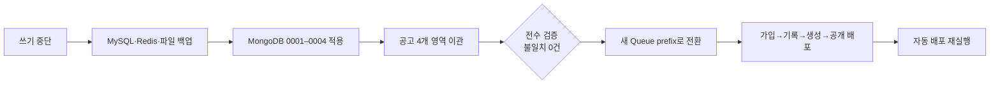
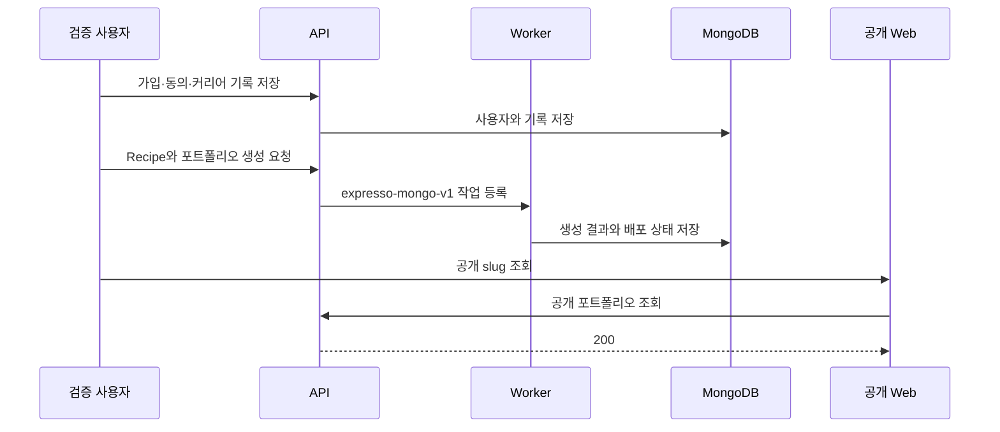
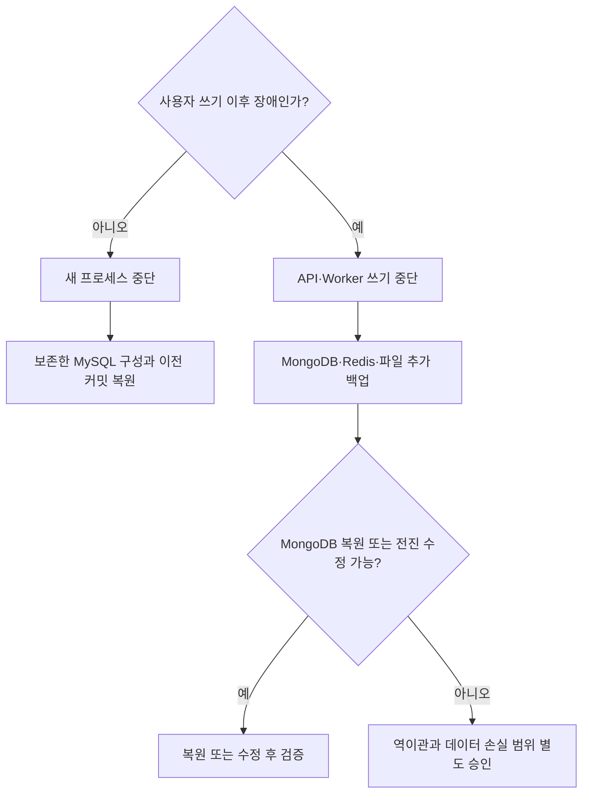

# MongoDB 운영 전환 결과

## 결과

MongoDB 기반 백엔드를 2026년 8월 30일 운영에 전환했습니다. 보존 대상으로 정한
채용 공고 4개 테이블은 모두 이관했고, API·Worker·Web과 자동 배포가 새 구성에서
정상 동작합니다. 기존 MySQL 컨테이너와 볼륨은 복구 판단을 위해 그대로 보존합니다.

## 실행 시각과 버전

| 항목 | 결과 |
| --- | --- |
| 최초 전환 커밋 | `b8bf80d3a250052f63180e9a85bca04313c7b593` |
| 운영 런타임 커밋 | `d16ce9d3382d5b513793c5ba05f3ba945db907a5` |
| 최초 병합 | 2026-08-30 20:49:10 KST |
| 전환 전 백업 | 2026-08-30 20:50:08 KST |
| 이관 후 백업 | 2026-08-30 20:54:05 KST |
| 최종 시나리오 검증 | 2026-08-30 21:40:50 KST |
| 자동 배포 재검증 | 2026-08-30 21:41:10–21:41:49 KST |
| MongoDB | `mongo:8.0@sha256:02a0cc7939f5ed38f30f9bc714ef5f682d49baf9350c54acf302ce833087fe8a` |
| Keyfile 초기화 도구 | `busybox:1.36.1@sha256:73aaf090f3d85aa34ee199857f03fa3a95c8ede2ffd4cc2cdb5b94e566b11662` |
| 적용 migration | `0001_initial_collections`–`0004_job_import_metadata` |
| Queue prefix | `expresso-mongo-v1` |

최초 전환 뒤 두 수정 커밋을 추가로 병합했습니다. `8cdbd46`은 CSS sanitizer의
`scroll-behavior` 오탐과 MongoDB 연결 준비 구간을 수정했습니다. `d16ce9d`은 공개
포트폴리오 경로가 세션 검사에 포함되던 matcher를 수정했습니다.

## 데이터 이관

이관 실행 ID는 `827ca2d2-3735-4f43-a630-99c0503a1861`입니다. 원본 스키마
해시는 `c7e44695e3a9d1c25b670d7ba2b0ebc69e96067d1c40c8a63398e0f78971d9c0`입니다.

| 데이터 | MySQL | MongoDB | 결과 |
| --- | ---: | ---: | --- |
| 채용 공고 출처 | 5 | 5 | 일치 |
| 회사 | 6 | 6 | 일치 |
| 채용 공고 | 189 | 189 | 일치 |
| 공고 요구사항 | 12 | 12 | 일치 |

Importer 완료 뒤 `verify-only`를 다시 실행했으며 불일치는 0건이었습니다. 전환 전
사용자 데이터와 생성 결과는 계획대로 이관하지 않았습니다. 운영 시나리오 검증에서
새로 만든 기록과 생성 결과는 전환 증거로 보존했습니다.

## 백업

| 시점 | 서버 위치 | 별도 로컬 복제 | 검증 |
| --- | --- | --- | --- |
| 전환 전 | `/home/ubuntu/expresso-backups/mongodb-cutover-20260830T115008Z-pre` | `var/production-backups/mongodb-cutover-20260830T115008Z-pre` | SHA-256 전체 일치 |
| 이관 후 | `/home/ubuntu/expresso-backups/mongodb-cutover-20260830T115405Z-post` | `var/production-backups/mongodb-cutover-20260830T115405Z-post` | SHA-256 전체 일치 |

전환 전 백업에는 MySQL dump, Redis RDB, media, 설정 사본과 metadata가 있습니다.
이관 후 백업에는 MongoDB archive, Redis RDB, media와 metadata가 있습니다. 서버와
로컬 복제본은 소유자만 읽을 수 있게 제한했습니다. 설정 파일의 내용과 운영 자격
증명은 저장소에 넣지 않았습니다.

## 운영 검증

검증 전용 계정으로 아래 흐름을 실제 운영 API·Worker·Web에서 실행했습니다.

- 준비 상태는 HTTP 200을 반환했습니다.
- 이관된 채용 공고 189건을 조회했습니다.
- 가입, 동의, 기록 저장, Recipe 생성, 포트폴리오 생성과 공개 배포가 통과했습니다.
- 공개 API와 공개 Web은 모두 HTTP 200을 반환했습니다.
- API, Worker, Web systemd unit은 모두 `active`입니다.
- MongoDB, Redis와 보존한 MySQL 컨테이너는 모두 `healthy`입니다.
- 기존 Redis volume을 유지했으며 Redis 전체 삭제는 수행하지 않았습니다.
- [자동 배포 실행](https://github.com/Expresso-Organization/expresso/actions/runs/33312145248)은 같은 운영 커밋으로 재실행해 성공했습니다.

## 복구 경계

사용자 쓰기가 시작된 뒤에는 설정만 MySQL로 되돌리지 않습니다. 먼저 쓰기를
중단하고 MongoDB, Redis와 파일을 보존한 뒤 복원이나 전진 수정을 우선합니다.
MySQL 복귀가 꼭 필요하면 새 데이터의 역이관과 손실 범위를 별도로 검토합니다.
기존 MySQL 컨테이너·볼륨의 폐기는 이번 전환 범위에 포함하지 않았습니다.
