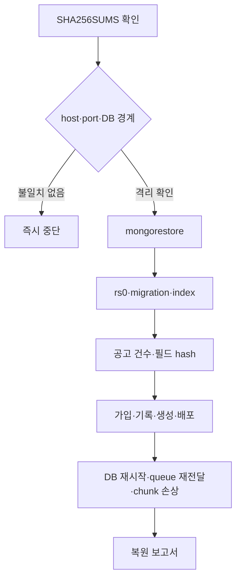

# MongoDB 복원 리허설 기록

## 실행 기준

복원 리허설은 원본 인스턴스와 volume을 사용하지 않습니다. 다음 순서로 실행하고
각 명령의 원문 출력을 증거 디렉터리에 보존합니다.

## 2026-08-30 · 실제 로컬 복원 리허설

- 백업·복원 스크립트는 원본과 같은 host:port를 거부합니다.
- 복원 DB 이름은 원본과 달라야 하며 `restore` 또는 `rehearsal`을 포함합니다.
- checksum, rs0 writable primary, schema migration 4 이상과 chunk 연결을 자동 확인합니다.
- 이관된 회사 10건·공고 11건·요구사항 14건이 든 격리 DB를 일관된 시점에
  `mongodump` archive로 만들었습니다. Redis RDB, 미디어 archive, commit·image
  digest·queue prefix·설정 버전과 SHA-256 목록도 함께 만들었습니다.
- 원본과 다른 컨테이너·volume·포트 `57117`, DB
  `expresso_restore_rehearsal`에 validator와 index를 포함해 복원했습니다.
- 원본과 복원본의 77개 collection 건수와 네 공고 collection의 SHA-256이 모두
  일치했습니다. rs0 primary, migration 4, snapshot chunk 무결성도 통과했습니다.
- 스테이징 리허설은 별도 DB와 queue prefix에서 API·Worker를 띄워 readiness와
  신규 가입까지 통과했습니다. 원본 DB·Redis prefix·volume은 변경하지 않았습니다.

요약과 구조화 보고서는 `coordination/mongodb/evidence/T18-restore-rehearsal.log`,
`T18-backup-source-report.json`, `T18-restore-report.json`에 있습니다. DB 재시작,
queue 재전달, chunk 손상 거부는 통합·복원 검증 suite에서 실행합니다.

운영 전환은 이 구현 검증과 별개입니다. T19 승인 전에는 운영 DB나 큐 prefix를
변경하지 않습니다.
