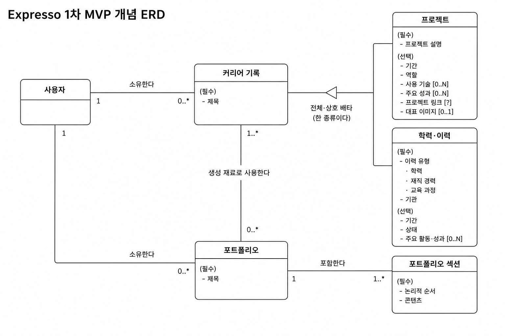

# Expresso 1차 MVP 개념 ERD

## 1. 목적

본 문서는 Expresso 1차 MVP에 필요한 핵심 비즈니스 개념과 관계를 정의한다.

현재 단계에서는 엔티티, 값, 관계 및 Cardinality만 다룬다. 논리 데이터 구조와
물리 데이터베이스 구조는 정의하지 않는다.

기준 문서는 다음과 같다.

- [소프트웨어 요구사항 명세서](../requirements-spec.md)
- [1차 MVP 범위](../mvp-scope.md)

## 2. 범위

현재 1차 MVP의 커리어 상세화 대상은 프로젝트와 학력·이력이다. 커리어 기록의
공통 구조와 두 구체 유형, 포트폴리오와 포트폴리오 섹션, 포트폴리오 생성에 사용한
커리어 기록 집합의 출처 관계를 범위에 포함한다.

자격증·수상과 학술·집필은 현재 1차 MVP에 포함하지 않는다. 활동·리더십, 경험 및
스킬·도구도 현재 상세화 범위에 포함하지 않는다.

사용자는 커리어 기록과 포트폴리오의 소유 주체로만 표현한다. 인증 정보와 계정
구현 정보는 본 개념 ERD의 범위에 포함하지 않는다.

## 3. 핵심 엔티티

| 엔티티 | 개념적 역할 |
| --- | --- |
| 사용자 | 커리어 기록과 포트폴리오의 소유자이다. |
| 커리어 기록 | 커리어의 공통 제목과 소유 관계를 정의하는 공통 상위 엔티티이다. |
| 프로젝트 | 목표와 결과물이 있는 프로젝트 커리어 기록이다. |
| 학력·이력 | 학력, 재직 경력 또는 교육 과정에 해당하는 커리어 기록이다. |
| 포트폴리오 | 선택한 커리어 기록을 재료로 생성하고 독립적으로 보존하는 결과물이다. |
| 포트폴리오 섹션 | 포트폴리오에 속하며 논리적 순서와 콘텐츠를 갖는 구성 단위이다. |

커리어 분류를 별도 엔티티나 커리어 기록의 공통 속성으로 중복 표현하지 않는다.
현재 MVP에서는 프로젝트 또는 학력·이력이라는 구체 유형 관계 자체가 해당
커리어 분류를 나타낸다.

## 4. 커리어 기록

커리어 기록은 커리어의 공통 기준점이다. 다음 공통 개념을 가진다.

- 사용자 소유 관계
- 필수 제목

커리어 기록은 독립적인 종류로 생성하지 않는다. 프로젝트 생성은 프로젝트 유형의
커리어 기록을 생성하는 것이고, 학력·이력 생성은 학력·이력 유형의 커리어 기록을
생성하는 것이다.

현재 MVP의 커리어 기록은 다음 조건을 모두 만족한다.

- 프로젝트 또는 학력·이력 중 정확히 하나의 구체 유형을 가진다.
- 구체 유형이 없는 커리어 기록은 허용하지 않는다.
- 하나의 커리어 기록이 두 구체 유형을 동시에 가질 수 없다.
- 생성 이후 다른 구체 유형으로 변경할 수 없다.

따라서 커리어 기록과 두 구체 유형의 관계는 일반적인 1:1 상세 관계가 아니라
`전체·상호 배타 일반화/특수화` 관계로 표현한다.

## 5. 프로젝트

프로젝트는 커리어 기록의 구체 유형이다. 공통 제목과 사용자 소유 관계는
커리어 기록에서 정의하므로 프로젝트에 중복하여 두지 않는다.

프로젝트의 핵심 값은 다음과 같다.

| 구분 | 값 | 개념적 수량 |
| --- | --- | --- |
| 필수 | 프로젝트 설명 | 1 |
| 선택 | 진행 기간 | 0..1 |
| 선택 | 역할 | 0..1 |
| 선택 | 사용 기술 | 0..N |
| 선택 | 주요 성과 | 0..N |
| 선택 | 프로젝트 링크 | 0..1 |
| 선택 | 대표 이미지 | 0..1 |

사용 기술과 주요 성과는 반복 가능한 값으로 표현한다. 대표 이미지는 최대 하나의
값으로 표현한다. 이들을 현재 단계에서 독립 엔티티로 확정하지 않는다.

현재 1차 MVP의 프로젝트 링크는 선택 가능한 단일값이며 최대 1개이다.

## 6. 학력·이력

학력·이력은 커리어 기록의 구체 유형이다. 공통 제목과 사용자 소유 관계는
커리어 기록에서 정의하므로 학력·이력에 중복하여 두지 않는다.

학력·이력의 핵심 개념은 다음과 같다.

- 필수 기관
- 필수 이력 유형
- 선택 기간
- 선택 상태
- 주요 활동 / 성과 0..N

하나의 학력·이력은 다음 이력 유형 중 정확히 하나를 가진다.

- 학력
- 재직 경력
- 교육 과정

이력 유형은 생성 이후 변경할 수 없다. 세 이력 유형은 학력·이력 안에서 구분하는
값이며, 현재 개념 ERD에서 각각을 독립 엔티티로 만들지 않는다. 유형별 상세 필드의
논리적 표현 방식은 다음 단계에서 검토한다.

주요 활동 / 성과는 반복 가능한 값으로 표현하며 독립 엔티티로 확정하지 않는다.

## 7. 포트폴리오

포트폴리오는 사용자에게 귀속되는 독립된 생성 결과물이다.

- 사용자 한 명은 여러 포트폴리오를 가질 수 있다.
- 각 포트폴리오는 사용자 한 명에게 귀속된다.
- 포트폴리오는 필수 제목을 가진다.
- 현재 MVP에서는 포트폴리오 제목 중복을 허용한다.
- 포트폴리오는 생성 이후 원본 커리어 기록과 독립적으로 수정하고 보존한다.

커리어 기록의 수정은 기존 포트폴리오를 자동으로 변경하지 않는다. 포트폴리오의
수정도 원본 커리어 기록을 자동으로 변경하지 않는다.

## 8. 포트폴리오 섹션

포트폴리오 섹션은 포트폴리오에 종속되는 구성 엔티티이다.

- 하나의 포트폴리오는 1개 이상의 포트폴리오 섹션을 가진다.
- 각 포트폴리오 섹션은 정확히 하나의 포트폴리오에 속한다.
- 포트폴리오 섹션은 포트폴리오 안에서의 논리적 순서를 가진다.
- 포트폴리오 섹션은 사용자가 확인할 수 있는 콘텐츠를 가진다.

섹션의 추가, 삭제 및 순서 변경 기능은 현재 MVP에 포함하지 않는다. 섹션
내부 콘텐츠의 저장 형식과 블록 구조도 현재 단계에서 결정하지 않는다.

## 9. 관계 및 Cardinality

| 관계 | Cardinality | 의미 |
| --- | --- | --- |
| 사용자 — 커리어 기록 | 1 : 0..N | 한 사용자는 여러 커리어 기록을 가질 수 있고, 각 커리어 기록은 한 사용자에게 귀속된다. |
| 커리어 기록 — 프로젝트 / 학력·이력 | 전체·상호 배타 특수화 | 각 커리어 기록은 두 구체 유형 중 정확히 하나이다. |
| 사용자 — 포트폴리오 | 1 : 0..N | 한 사용자는 여러 포트폴리오를 가질 수 있고, 각 포트폴리오는 한 사용자에게 귀속된다. |
| 포트폴리오 — 포트폴리오 섹션 | 1 : 1..N | 각 포트폴리오는 하나 이상의 섹션을 가지며, 각 섹션은 하나의 포트폴리오에 속한다. |
| 포트폴리오 — 커리어 기록 | N : M | 각 포트폴리오는 하나 이상의 커리어 기록을 생성 재료로 사용하며, 하나의 커리어 기록은 여러 포트폴리오의 생성 재료가 될 수 있다. |

포트폴리오와 커리어 기록 관계에서 포트폴리오 쪽 참여는 1개 이상이고,
커리어 기록 쪽 참여는 0개 이상이다.

## 10. 포트폴리오와 커리어 기록의 생성 재료 관계

포트폴리오는 생성에 사용한 커리어 기록 집합을 포트폴리오 전체 수준에서 추적한다.
이 관계의 의미는 `생성 재료로 사용한다`이다.

- 하나의 포트폴리오는 1개 이상의 커리어 기록을 생성 재료로 사용한다.
- 하나의 커리어 기록은 아직 사용되지 않거나 여러 포트폴리오에 사용될 수 있다.
- 출처 추적은 섹션별 또는 콘텐츠별로 세분화하지 않는다.
- 출처 관계는 커리어 기록과 포트폴리오 콘텐츠의 자동 동기화를 의미하지 않는다.
- 커리어 기록이 수정되어도 기존 포트폴리오의 내용은 자동 변경되지 않는다.
- 포트폴리오가 수정되어도 원본 커리어 기록은 자동 변경되지 않는다.

현재 개념 ERD에서는 이 관계를 독립 연결 엔티티로 표현하지 않는다. 관계의 논리적
구현 방식과 원본 변경 또는 삭제 이후의 추적 정보 처리 방식은 다음 단계에서
검토한다.

## 11. 현재 개념 ERD

## 12. 현재 단계에서 의도적으로 결정하지 않은 사항

다음 사항은 현재 개념 ERD의 성립을 막지 않으며, 본 문서에서 결정하지 않는다.

- 반복값의 최대·최소 항목 수, 중복 허용 여부 및 항목 순서의 의미
- 기간의 논리적 표현과 저장 구조
- 사용 기술, 주요 성과 및 주요 활동 / 성과의 저장 구조
- 대표 이미지의 저장 및 수명주기 구조
- 포트폴리오와 커리어 기록의 N:M 관계 구현 구조
- 포트폴리오 섹션 콘텐츠의 저장 구조
- 커리어 기록과 구체 유형의 논리 데이터 구조
- 학력·이력 유형별 상세 필드의 논리 데이터 구조

## 13. 다음 논리 ERD에서 검토할 사항

다음 단계에서는 본 개념 모델의 의미를 유지하면서 아래 사항을 비교하고 결정한다.

- 커리어 기록 공통 구조와 프로젝트·학력·이력 구체 유형의 논리적 표현
- 학력·이력 유형별 허용 필드의 논리적 표현
- 반복 가능한 값의 논리적 저장 구조와 제약
- 포트폴리오와 커리어 기록 생성 재료 관계의 논리적 구현
- 포트폴리오 섹션의 논리적 구조와 콘텐츠 표현
- 대표 이미지의 논리적 참조 및 보존 구조
- 기간의 시작, 종료 및 진행 상태를 표현하는 논리 구조

논리 ERD 단계에서도 개념 관계와 비즈니스 규칙을 먼저 보존하고, 구체적인 물리
데이터베이스와 애플리케이션 매핑은 별도의 기술 설계에서 결정한다.
