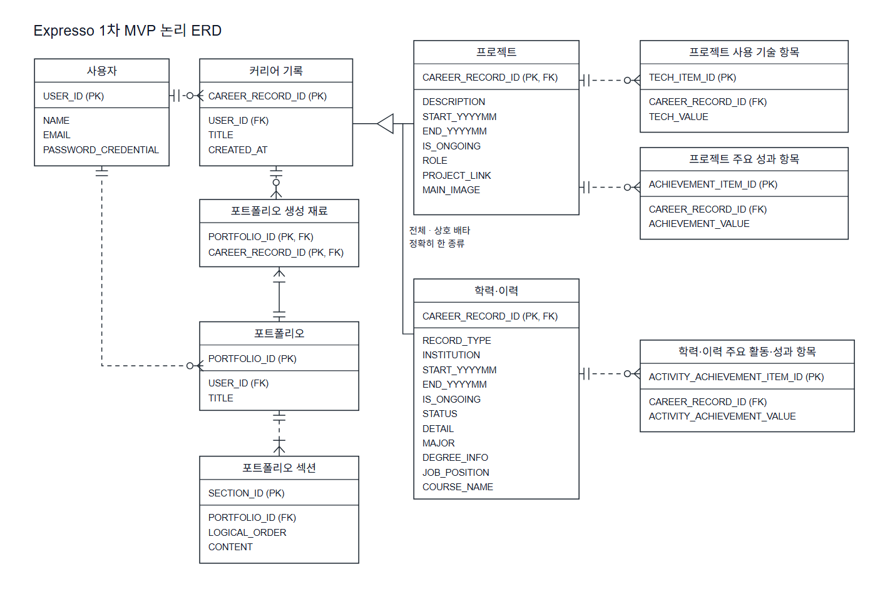

# Expresso 1차 MVP 논리 ERD

## 1. 목적

본 문서는 Expresso 1차 MVP의 개념 ERD를 관계형 논리 모델로 구체화한다.
현재 요구사항을 논리 엔티티, 논리 속성, 식별자, 참조 관계 및 Cardinality로
표현하여 이후 물리 ERD와 데이터베이스 설계의 기준으로 사용한다.

본 문서는 논리 ERD까지만 다룬다. 실제 데이터 타입, DDL, 인덱스, 삭제 정책,
ORM 매핑 및 API 구조는 정의하지 않는다.

## 2. 기준 및 범위

본 문서는 다음 문서를 기준으로 한다.

- [Expresso 소프트웨어 요구사항 명세서](../requirements-spec.md)
- [Expresso 1차 MVP 범위 초안](../mvp-scope.md)
- [Expresso 1차 MVP 개념 ERD](./mvp-conceptual-erd.md)

현재 1차 MVP의 논리 모델에는 다음 10개 엔티티를 포함한다.

1. 사용자
2. 커리어 기록
3. 프로젝트
4. 프로젝트 사용 기술 항목
5. 프로젝트 주요 성과 항목
6. 학력·이력
7. 학력·이력 주요 활동·성과 항목
8. 포트폴리오
9. 포트폴리오 섹션
10. 포트폴리오 생성 재료

현재 MVP에서 상세화하는 Career Category는 프로젝트와 학력·이력이다.
자격증·수상과 학술·집필은 현재 MVP에 포함하지 않으며, 활동·리더십과 경험은
`DEFERRED` 상태를 유지한다.

## 3. 개념 ERD에서 논리 ERD로의 변환

개념 ERD의 비즈니스 개념을 다음과 같이 논리 구조로 변환한다.

| 개념 구조 | 논리 구조 |
| --- | --- |
| 사용자 | 독립 식별자를 가진 사용자 엔티티 |
| 커리어 기록 | 공통 속성과 사용자 소유 관계를 가진 상위 엔티티 |
| 프로젝트 | 커리어 기록 식별자를 PK이자 FK로 사용하는 구체 유형 엔티티 |
| 프로젝트 사용 기술 `[0..N]` | 프로젝트에 종속된 사용 기술 항목 엔티티 |
| 프로젝트 주요 성과 `[0..N]` | 프로젝트에 종속된 주요 성과 항목 엔티티 |
| 학력·이력 | 커리어 기록 식별자를 PK이자 FK로 사용하는 구체 유형 엔티티 |
| 학력·이력 주요 활동·성과 `[0..N]` | 학력·이력에 종속된 주요 활동·성과 항목 엔티티 |
| 포트폴리오 | 사용자에게 귀속되는 독립 결과물 엔티티 |
| 포트폴리오 섹션 | 포트폴리오에 종속된 순서 있는 콘텐츠 엔티티 |
| 포트폴리오 N:M 커리어 기록 | 두 식별자를 복합 식별자로 사용하는 포트폴리오 생성 재료 엔티티 |

개념 ERD에서는 사용자를 소유 주체로만 표현하고 인증 정보를 생략했다. 논리
ERD에서는 현재 사용자 Decision에 따라 이름, 이메일 및 비밀번호 자격정보를
사용자 논리 속성으로 포함한다.

프로젝트와 학력·이력의 기간은 별도 엔티티로 분리하지 않고 시작 연·월,
종료 연·월 및 진행 중 표시라는 논리 속성으로 표현한다. 대표 이미지도 현재
논리 ERD에서는 별도 Asset 엔티티로 분리하지 않는다.

## 4. 사용자

사용자는 커리어 기록과 포트폴리오의 소유 주체이다.

| 논리 속성 | 역할 | 필수 여부 및 제약 |
| --- | --- | --- |
| 사용자 식별자 | PK | 필수 |
| 이름 | 일반 속성 | 필수 |
| 이메일 | 일반 속성 | 필수, 고유 |
| 비밀번호 자격정보 | 일반 속성 | 필수 |

사용자 식별자는 이메일과 별도로 존재하며 이메일 자체를 PK로 사용하지 않는다.
비밀번호 자격정보는 인증에 필요한 논리적 개념이며 평문 비밀번호 저장을 의미하지
않는다.

외부 인증은 현재 1차 MVP에 포함하지 않는다. `nickname`, 프로필 이미지 및 역할
등의 속성도 현재 논리 모델에 추가하지 않는다.

## 5. 커리어 기록

커리어 기록은 Career의 공통 기준점이다.

| 논리 속성 | 역할 | 필수 여부 및 제약 |
| --- | --- | --- |
| 커리어 기록 식별자 | PK | 필수 |
| 사용자 식별자 | FK → 사용자 | 필수 |
| 제목 | 일반 속성 | 필수 |
| 생성 시점 | 일반 속성 | 필수 |

생성 시점은 Career 목록 정렬에서 제목까지 동일한 경우 최근 생성 Record를
우선하는 tie-break에 사용한다.

현재 MVP의 모든 커리어 기록은 프로젝트 또는 학력·이력 중 정확히 하나이다.
이는 전체·상호 배타 특수화 관계이며 다음 조건을 만족한다.

- 구체 유형이 없는 커리어 기록은 존재할 수 없다.
- 하나의 커리어 기록이 프로젝트와 학력·이력에 동시에 속할 수 없다.
- 프로젝트와 학력·이력은 커리어 기록 없이 독립적으로 존재할 수 없다.
- 구체 유형의 식별자는 상위 커리어 기록 식별자를 PK이자 FK로 사용한다.

현재 두 구체 유형 관계가 Career Category를 표현하므로 커리어 기록에 Category
공통 속성을 중복하여 두지 않는다.

## 6. 프로젝트

프로젝트는 커리어 기록의 구체 유형이다. 공통 제목, 사용자 소유 관계 및 생성
시점은 상위 커리어 기록에서 관리한다.

| 논리 속성 | 역할 | 필수 여부 및 제약 |
| --- | --- | --- |
| 커리어 기록 식별자 | PK, FK → 커리어 기록 | 필수 |
| 프로젝트 설명 | 일반 속성 | 필수 |
| 시작 연·월 | 기간 속성 | 선택 |
| 종료 연·월 | 기간 속성 | 선택 |
| 진행 중 표시 | 기간 상태 속성 | 기간 규칙 적용 |
| 역할 | 일반 속성 | 선택 |
| 프로젝트 링크 | 일반 속성 | 선택, 단일값 |
| 대표 이미지 | 일반 속성 | 선택, 최대 1개 |

프로젝트는 다음 종속 논리 엔티티와 관계를 가진다.

- 프로젝트 1 : 0..N 프로젝트 사용 기술 항목
- 프로젝트 1 : 0..N 프로젝트 주요 성과 항목

### 6.1 프로젝트 사용 기술 항목

| 논리 속성 | 역할 |
| --- | --- |
| 기술 항목 식별자 | PK |
| 프로젝트 식별자 | FK → 프로젝트의 커리어 기록 식별자 |
| 기술 값 | 사용 기술 값 |

각 사용 기술 항목은 정확히 하나의 프로젝트에 종속된다.

### 6.2 프로젝트 주요 성과 항목

| 논리 속성 | 역할 |
| --- | --- |
| 성과 항목 식별자 | PK |
| 프로젝트 식별자 | FK → 프로젝트의 커리어 기록 식별자 |
| 성과 값 | 주요 성과 값 |

각 주요 성과 항목은 정확히 하나의 프로젝트에 종속된다.

## 7. 학력·이력

학력·이력은 커리어 기록의 구체 유형이다. 공통 제목, 사용자 소유 관계 및 생성
시점은 상위 커리어 기록에서 관리한다.

| 논리 속성 | 역할 | 필수 여부 및 제약 |
| --- | --- | --- |
| 커리어 기록 식별자 | PK, FK → 커리어 기록 | 필수 |
| 이력 유형 | 일반 속성 | 필수 |
| 기관 | 일반 속성 | 필수 |
| 시작 연·월 | 기간 속성 | 선택 |
| 종료 연·월 | 기간 속성 | 선택 |
| 진행 중 표시 | 기간 상태 속성 | 기간 규칙 적용 |
| 상태 | 일반 속성 | 선택, 이력 유형별 허용값 적용 |
| 상세 설명 | 일반 속성 | 선택 |
| 전공 | 유형별 속성 | 학력 선택 |
| 학위 정보 | 유형별 속성 | 학력 선택 |
| 직무 / 직책 | 유형별 속성 | 재직 경력 선택 |
| 과정명 | 유형별 속성 | 교육 과정 선택 |

하나의 학력·이력은 다음 중 정확히 하나의 이력 유형을 가진다.

- 학력 (`EDUCATION`)
- 재직 경력 (`EMPLOYMENT`)
- 교육 과정 (`TRAINING`)

유형별 선택 필드는 해당 유형에서만 허용한다. 이력 유형은 생성 이후 변경할 수
없으며, 유형별 필드의 실제 물리 표현 방식은 현재 결정하지 않는다.

학력·이력은 다음 종속 논리 엔티티와 관계를 가진다.

- 학력·이력 1 : 0..N 학력·이력 주요 활동·성과 항목

### 7.1 학력·이력 주요 활동·성과 항목

| 논리 속성 | 역할 |
| --- | --- |
| 활동·성과 항목 식별자 | PK |
| 학력·이력 식별자 | FK → 학력·이력의 커리어 기록 식별자 |
| 활동·성과 값 | 주요 활동 또는 성과 값 |

각 주요 활동·성과 항목은 정확히 하나의 학력·이력에 종속된다.

## 8. 반복값 논리 구조

현재 논리 모델에서 반복값은 다음과 같다.

- 프로젝트 사용 기술
- 프로젝트 주요 성과
- 학력·이력 주요 활동·성과

각 반복값은 부모와 1:N 관계를 가진 종속 논리 엔티티로 표현한다. 개별 항목은
독립 식별자를 가지며 부모 식별자를 FK로 참조한다.

이 구조는 논리 ERD에서 반복값과 부모의 관계를 명확하게 표현하기 위한 것이다.
다음 정책은 현재 미결정 상태를 유지한다.

- 동일한 값의 중복 허용 여부
- 항목 순서의 의미
- 최대 항목 개수
- 별도 순서 속성의 필요 여부

## 9. 기간 논리 구조

프로젝트와 학력·이력은 다음 논리 속성으로 기간을 표현한다.

- 시작 연·월
- 종료 연·월
- 진행 중 표시

허용되는 논리 상태는 다음과 같다.

| 기간 상태 | 시작 연·월 | 종료 연·월 | 진행 중 표시 |
| --- | --- | --- | --- |
| 기간 없음 | 없음 | 없음 | 거짓 |
| 종료됨 | 있음 | 있음 | 거짓 |
| 진행 중 | 있음 | 없음 | 참 |

다음 제약을 적용한다.

- 시작 연·월만 존재하는 상태는 허용하지 않는다.
- 종료 연·월과 진행 중 상태를 동시에 사용할 수 없다.
- 종료 연·월은 시작 연·월보다 빠를 수 없다.
- 종료 연·월이 없다는 사실만으로 진행 중이라고 판단하지 않는다.

기간은 현재 논리 모델에서 별도 엔티티로 분리하지 않는다.

## 10. 포트폴리오

포트폴리오는 사용자에게 귀속되는 독립된 생성 결과물이다.

| 논리 속성 | 역할 | 필수 여부 및 제약 |
| --- | --- | --- |
| 포트폴리오 식별자 | PK | 필수 |
| 사용자 식별자 | FK → 사용자 | 필수 |
| 제목 | 일반 속성 | 필수, 중복 허용 |

사용자 한 명은 여러 포트폴리오를 가질 수 있으며, 각 포트폴리오는 정확히 한
사용자에게 귀속된다. 포트폴리오 제목에는 고유 제약을 두지 않는다.

포트폴리오는 생성 이후 원본 커리어 기록과 독립적으로 보존한다. 커리어 기록의
수정은 기존 포트폴리오를 자동 변경하지 않으며, 포트폴리오 수정도 원본 커리어
기록을 자동 변경하지 않는다.

## 11. 포트폴리오 섹션

포트폴리오 섹션은 포트폴리오에 종속되는 순서 있는 콘텐츠 엔티티이다.

| 논리 속성 | 역할 | 필수 여부 및 제약 |
| --- | --- | --- |
| 섹션 식별자 | PK | 필수 |
| 포트폴리오 식별자 | FK → 포트폴리오 | 필수 |
| 논리적 순서 | 일반 속성 | 필수, 같은 포트폴리오 안에서 고유 |
| 콘텐츠 | 일반 속성 | 필수 |

포트폴리오와 포트폴리오 섹션의 관계는 1 : 1..N이다. 하나의 포트폴리오는
1개 이상의 섹션을 가지며 각 섹션은 정확히 하나의 포트폴리오에 속한다.

`(포트폴리오 식별자, 논리적 순서)` 조합에는 논리적 고유성이 있다. 콘텐츠의
실제 저장 형식은 현재 결정하지 않는다.

## 12. 포트폴리오 생성 재료

포트폴리오 생성 재료는 개념 ERD의 포트폴리오 N:M 커리어 기록 관계를 해소하는
연관 논리 엔티티이다.

| 논리 속성 | 역할 | 제약 |
| --- | --- | --- |
| 포트폴리오 식별자 | PK, FK → 포트폴리오 | 복합 식별자의 일부 |
| 커리어 기록 식별자 | PK, FK → 커리어 기록 | 복합 식별자의 일부 |

두 식별자의 조합을 논리 식별자로 사용한다. 따라서 같은 포트폴리오와 커리어
기록의 조합은 중복될 수 없다.

관계는 다음과 같다.

- 포트폴리오 1 : 1..N 포트폴리오 생성 재료
- 커리어 기록 1 : 0..N 포트폴리오 생성 재료

하나의 포트폴리오는 최소 1개의 커리어 기록을 생성 재료로 사용한다. 하나의
커리어 기록은 아직 생성 재료로 사용되지 않았거나 여러 포트폴리오에 사용될 수
있다.

현재는 포트폴리오 전체 수준에서만 Career 출처를 추적한다. Section별 또는
콘텐츠별 출처 관계는 추가하지 않는다. 출처 관계는 원본 Career와 포트폴리오의
자동 동기화를 의미하지 않는다.

## 13. 논리 엔티티 관계

| 관계 | Cardinality | 관계 종류 | 의미 |
| --- | --- | --- | --- |
| 사용자 — 커리어 기록 | 1 : 0..N | 비식별 관계 | 각 커리어 기록은 정확히 한 사용자에게 귀속된다. |
| 사용자 — 포트폴리오 | 1 : 0..N | 비식별 관계 | 각 포트폴리오는 정확히 한 사용자에게 귀속된다. |
| 커리어 기록 — 프로젝트 / 학력·이력 | 전체·상호 배타 | 일반화/특수화 | 각 커리어 기록은 두 구체 유형 중 정확히 하나이다. |
| 프로젝트 — 프로젝트 사용 기술 항목 | 1 : 0..N | 비식별 관계 | 각 기술 항목은 하나의 프로젝트에 종속된다. |
| 프로젝트 — 프로젝트 주요 성과 항목 | 1 : 0..N | 비식별 관계 | 각 성과 항목은 하나의 프로젝트에 종속된다. |
| 학력·이력 — 학력·이력 주요 활동·성과 항목 | 1 : 0..N | 비식별 관계 | 각 활동·성과 항목은 하나의 학력·이력에 종속된다. |
| 포트폴리오 — 포트폴리오 섹션 | 1 : 1..N | 비식별 관계 | 각 포트폴리오는 하나 이상의 섹션을 가진다. |
| 포트폴리오 — 포트폴리오 생성 재료 | 1 : 1..N | 식별 관계 | 포트폴리오 식별자가 생성 재료의 복합 PK에 포함된다. |
| 커리어 기록 — 포트폴리오 생성 재료 | 1 : 0..N | 식별 관계 | 커리어 기록 식별자가 생성 재료의 복합 PK에 포함된다. |

## 14. 현재 논리 ERD

다음 그림은 물리 데이터 타입과 구현 기술을 제외한 현재 논리 관계를 나타낸다.

```text
사용자 (1)
  ├─ 비식별 ── (0..N) 커리어 기록
  │                         │
  │                         └─ 전체·상호 배타 특수화
  │                              ├─ 프로젝트
  │                              │    ├─ (0..N) 프로젝트 사용 기술 항목
  │                              │    └─ (0..N) 프로젝트 주요 성과 항목
  │                              └─ 학력·이력
  │                                   └─ (0..N) 학력·이력 주요 활동·성과 항목
  │
  └─ 비식별 ── (0..N) 포트폴리오
                            ├─ (1..N) 포트폴리오 섹션
                            └─ (1..N) 포트폴리오 생성 재료
                                              └─ (각 항목이 커리어 기록 1개 참조)

커리어 기록 (1) ── 식별 ── (0..N) 포트폴리오 생성 재료
포트폴리오   (1) ── 식별 ── (1..N) 포트폴리오 생성 재료
```



> 본 이미지는 임시 파일이며, 추후 수정할 예정이다.

## 15. 논리 제약

현재 논리 모델은 다음 제약을 가진다.

- 사용자 이메일은 필수이며 전체 사용자 집합에서 고유하다.
- 각 커리어 기록과 포트폴리오는 정확히 한 사용자에게 귀속된다.
- 모든 커리어 기록은 프로젝트 또는 학력·이력 중 정확히 하나이다.
- 프로젝트와 학력·이력은 상위 커리어 기록 없이 존재할 수 없다.
- 대표 이미지는 프로젝트별 최대 1개이다.
- 프로젝트 및 학력·이력의 기간은 정의된 세 가지 상태 중 하나여야 한다.
- 각 반복값 항목은 정확히 하나의 부모에 종속된다.
- 하나의 포트폴리오는 최소 1개의 포트폴리오 섹션을 가진다.
- 같은 포트폴리오 안에서 논리적 순서는 중복되지 않는다.
- 하나의 포트폴리오는 최소 1개의 포트폴리오 생성 재료를 가진다.
- 같은 포트폴리오와 커리어 기록의 생성 재료 조합은 중복되지 않는다.
- Career와 포트폴리오는 출처 관계를 유지하더라도 자동으로 동기화되지 않는다.

## 16. 정규화 검토

현재 논리 구조는 다음 원칙을 따른다.

- 사용자 소유 관계, 제목 및 생성 시점은 커리어 기록에 한 번만 둔다.
- 프로젝트와 학력·이력에는 구체 유형에서만 사용하는 속성을 둔다.
- Career Category를 상위 속성과 구체 유형 관계에 중복 표현하지 않는다.
- 반복 가능한 사용 기술, 주요 성과 및 주요 활동·성과는 부모와 분리된 종속
  논리 엔티티로 표현한다.
- 포트폴리오와 커리어 기록의 N:M 관계는 포트폴리오 생성 재료 엔티티로
  해소한다.
- 포트폴리오 섹션의 순서는 포트폴리오 범위의 논리적 고유성으로 관리한다.

현재 1차 MVP의 프로젝트 링크는 선택 가능한 단일값이다. 대표 이미지 및 Section
콘텐츠는 현재 정의된 의미까지만 표현하며, 실제 저장 구조는 물리 ERD에서 검토한다.

## 17. 현재 미결정 사항

다음 사항은 현재 논리 ERD의 문서화를 막지 않으며 미결정 상태를 유지한다.

- 반복값의 중복 허용 여부
- 반복값 순서의 의미
- 반복값의 최대 개수
- 반복값의 별도 순서 속성
- 실제 데이터베이스 타입
- 포트폴리오 섹션 콘텐츠 저장 형식
- 대표 이미지 저장 형식
- FK 삭제 정책
- 생성 결과 독립성을 구현할 Snapshot 방식
- JPA 매핑 방식

## 18. 물리 ERD에서 검토할 사항

물리 ERD 단계에서는 다음 사항을 별도로 검토한다.

- 사용자, 커리어 기록 및 포트폴리오 식별자의 실제 타입과 생성 방식
- 이메일 고유성의 물리 제약 구현 방식
- 비밀번호 자격정보의 실제 저장 구조와 보안 방식
- 커리어 기록의 전체·상호 배타 특수화를 보장하는 구현 방식
- 프로젝트와 학력·이력 기간 속성의 실제 타입 및 제약 구현 방식
- 학력·이력 유형별 선택 필드의 물리 표현 방식
- 반복값 엔티티의 실제 테이블 구조와 중복·순서 정책 반영 방식
- 대표 이미지의 저장 및 수명주기 구조
- 포트폴리오 섹션 콘텐츠의 저장 형식
- 포트폴리오 생성 재료의 복합 PK와 참조 무결성 구현 방식
- FK 삭제 및 Cascade 정책
- 필요한 인덱스와 고유 제약
- 생성 결과 독립성을 위한 Snapshot, 복사 또는 참조 구조
- JPA 연관관계와 객체 매핑 방식

본 문서에서는 위 항목의 구체적인 구현 방식을 결정하지 않는다.
