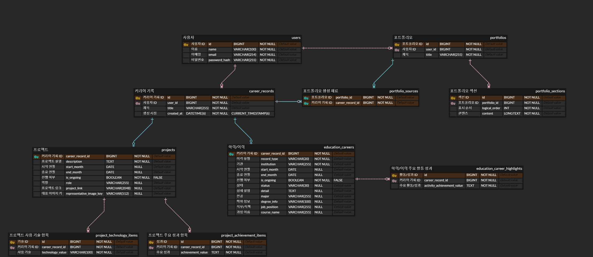

# Expresso 1차 MVP 물리 ERD

## 1. 목적

본 문서는 Expresso 1차 MVP 논리 ERD를 MySQL 관계형 데이터베이스의 현재 물리
설계로 구체화한다. 현재 요구사항에서 필요한 테이블, 컬럼, 식별자, 참조 관계,
제약 후보 및 인덱스를 정의하여 이후 DDL과 애플리케이션 데이터 모델 설계의
기준으로 사용한다.

본 문서는 물리 ERD까지 다룬다. 실제 DDL, Migration, Spring Entity, JPA 매핑,
Repository 및 API 구조는 정의하지 않는다.

## 2. 기준 및 범위

본 문서는 다음 문서를 우선순위에 따라 기준으로 사용한다.

1. [Expresso 1차 MVP 논리 ERD](./mvp-logical-erd.md)
2. [Expresso 1차 MVP 범위 초안](../mvp-scope.md)
3. [Expresso 1차 MVP 개념 ERD](./mvp-conceptual-erd.md)
4. [Expresso 소프트웨어 요구사항 명세서](../requirements-spec.md)

기존 개발 포털의 DB와 ERD는 구현 경험을 비교하는 참고자료로만 사용한다. 기존
구조에 테이블이나 컬럼이 존재한다는 이유만으로 현재 물리 설계에 포함하지 않는다.

현재 1차 MVP에서 물리 구조를 상세화하는 Career Category는 프로젝트와
학력·이력이다. 자격증·수상과 학술·집필은 현재 MVP에 포함하지 않으며,
활동·리더십과 경험은 `DEFERRED` 상태를 유지한다.

이 문서에서 사용하는 “현재 설계”와 “현재 1차 MVP 기준”은 SRS Requirement의
`CONFIRMED` 상태를 의미하지 않는다.

## 3. DBMS 및 물리 설계 원칙

현재 DBMS는 MySQL이다.

물리 명명 규칙은 다음과 같다.

- 테이블명은 `snake_case` 복수형을 사용한다.
- 독립 엔티티의 자체 PK 컬럼명은 `id`를 사용한다.
- FK는 참조 대상의 의미가 드러나는 `{target}_id` 형식을 사용한다.
- subtype이 상위 엔티티의 PK를 공유하면 `career_record_id`를 PK이자 FK로 사용한다.
- 관계 자체가 식별자인 연결 테이블은 두 FK로 구성한 복합 PK를 사용한다.

독립 엔티티와 반복값 항목의 식별자는 `BIGINT AUTO_INCREMENT`를 기본으로 한다.
UUID는 현재 1차 MVP에서 사용하지 않는다.

다음 원칙도 함께 적용한다.

- 모든 테이블에 `created_at`과 `updated_at`을 관습적으로 추가하지 않는다.
- 현재 요구사항과 실제 조회에 필요한 컬럼만 사용한다.
- 실제 조회 요구가 없는 인덱스를 미리 추가하지 않는다.
- PK 또는 UNIQUE가 이미 제공하는 인덱스와 중복되는 인덱스를 만들지 않는다.
- 구현 후 대표 쿼리를 `EXPLAIN`으로 확인하여 실행계획을 재검증한다.

## 4. 현재 물리 테이블

현재 1차 MVP 물리 모델은 정확히 다음 10개 테이블로 구성한다.

| 테이블 | 역할 | 대응 논리 엔티티 |
| --- | --- | --- |
| `users` | 사용자와 비밀번호 자격정보를 저장한다. | 사용자 |
| `career_records` | Career 공통 식별자, 소유자, 제목 및 생성 시점을 저장한다. | 커리어 기록 |
| `projects` | 프로젝트 Category의 상세 정보를 저장한다. | 프로젝트 |
| `project_technology_items` | 프로젝트 사용 기술 반복값을 한 항목당 한 행으로 저장한다. | 프로젝트 사용 기술 항목 |
| `project_achievement_items` | 프로젝트 주요 성과 반복값을 한 항목당 한 행으로 저장한다. | 프로젝트 주요 성과 항목 |
| `education_careers` | 학력, 재직 경력 및 교육 과정 상세 정보를 저장한다. | 학력·이력 |
| `education_career_highlights` | 학력·이력 주요 활동·성과 반복값을 한 항목당 한 행으로 저장한다. | 학력·이력 주요 활동·성과 항목 |
| `portfolios` | 사용자에게 귀속되는 독립 Portfolio 결과를 저장한다. | 포트폴리오 |
| `portfolio_sections` | Portfolio의 순서 있는 콘텐츠를 저장한다. | 포트폴리오 섹션 |
| `portfolio_sources` | Portfolio 생성에 사용한 CareerRecord 집합을 추적한다. | 포트폴리오 생성 재료 |

현재 물리 설계에는 별도 Master, Category, Asset 또는 Block 테이블을 추가하지
않는다.

## 5. 사용자

### 5.1 `users`

| 컬럼 | MySQL 타입 | NULL | 키 및 제약 | 의미 |
| --- | --- | --- | --- | --- |
| `id` | `BIGINT AUTO_INCREMENT` | 불가 | PK | 사용자 식별자 |
| `name` | `VARCHAR(100)` | 불가 |  | 사용자 이름 |
| `email` | `VARCHAR(254)` | 불가 | UNIQUE | 로그인과 사용자 식별에 사용하는 이메일 |
| `password_hash` | `VARCHAR(255)` | 불가 |  | 평문이 아닌 비밀번호 해시 |

DB에는 평문 비밀번호를 저장하지 않는다. 해시 알고리즘과 구체적인 해시 포맷은
후속 보안 및 인증 설계에서 결정한다. 외부 인증은 현재 1차 MVP 범위에 포함하지
않는다. 현재 요구사항에 필요하지 않은 `created_at`과 `updated_at`은 추가하지
않는다.

현재 이메일 정책은 대소문자를 구분하지 않는다. 애플리케이션은 저장 전에 이메일을
일관된 소문자로 정규화한다. DB의 이메일 Collation도 대소문자를 구분하지 않는
정책과 일치해야 한다. 정확한 MySQL Collation 명칭은 DDL 단계에서 결정한다.

`UNIQUE(email)`이 이메일 조회 인덱스를 함께 제공하므로 별도 이메일 인덱스는
추가하지 않는다.

## 6. 커리어 기록

### 6.1 `career_records`

| 컬럼 | MySQL 타입 | NULL | 키 및 제약 | 의미 |
| --- | --- | --- | --- | --- |
| `id` | `BIGINT AUTO_INCREMENT` | 불가 | PK | CareerRecord 식별자 |
| `user_id` | `BIGINT` | 불가 | FK → `users.id` | CareerRecord 소유 사용자 |
| `title` | `VARCHAR(255)` | 불가 |  | Career 공통 필수 제목 |
| `created_at` | `DATETIME(6)` | 불가 | DEFAULT `CURRENT_TIMESTAMP(6)` | 생성 시점과 목록 정렬 tie-break |

`created_at`은 단순 Audit 컬럼이 아니다. 다음 대표 조회에서 사용자의 CareerRecord를
생성 시점 최신순으로 정렬하는 데 사용한다.

```text
WHERE user_id = ?
ORDER BY created_at DESC, id DESC
```

현재 인덱스는 `(user_id, created_at)`을 사용한다. MySQL InnoDB의 보조 인덱스
레코드에는 클러스터드 PK가 내부적으로 포함되므로 현재 단계에서는
`(user_id, created_at, id)`를 별도로 만들지 않는다. 구현 후 `EXPLAIN`으로 인덱스
사용과 filesort 여부를 확인하고 필요할 때 재검토한다.

Career Category 컬럼은 추가하지 않는다. Project와 EducationCareer라는 구체
유형 관계 자체가 현재 MVP의 Category를 표현한다.

## 7. 프로젝트

### 7.1 `projects`

| 컬럼 | MySQL 타입 | NULL | 키 및 제약 | 의미 |
| --- | --- | --- | --- | --- |
| `career_record_id` | `BIGINT` | 불가 | PK, FK → `career_records.id` | 상위 CareerRecord와 공유하는 식별자 |
| `description` | `TEXT` | 불가 |  | 프로젝트 설명 |
| `start_month` | `DATE` | 허용 | 기간 CHECK 후보 | 시작 연·월의 월 첫날 |
| `end_month` | `DATE` | 허용 | 기간 CHECK 후보 | 종료 연·월의 월 첫날 |
| `is_ongoing` | `BOOLEAN` | 불가 | DEFAULT `FALSE`, 기간 CHECK 후보 | 진행 중 여부 |
| `role` | `VARCHAR(255)` | 허용 |  | 프로젝트 역할 단일 문자열 |
| `project_link` | `VARCHAR(2048)` | 허용 |  | 선택 가능한 단일 프로젝트 링크 |
| `representative_image_key` | `VARCHAR(512)` | 허용 |  | 선택 가능한 대표 이미지 저장소 키 |

`projects`는 `career_records`의 subtype이다. 별도 `project_id`를 만들지 않고
`career_records.id`를 `projects.career_record_id`가 PK이자 FK로 공유한다.

현재 1차 MVP에서 `role`은 단일 문자열이다. `project_link`도 선택 가능한 단일값이며
프로젝트별 최대 1개를 저장한다. 별도 `project_links` 테이블은 만들지 않는다.

대표 이미지는 프로젝트별 0..1개이다. 공용 Asset 테이블을 추가하지 않고 저장소
객체의 키만 `representative_image_key`로 참조한다. URL 형식과 이미지 키의
유효성은 서비스 계층에서 검증한다. 현재 `projects`에는 별도 추가 인덱스를 두지
않는다.

## 8. 프로젝트 반복값

### 8.1 `project_technology_items`

| 컬럼 | MySQL 타입 | NULL | 키 및 제약 | 의미 |
| --- | --- | --- | --- | --- |
| `id` | `BIGINT AUTO_INCREMENT` | 불가 | PK | 사용 기술 항목 식별자 |
| `career_record_id` | `BIGINT` | 불가 | FK → `projects.career_record_id` | 종속 프로젝트 |
| `technology_value` | `VARCHAR(100)` | 불가 |  | 사용자가 입력한 기술 값 |

이 테이블은 Technology Master가 아니다. 특정 Project에 사용자가 입력한 복수 기술
값을 한 항목당 한 행으로 저장하는 종속 반복값 테이블이다. Project와의 관계는
1 : 0..N 비식별 관계이다.

현재 중복 UNIQUE, 순서 컬럼 및 최대 개수 제약은 두지 않는다.
`INDEX(career_record_id)`를 사용한다.

### 8.2 `project_achievement_items`

| 컬럼 | MySQL 타입 | NULL | 키 및 제약 | 의미 |
| --- | --- | --- | --- | --- |
| `id` | `BIGINT AUTO_INCREMENT` | 불가 | PK | 주요 성과 항목 식별자 |
| `career_record_id` | `BIGINT` | 불가 | FK → `projects.career_record_id` | 종속 프로젝트 |
| `achievement_value` | `TEXT` | 불가 |  | 사용자가 입력한 주요 성과 값 |

Project와의 관계는 1 : 0..N 비식별 관계이다. 현재 중복 UNIQUE, 순서 컬럼 및
최대 개수 제약은 두지 않는다. `INDEX(career_record_id)`를 사용한다.

## 9. 학력·이력

### 9.1 `education_careers`

| 컬럼 | MySQL 타입 | NULL | 키 및 제약 | 의미 |
| --- | --- | --- | --- | --- |
| `career_record_id` | `BIGINT` | 불가 | PK, FK → `career_records.id` | 상위 CareerRecord와 공유하는 식별자 |
| `record_type` | `VARCHAR(20)` | 불가 | 허용값 CHECK 후보 | 이력 유형 |
| `institution` | `VARCHAR(255)` | 불가 |  | 기관명 |
| `start_month` | `DATE` | 허용 | 기간 CHECK 후보 | 시작 연·월의 월 첫날 |
| `end_month` | `DATE` | 허용 | 기간 CHECK 후보 | 종료 연·월의 월 첫날 |
| `is_ongoing` | `BOOLEAN` | 불가 | DEFAULT `FALSE`, 기간 CHECK 후보 | 현재 진행 중 여부 |
| `status` | `VARCHAR(30)` | 허용 |  | 이력 유형별 의미 상태 |
| `detail` | `TEXT` | 허용 |  | 상세 설명 |
| `major` | `VARCHAR(255)` | 허용 | 유형별 필드 CHECK 후보 | 학력 전공 |
| `degree_info` | `VARCHAR(100)` | 허용 | 유형별 필드 CHECK 후보 | 학위 정보 |
| `job_position` | `VARCHAR(255)` | 허용 | 유형별 필드 CHECK 후보 | 재직 경력 직무 또는 직책 |
| `course_name` | `VARCHAR(255)` | 허용 | 유형별 필드 CHECK 후보 | 교육 과정명 |

`education_careers`도 `career_records`의 subtype이다. 별도
`education_career_id`를 만들지 않는다.

### 9.2 이력 유형

`record_type`에는 다음 값만 허용한다.

- `EDUCATION`
- `EMPLOYMENT`
- `TRAINING`

물리 저장은 `VARCHAR(20)`을 사용하고 위 값만 허용하는 DB CHECK를 후보로 둔다.
MySQL `ENUM`은 사용하지 않는다. 애플리케이션에서는 Java Enum을 사용할 수 있다.

`VARCHAR + CHECK`를 선택한 이유는 DB 검증을 유지하면서 MySQL `ENUM` 정의에 대한
결합도를 낮추기 위함이다.

### 9.3 유형별 선택 필드

유형별 전용 필드는 다음과 같다.

| 이력 유형 | 사용 가능한 전용 필드 |
| --- | --- |
| `EDUCATION` | `major`, `degree_info` |
| `EMPLOYMENT` | `job_position` |
| `TRAINING` | `course_name` |

모든 전용 필드는 선택값이다. 해당 유형이라고 해서 NOT NULL이 되지는 않는다.
반대로 다른 유형의 전용 필드는 값을 가지지 않는 것을 현재 작업 기준으로 한다.

유형별 CHECK 후보는 다음 의미를 보장한다.

- `EDUCATION`이면 `job_position`과 `course_name`은 NULL이다.
- `EMPLOYMENT`이면 `major`, `degree_info` 및 `course_name`은 NULL이다.
- `TRAINING`이면 `major`, `degree_info` 및 `job_position`은 NULL이다.

현재 `education_careers`를 `educations`, `employments`, `trainings`로 추가
분리하지 않는다. 현재 구조는 1NF, 2NF 및 3NF를 충족하며, subtype 전용 nullable
컬럼 자체는 정규화 위반이 아니다.

다음 조건이 발생하면 추가 분리를 재검토할 수 있다.

- 유형별 필드가 크게 증가한다.
- 대부분의 행에 NULL 컬럼이 지나치게 증가한다.
- 유형별 생명주기, 조회 또는 권한이 분리된다.
- 유형별 CHECK가 지나치게 복잡해진다.

### 9.4 `status`와 `is_ongoing`

`is_ongoing`은 기간이 현재까지 이어지는지를 나타낸다. `status`는 재학, 휴학,
졸업, 재직 또는 퇴사처럼 해당 이력의 의미적 상태를 나타낸다. 두 속성은 서로 다른
개념이므로 모두 유지한다.

`status`의 실제 물리 코드와 CHECK 표현은 현재 단계에서 임의로 결정하지 않고 후속
API 및 도메인 상세 설계에서 검토한다.

### 9.5 `education_career_highlights`

| 컬럼 | MySQL 타입 | NULL | 키 및 제약 | 의미 |
| --- | --- | --- | --- | --- |
| `id` | `BIGINT AUTO_INCREMENT` | 불가 | PK | 주요 활동·성과 항목 식별자 |
| `career_record_id` | `BIGINT` | 불가 | FK → `education_careers.career_record_id` | 종속 학력·이력 |
| `activity_achievement_value` | `TEXT` | 불가 |  | 주요 활동 또는 성과 값 |

EducationCareer와의 관계는 1 : 0..N 비식별 관계이다. 현재 중복 UNIQUE, 순서
컬럼 및 최대 개수 제약은 두지 않는다. `INDEX(career_record_id)`를 사용한다.

## 10. 기간 저장 구조

`projects`와 `education_careers`는 동일한 기간 구조를 사용한다.

| 상태 | `start_month` | `end_month` | `is_ongoing` |
| --- | --- | --- | --- |
| 기간 없음 | NULL | NULL | FALSE |
| 종료됨 | 값 | 값 | FALSE |
| 진행 중 | 값 | NULL | TRUE |

사용자가 입력한 `YYYY-MM`은 `DATE`에 해당 월의 첫날로 저장한다. 예를 들어
`2026-08`은 `2026-08-01`로 저장한다.

현재 CHECK 후보는 다음 규칙을 보장한다.

- 시작일이나 종료일이 존재하면 해당 날짜의 day는 1이다.
- 시작 없이 종료만 존재할 수 없다.
- 시작만 존재하면서 `is_ongoing`이 FALSE인 상태는 허용하지 않는다.
- 종료가 존재하면서 `is_ongoing`이 TRUE인 상태는 허용하지 않는다.
- 종료는 시작보다 빠를 수 없다.
- `is_ongoing`은 0 또는 1이다.

DB CHECK와 서비스 검증을 함께 사용한다. DB는 최종 데이터 무결성을 보장하고,
서비스는 사용자에게 구체적인 검증 실패 사유를 제공한다.

## 11. 포트폴리오

### 11.1 `portfolios`

| 컬럼 | MySQL 타입 | NULL | 키 및 제약 | 의미 |
| --- | --- | --- | --- | --- |
| `id` | `BIGINT AUTO_INCREMENT` | 불가 | PK | Portfolio 식별자 |
| `user_id` | `BIGINT` | 불가 | FK → `users.id` | Portfolio 소유 사용자 |
| `title` | `VARCHAR(255)` | 불가 |  | Portfolio 필수 제목 |

Portfolio 제목 중복을 허용하므로 `title` 단독 UNIQUE와 `(user_id, title)` 복합
UNIQUE를 두지 않는다. 현재 요구사항에 필요하지 않은 `created_at`과 `updated_at`은
추가하지 않는다. 사용자별 Portfolio 조회를 위해 `INDEX(user_id)`를 사용한다.

## 12. 포트폴리오 섹션

### 12.1 `portfolio_sections`

| 컬럼 | MySQL 타입 | NULL | 키 및 제약 | 의미 |
| --- | --- | --- | --- | --- |
| `id` | `BIGINT AUTO_INCREMENT` | 불가 | PK | Section 식별자 |
| `portfolio_id` | `BIGINT` | 불가 | FK → `portfolios.id` | 종속 Portfolio |
| `logical_order` | `INT` | 불가 | Portfolio 범위 UNIQUE | Section 논리적 순서 |
| `content` | `LONGTEXT` | 불가 |  | Section 콘텐츠 |

`(portfolio_id, logical_order)` 조합에 UNIQUE 제약을 둔다. 해당 복합 UNIQUE는
`portfolio_id`를 선두 컬럼으로 가지므로 별도 `INDEX(portfolio_id)`는 추가하지
않는다.

현재 Section 내부 Block 구조는 정의하지 않는다. 따라서 JSON 구조를 미리 도입하지
않고 `content`를 `LONGTEXT`로 저장한다. 실제 콘텐츠가 Markdown, HTML 또는 기타
Text 표현인지는 후속 콘텐츠 계약에서 결정할 수 있다.

정상 생성된 Portfolio는 최소 1개의 Section을 가진다. 이 최소 개수 조건은 행 단위
FK로 보장하기 어려우므로 Portfolio 생성 트랜잭션에서 검증한다.

`logical_order`가 0부터 시작하는지 1부터 시작하는지는 현재 결정하지 않는다. 이에
대한 범위 CHECK를 임의로 추가하지 않는다.

## 13. 포트폴리오 생성 재료

### 13.1 `portfolio_sources`

| 컬럼 | MySQL 타입 | NULL | 키 및 제약 | 의미 |
| --- | --- | --- | --- | --- |
| `portfolio_id` | `BIGINT` | 불가 | PK, FK → `portfolios.id` | 생성된 Portfolio |
| `career_record_id` | `BIGINT` | 불가 | PK, FK → `career_records.id` | 생성에 사용한 CareerRecord |

두 컬럼의 조합을 복합 PK로 사용하며 별도 `id`는 만들지 않는다. 복합 PK는 동일한
Portfolio와 CareerRecord 조합의 중복을 차단하고 Portfolio 기준 Source 조회를
지원한다.

CareerRecord 기준 역조회를 위해 `(career_record_id, portfolio_id)` 인덱스를
추가한다. Section 또는 Block 수준의 Source 추적은 현재 MVP에 포함하지 않는다.

### 13.2 Source 소유권

다음 조건은 현재 두 FK만으로 완전히 보장하기 어렵다.

```text
Portfolio 소유 사용자 = Source CareerRecord 소유 사용자
```

`portfolio_sources`에 `user_id`를 중복해서 추가하지 않는다. Portfolio 생성 직전에
선택한 모든 CareerRecord의 존재 여부, 사용자 소유권 및 새로운 생성 재료로 사용할
수 있는지를 재검증하고 하나의 생성 트랜잭션으로 저장한다.

## 14. 일반화와 특수화

현재 subtype 구조는 다음과 같다.

```text
career_records
    ├── projects
    └── education_careers
```

`projects.career_record_id`와 `education_careers.career_record_id`는 각각
`career_records.id`를 PK이자 FK로 공유한다.

DB의 PK와 FK로 다음 조건을 보장할 수 있다.

- 상위 CareerRecord가 없는 Project는 존재할 수 없다.
- 상위 CareerRecord가 없는 EducationCareer는 존재할 수 없다.
- 같은 subtype에 동일한 CareerRecord가 중복될 수 없다.

일반 FK와 행 단위 CHECK만으로 다음 전체·상호 배타 조건을 완전히 보장하기는
어렵다.

- 모든 CareerRecord에 subtype이 반드시 하나 존재한다.
- 하나의 CareerRecord가 Project와 EducationCareer 양쪽에 동시에 존재하지 않는다.

생성 시 `career_records`와 선택한 subtype 하나를 같은 트랜잭션에서 저장하고 전체
검증 후 함께 Commit한다. 이 조건을 위해 Category 컬럼이나 DB Trigger를 현재
추가하지 않는다.

## 15. 인덱스와 고유 제약

| 테이블 | Index / Constraint | 목적 |
| --- | --- | --- |
| `users` | UNIQUE `(email)` | 이메일 중복 방지 및 로그인 조회 |
| `career_records` | INDEX `(user_id, created_at)` | 사용자별 CareerRecord 최신순 조회 |
| `project_technology_items` | INDEX `(career_record_id)` | Project별 기술 항목 조회 및 FK 지원 |
| `project_achievement_items` | INDEX `(career_record_id)` | Project별 성과 항목 조회 및 FK 지원 |
| `education_career_highlights` | INDEX `(career_record_id)` | EducationCareer별 활동·성과 조회 및 FK 지원 |
| `portfolios` | INDEX `(user_id)` | 사용자별 Portfolio 조회 및 FK 지원 |
| `portfolio_sections` | UNIQUE `(portfolio_id, logical_order)` | Portfolio별 순서 중복 방지 및 정렬 |
| `portfolio_sources` | PK `(portfolio_id, career_record_id)` | Source 조합 중복 방지와 Portfolio 기준 조회 |
| `portfolio_sources` | INDEX `(career_record_id, portfolio_id)` | CareerRecord 기준 Source 역조회 및 FK 지원 |

현재 요구사항 없이 `title`, `role`, `record_type`, `status`, `institution`,
`start_month`, `end_month`, `is_ongoing`, `technology_value` 또는
`achievement_value`에 별도 인덱스를 추가하지 않는다.

인덱스는 대표 쿼리의 `WHERE`, `JOIN`, `ORDER BY` 및 `GROUP BY`, 컬럼 선택도,
복합 인덱스 컬럼 순서, PK와 UNIQUE 인덱스의 중복 여부 및 쓰기 비용을 함께
검토하여 선택한다. 구현 후 `EXPLAIN`으로 실제 실행계획을 확인한다.

## 16. FK 관계

| 자식 테이블 | FK | 부모 테이블 | 참조 컬럼 | 관계 성격 |
| --- | --- | --- | --- | --- |
| `career_records` | `user_id` | `users` | `id` | 비식별, 사용자 1 : CareerRecord 0..N |
| `projects` | `career_record_id` | `career_records` | `id` | 공유 PK subtype |
| `project_technology_items` | `career_record_id` | `projects` | `career_record_id` | 비식별, Project 1 : 항목 0..N |
| `project_achievement_items` | `career_record_id` | `projects` | `career_record_id` | 비식별, Project 1 : 항목 0..N |
| `education_careers` | `career_record_id` | `career_records` | `id` | 공유 PK subtype |
| `education_career_highlights` | `career_record_id` | `education_careers` | `career_record_id` | 비식별, EducationCareer 1 : 항목 0..N |
| `portfolios` | `user_id` | `users` | `id` | 비식별, 사용자 1 : Portfolio 0..N |
| `portfolio_sections` | `portfolio_id` | `portfolios` | `id` | 비식별, Portfolio 1 : Section 1..N |
| `portfolio_sources` | `portfolio_id` | `portfolios` | `id` | 식별, Portfolio 1 : Source 1..N |
| `portfolio_sources` | `career_record_id` | `career_records` | `id` | 식별, CareerRecord 1 : Source 0..N |

## 17. 삭제 정책

현재 1차 MVP 핵심 범위에서는 Career, User 및 Portfolio 삭제의 물리 정책을
결정하지 않는다. 모든 FK의 `ON DELETE CASCADE`, `RESTRICT` 또는 `SET NULL`을
근거 없이 지정하지 않는다.

특히 다음 세 조건을 함께 만족하는 방식을 후속 Decision에서 검토한다.

- CareerRecord 삭제 이후에도 기존 Portfolio는 독립적으로 유지된다.
- 기존 Portfolio의 생성 출처는 추적 가능해야 한다.
- 삭제된 CareerRecord는 새로운 Portfolio 생성에 사용할 수 없다.

현재 삭제 정책 미결정은 물리 ERD 문서화를 막지 않는다.

## 18. 기존 개발 포털 DB 참고 결과

### 18.1 수정 후 참고

- 기존 `password_hash` 명칭을 현재 필수 자격정보 컬럼에 맞춰 참고한다.
- 기존 `media_asset.storage_key` 개념을 단일 `representative_image_key` 컬럼에
  맞춰 참고한다.
- 기존 Portfolio Section 순서 복합 UNIQUE 경험을 현재
  `(portfolio_id, logical_order)` 제약에 맞춰 참고한다.

### 18.2 사용하지 않음

- UUID 식별자
- PostgreSQL `citext`의 직접 사용
- 범용 `record`, `category` 및 JSONB 구조
- Draft Record 상태
- PostgreSQL `daterange`
- Block JSONB 구조
- `brew_source`
- `record_usage`

기존 개발 포털 DB는 현재 물리 설계의 정답이 아니다.

## 19. 현재 보류사항

다음 사항은 현재 물리 ERD를 막지 않으며 후속 단계에서 검토한다.

- 반복값 중복 허용 여부
- 반복값 순서의 의미
- 반복값 최대 개수
- `status`의 실제 물리 코드와 CHECK 표현
- 비밀번호 해시 알고리즘
- 정확한 이메일 Collation
- 이미지 저장소와 파일 수명주기
- Portfolio Section 콘텐츠의 실제 표현 형식
- FK 삭제 정책
- Career 삭제 이후 Source 보존 방식
- User와 Portfolio 삭제의 물리 방식
- JPA 매핑
- 실제 `EXPLAIN` 결과에 따른 인덱스 조정

프로젝트 링크의 단일 또는 복수 여부는 현재 보류사항이 아니다. 현재 1차 MVP의
프로젝트 링크는 선택 가능한 단일값이다.

## 20. 현재 물리 ERD



하나의 CareerRecord는 Project 또는 EducationCareer 중 정확히 하나의 subtype을
가진다. 위 ASCII의 각 subtype `0..1` 표시는 개별 가지의 수량이며, 두 가지를 합친
전체 특수화 수량은 정확히 1이다.

## 21. 현재 1차 MVP E2E 지원

현재 물리 구조는 다음 1차 MVP 흐름을 지원한다.

- Project CareerRecord 생성, 조회 및 수정
- Project의 복수 사용 기술과 복수 주요 성과 저장
- EducationCareer 생성, 조회 및 수정
- EducationCareer의 복수 주요 활동·성과 저장
- 서로 다른 Career Category의 Record를 Portfolio 재료 후보로 조회하고 선택
- Portfolio 생성 직전 선택 CareerRecord 전체의 존재, 소유권 및 사용 가능 상태 검증
- 최소 1개 Source와 최소 1개 Section을 가진 Portfolio 생성
- Portfolio 목록 및 단일 결과 조회
- Portfolio 제목 수정
- 기존 Portfolio Section 콘텐츠 수정
- Portfolio 전체 수준의 Career Source 추적
- CareerRecord 수정 이후에도 기존 Portfolio 콘텐츠 자동 변경 없음
- Portfolio 수정 이후에도 원본 CareerRecord 자동 변경 없음

Portfolio의 최소 Source 수와 최소 Section 수, Source 소유권 및 subtype 전체·상호
배타 조건은 단일 행 FK만으로 완전히 보장하기 어려우므로 각 생성 트랜잭션에서
검증한다.

## 22. 문서 범위 밖

다음 내용은 본 문서에서 작성하지 않는다.

- DDL 및 `CREATE TABLE`
- Migration, Flyway 및 Liquibase
- Spring Entity와 JPA Annotation
- Repository, Service 및 Controller
- DTO와 API 상세 설계
- 인증 구현
- 실제 이미지 저장 구현
- 물리 ERD 이미지
